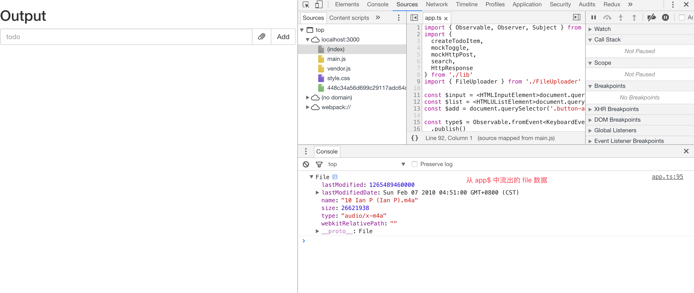
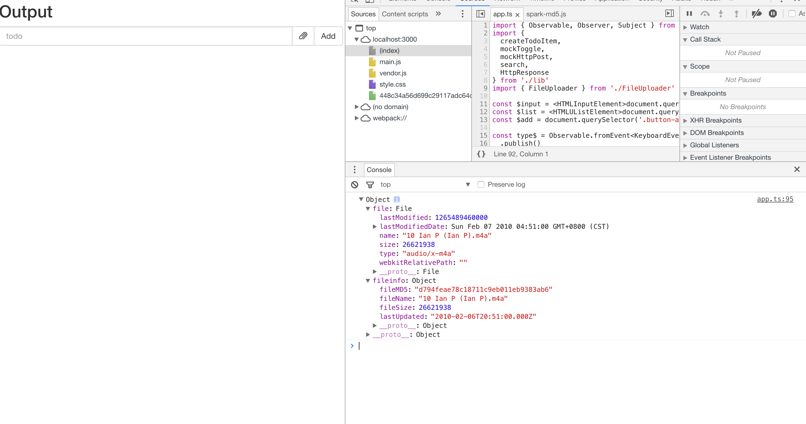
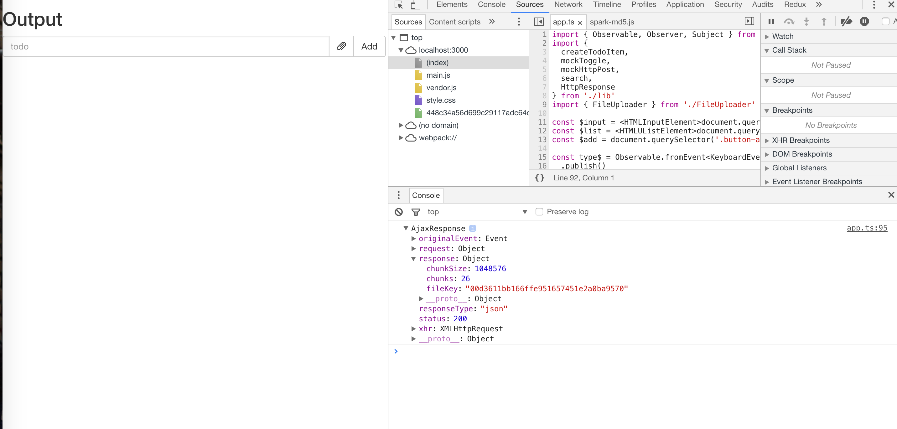
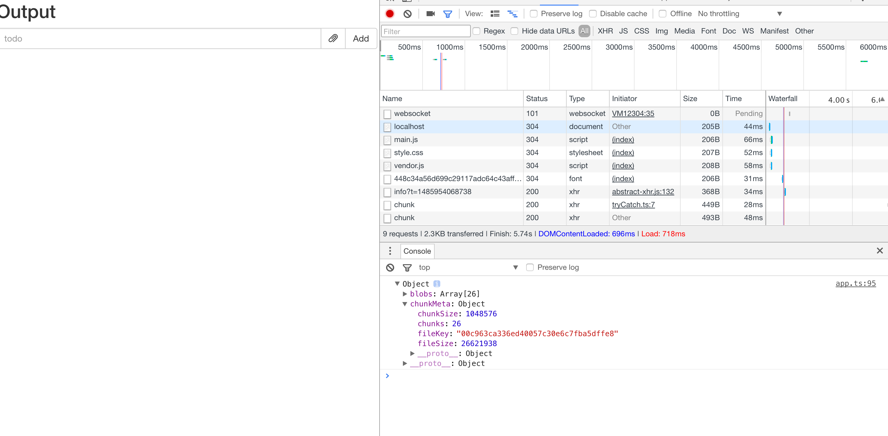
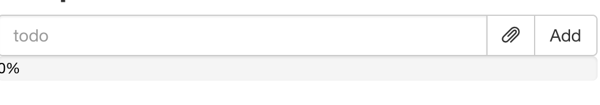
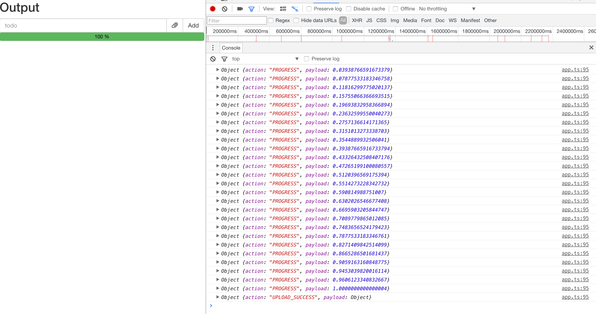

Learn how to elegantly implement resumable chunked file uploads in under 200 lines of code using RxJS.

## Intro

[ben lesh](https://github.com/blesh) often describes RxJS as _Lodash for Async_ in his various talks to highlight its powerful async control capabilities, and indeed RxJS offers functionality for asynchronous operations comparable to what [lodash](https://lodash.com/) provides for Arrays. Similar to lodash's excellent performance, RxJS also performs very well when handling asynchronous tasks, without sacrificing too much performance for its high-level abstractions. This article will walk through a relatively complex async task step by step, demonstrating how RxJS can handle complex async control in a clean and elegant way.

<!--more-->

## Setup

Clone the seed project from [learning-rxjs](https://github.com/Brooooooklyn/learning-rxjs), and checkout your own article3 branch based on the `article3-seed` branch. All RxJS-related code in this article will be written in TypeScript.

In this article, we will use RxJS to implement the following features:

The article3-seed branch comes with a simple file upload server. Its purpose is to provide a simple chunked file upload API.

There are three APIs available:

- `post /api/upload/chunk`

  Used to obtain file chunk information by uploading file size, file MD5, file modification time, and file name.

  The server returns the number of file chunks, the size of each chunk, and a unique fileKey for the file.

  - Request body:

```ts
{
  fileSize: string // file size
  fileMD5: string // file MD5
  lastUpdated: ISOString // file last modified time
  fileName: string // file name
}
```

- Response:

```ts
{
  chunkSize: number // size of each chunk
  chunks: number // number of chunks
  fileKey: string // unique file id
}
```

- `post /api/upload/chunk/:fileKey?chunk=:chunk&chunks=:chunks`

  Used to upload a file chunk.

  - Request header: `'Content-Type': 'application/octet-stream'`
  - Request body: `blob`
  - Response: `'ok'` or `error message`

- `post /api/upload/chunk/:fileKey`

  Finalizes the file chunks. The backend will concatenate all chunks into a complete file and return the result.

  Response: `'ok'` or `error message`

Based on these APIs, we will implement the following features in this article:

1. Add a button to the left of the add button for selecting a file & (pausing & resuming) file uploads.

2. After adding a file:

   - Calculate the file's MD5, file name, last modified time, file size, and other information.
   - Call the `post /api/upload/chunk` endpoint to get the file chunk information.
   - Based on the chunk information, split the file into chunks and call `post /api/upload/chunk/:fileKey?chunk=:chunk&chunks=:chunks` to upload the file chunks, ensuring that only three chunks are uploaded concurrently at any time.
   - After all chunks have been uploaded, call `post /api/upload/chunk/:fileKey` to finalize the file.

3. During the upload, a progress bar below the input field shows the upload progress.

4. Once the upload starts, the file selection button becomes a pause button. Clicking it pauses the upload.

5. After clicking the pause button, it becomes a resume button. Clicking it resumes the upload from where it left off.

To implement these features and keep them separate from the existing todo app, we create a new `FileUploader.ts` file under the `src` folder and implement the requirements there:

```typescript
// FileUploader.ts
import { Observable } from 'rxjs'

// @warn memory leak
const $attachment = document.querySelector('.attachment')

export class FileUploader {
  private file$ = Observable.fromEvent($attachment, 'change')
    .map((r: Event) => (r.target as HTMLInputElement).files[0])
    .filter((f) => !!f)

  uploadStream$ = this.file$
}
```

Add the attachment node to the HTML:

```html
// index.html ...
<div class="input-group-btn">
  <label
    class="btn btn-default btn-file glyphicon glyphicon-paperclip attachment"
  >
    <input type="file" style="display: none;" />
  </label>
  <div class="btn btn-default button-add">Add</div>
</div>
...
```

Adjust the styles:

```css
// style.css
... .attachment {
  top: 0;
}
```

Then merge this stream (which we're about to implement) into `app$` in app.ts:

```typescript
...
import { FileUploader } from './FileUploader'
...
const uploader = new FileUploader()

const app$ = toggle$.merge(remove$, search$, uploader.uploadStream$)
  .do(r => {
    console.log(r)
  })

app$.subscribe()
```

At this point, by selecting a file through the attachment button, you can already see the `file` flowing out of `app$` in the console:



## Getting File Chunk Information

We use FileReader + spark-md5 to calculate the file's MD5 information. Other information can be obtained directly from the File object. Since FileReader reads files asynchronously, we wrap it as an `Observable` so it can be composed with uploadStream\$:

```typescript
import { Observable, Observer } from 'rxjs'
// spark-md5 doesn't have a third-party .d.ts file, so we use CommonJS-style require here
// If noImplicitAny: true is not set in tsconfig.json and TypeScript version is > 2.1,
// you can also use import * as SparkMD5 from 'spark-md5'
const SparkMD5 = require('spark-md5')
const $attachment = document.querySelector('.attachment')

interface FileInfo {
  fileSize: number
  fileMD5: string
  lastUpdated: string
  fileName: string
}

export class FileUploader {
  private file$ = Observable.fromEvent($attachment, 'change')
    .map((r: Event) => (r.target as HTMLInputElement).files[0])
    .filter((f) => !!f)

  uploadStream$ = this.file$.switchMap(this.readFileInfo)

  private readFileInfo(
    file: File,
  ): Observable<{ file: File; fileinfo: FileInfo }> {
    const reader = new FileReader()
    const spark = new SparkMD5.ArrayBuffer()
    reader.readAsArrayBuffer(file)
    return Observable.create(
      (observer: Observer<{ file: File; fileinfo: FileInfo }>) => {
        reader.onload = (e: Event) => {
          spark.append((e.target as FileReader).result)
          const fileMD5 = spark.end()
          observer.next({
            file,
            fileinfo: {
              fileMD5,
              fileSize: file.size,
              lastUpdated: file.lastModifiedDate.toISOString(),
              fileName: file.name,
            },
          })
          observer.complete()
        }
        return () => {
          if (!reader.result) {
            console.warn('read file aborted')
            reader.abort()
          }
        }
      },
    )
  }
}
```

At this point, you can see the `FileInfo` flowing out of `app$`:



Then use the file information to get the chunk metadata via the `post /api/upload/chunk` endpoint:

```typescript
...
const apiHost = 'http://127.0.0.1:5000/api'
...

interface ChunkMeta {
  fileSize: number
  chunkSize: number
  chunks: number
  fileKey: string
}
...

export class FileUploader {
  ...
  uploadStream$ = this.file$
    .switchMap(this.readFileInfo)
    .switchMap(i => Observable.ajax
      .post(`${apiHost}/upload/chunk`, i.fileinfo)
    )
}
```



## Chunked Upload

After obtaining the chunk information, the first thing we need to do is split the file according to the chunk metadata. Let's create a slice method to split the file:

```typescript
...
export class FileUploader {
  ...
  uploadStream$ = this.file$
    .switchMap(this.readFileInfo)
    .switchMap(i => Observable.ajax
      .post(`${apiHost}/upload/chunk`, i.fileinfo)
      .map((r) => {
        const blobs = this.slice(i.file, r.response.chunks, r.response.chunkSize)
        return { blobs, chunkMeta: r.response }
      })
    )

  ...

  private slice(file: File, n: number, chunkSize: number): Blob[] {
    const result: Blob[] = []
    for (let i = 0; i < n; i ++) {
      const startSize = i * chunkSize
      const slice = file.slice(startSize, i === n - 1 ? startSize + (file.size - startSize) : (i + 1) * chunkSize)
      result.push(slice)
    }
    return result
  }
}
```

Now we can see the sliced blobs and meta information:



After slicing the file, we need to implement a method to upload individual chunks:

```typescript
...
export class FileUploader {
  ...

  uploadStream$ = this.file$
    .switchMap(this.readFileInfo)
    .switchMap(i => Observable.ajax
      .post(`${apiHost}/upload/chunk`, i.fileinfo)
      .map((r) => {
        const blobs = this.slice(i.file, r.response.chunks, r.response.chunkSize)
        return { blobs, chunkMeta: r.response }
      })
    )
    .switchMap(({ blobs, chunkMeta }) => {
      const dists = blobs.map((blob, index) => this.uploadChunk(chunkMeta, index, blob))
      const uploadStream = Observable.from(dists)
        .mergeAll(this.concurrency)

      return Observable.forkJoin(uploadStream)
        .mapTo(chunkMeta)
    })

  constructor(
    private concurrency = 3
  ) { }
  ...
  private uploadChunk(meta: ChunkMeta, index: number, blob: Blob) {
    const host = `${apiHost}/upload/chunk/${meta.fileKey}?chunk=${index + 1}&chunks=${meta.chunks}`
    return Observable.ajax({
      url: host,
      body: blob,
      method: 'post',
      crossDomain: true,
      headers: { 'Content-Type': 'application/octet-stream' }
    })
  }
}
```

Here, `uploadChunk` is the method for uploading a single file chunk. The logic in the last `switchMap` of `uploadStream$` uses the `mergeAll` operator to merge all upload streams into a single `Observable`, which results in concurrent uploading of all chunks. The `forkJoin` operator below waits for the merged `uploadStream` to `complete` before emitting a result. The `mergeAll` + `forkJoin` pattern here behaves very similarly to `Promise.all`. This could also be written as:

```typescript
...
const dists = blobs.map((blob, index) => this.uploadChunk(chunkMeta, index, blob))

return Observable.forkJoin(... dists)
  .mapTo(chunkMeta)
...
```

However, we have a requirement that _only three chunks should be uploading concurrently at any time_, so we need to use the `mergeAll` method with `concurrency = 3` to control the concurrency level. You can now select a file and observe the upload behavior in DevTools. If the program is working correctly, the behavior should be: file chunks are uploaded concurrently with only 3 chunks uploading simultaneously at any time, and after all chunks are uploaded, `chunkMeta` data flows out of `app$`.

Finally, we just need to finalize these chunks, and the file upload is complete:

```typescript
...
export class FileUploader {
  ...
  uploadStream$ = this.file$
    .switchMap(this.readFileInfo)
    .switchMap(i => Observable.ajax
      .post(`${apiHost}/upload/chunk`, i.fileinfo)
      .map((r) => {
        const blobs = this.slice(i.file, r.response.chunks, r.response.chunkSize)
        return { blobs, chunkMeta: r.response }
      })
    )
    .switchMap(({ blobs, chunkMeta }) => {
      const dists = blobs.map((blob, index) => this.uploadChunk(chunkMeta, index, blob))
      const uploadStream = Observable.from(dists)
        .mergeAll(this.concurrency)

      return Observable.forkJoin(uploadStream)
        .mapTo(chunkMeta)
    })
    .switchMap((r: ChunkMeta) => Observable.ajax.post(`${apiHost}/upload/chunk/${r.fileKey}`)
      .mapTo({
        action: 'UPLOAD_SUCCESS',
        payload: r
      })
    )
}
```

At this point, after selecting a file, you can see it being uploaded in chunks, and after finalization, a piece of data is emitted from `$app`:

```json
{
  "action": "UPLOAD_SUCCESS",
  "payload": {
    "chunkSize": 1048576,
    "chunks": 26,
    "fileKey": "00a12bdc10449d8ec93883a7d45292a30c",
    "fileSize": 26621938
  }
}
```

And you can find the finalized file in the project's `chunks` folder.

## Progress Bar

To display the progress bar in real time on the UI, we first need to add the progress bar markup to index.html:

```html
// index.html ...
<div class="progress">
  <div
    class="progress-bar progress-bar-success"
    role="progressbar"
    aria-valuenow="0"
    aria-valuemin="0"
    aria-valuemax="100"
    style="width: 0%"
  >
    <span>0%</span>
  </div>
</div>
...
```

Adjust the text color in the styles:

```css
// style.css
... .progress-bar > span {
  color: black;
}
```

At this point, the UI should look like this:



To get the overall upload progress, we first need to get the upload progress of individual chunks. `Observable.ajax` has a method to get progress:

```typescript
...
import { Observable, Observer, Subscriber } from 'rxjs'
...

export class FileUploader {
  ...

  private uploadChunk(meta: ChunkMeta, index: number, blob: Blob): Observable<ProgressEvent> {
    const host = `${apiHost}/upload/chunk/${meta.fileKey}?chunk=${index + 1}&chunks=${meta.chunks}`
    return Observable.create((subscriber: Subscriber<ProgressEvent>) => {
      const ajax$ = Observable.ajax({
        url: host,
        body: blob,
        method: 'post',
        crossDomain: true,
        headers: { 'Content-Type': 'application/octet-stream' },
        progressSubscriber: subscriber
      })
      const subscription = ajax$.subscribe()
      return () => subscription.unsubscribe()
    })
  }
}
```

With this in place, we can now calculate the overall upload progress in uploadStream\$:

```typescript
...

export class FileUploader {

  uploadStream$ = this.file$
    .switchMap(this.readFileInfo)
    .switchMap(i => Observable.ajax
      .post(`${apiHost}/upload/chunk`, i.fileinfo)
      .map((r) => {
        const blobs = this.slice(i.file, r.response.chunks, r.response.chunkSize)
        return { blobs, chunkMeta: r.response }
      })
    )
    .switchMap(({ blobs, chunkMeta }) => {
      const uploaded: number[] = []
      const dists = blobs.map((blob, index) => {
        let currentLoaded = 0
        return this.uploadChunk(chunkMeta, index, blob)
          .do(r => {
            currentLoaded = r.loaded / chunkMeta.fileSize
            uploaded[index] = currentLoaded
            const percent = uploaded.reduce((acc, val) => acc + (val ? val : 0))
            const p = Math.round(percent * 100)
            $progressBar.style.width = `${p}%`
            $progressBar.firstElementChild.textContent = `${p > 1 ? p - 1 : p} %`
          })
      })

      const uploadStream = Observable.from(dists)
        .mergeAll(this.concurrency)

      return Observable.forkJoin(uploadStream)
        .mapTo(chunkMeta)
    })
    .switchMap((r: ChunkMeta) => Observable.ajax.post(`${apiHost}/upload/chunk/${r.fileKey}`)
      .mapTo({
        action: 'UPLOAD_SUCCESS',
        payload: r
      })
    )
    .do(() => {
      $progressBar.firstElementChild.textContent = '100 %'
    })
}
```

Now we can see the chunked upload progress on the UI.

For convenience and debugging purposes, we typically put all local state like:

```json
{
  "action": "UPLOAD_SUCCESS",
  "payload": {
    "chunkSize": 1048576,
    "chunks": 26,
    "fileKey": "00a12bdc10449d8ec93883a7d45292a30c",
    "fileSize": 26621938
  }
}
```

into a single stream:

```typescript
import { Observable, Subscriber, Subject } from 'rxjs'
...
type Action = 'pause' | 'resume' | 'progress' | 'complete'
...
export class FileUploader {
  ...
  private action$ = new Subject<{
    name: Action
    payload?: any
  }>()

  private progress$ = this.action$
    .filter(action => action.name === 'progress')
    .map(action => action.payload)
  	.do(r => {
      const percent = Math.round(r * 100)
      $progressBar.style.width = `${percent}%`
      $progressBar.firstElementChild.textContent = `${percent > 1 ? percent - 1 : percent} %`
  	})
    .map(r => ({ action: 'PROGRESS', payload: r }))


  uploadStream$ = this.file$
    ...

        return this.uploadChunk(chunkMeta, index, blob)
          .do(r => {
            currentLoaded = r.loaded / chunkMeta.fileSize
            uploaded[index] = currentLoaded
            const percent = uploaded.reduce((acc, val) => acc + (val ? val : 0))
            this.action$.next({ name: 'progress', payload: percent })
          })
	...
    .merge(this.progerss$)
}
```

Now the console will show more intuitive debug information:



## Pause and Resume

According to the requirements, after selecting a file, the file selection button will become a pause button. We can use `Observable.fromEvent` to implement this:

```typescript
...
export class FileUploader {
  ...

  private click$ = Observable.fromEvent($attachment, 'click')
    .map((e: Event) => e.target)
    .filter((e: HTMLElement) => e === $attachment)
    .scan((acc: number, val: HTMLElement) => {
      if (val.classList.contains('glyphicon-paperclip')) {
        return 1
      }
      if (acc === 2) {
        return 3
      }
      return 2
    }, 3)
    .filter(v => v !== 1)
  	.do((v) => {
      if (v === 2) {
        this.action$.next({ name: 'pause' })
        $attachment.classList.remove('glyphicon-pause')
        $attachment.classList.add('glyphicon-play')
      } else {
        this.action$.next({ name: 'resume' })
        this.buildPauseIcon()
      }
    })

  uploadStream$ = this.file$
	.switchMap...
  	.switchMap...
  	.do(() => this.buildPauseIcon())
  	...
    .do(() => {
      $progressBar.firstElementChild.textContent = '100 %'
      // restore icon
      $attachment.classList.remove('glyphicon-pause')
      $attachment.classList.add('glyphicon-paperclip');
      ($attachment.firstElementChild as HTMLInputElement).disabled = false
    })
    .merge(this.progress$, this.click$)

  // side effect
  private buildPauseIcon() {
    $attachment.classList.remove('glyphicon-paperclip')
    $attachment.classList.add('glyphicon-pause');
    ($attachment.firstElementChild as HTMLInputElement).disabled = true
  }
}
```

This code involves quite a few concepts, so let's break it down:

A `do` operator is inserted after the two `switchMap` calls in `uploadStream$`. This code changes the file upload icon to a pause icon.

Then we create a new `click$` stream. To prevent duplicate value emissions caused by event bubbling, we use map + filter to filter out events bubbled up from child nodes. To distinguish between clicking the `upload file button`, the `pause button`, or the `resume button`, we use the values 1, 2, and 3 to represent three different click events, and use the `scan` operator to continuously generate these three states. The behavior of `scan` is very similar to `Array#reduce` -- it takes an `accumulator` and continuously derives new state from the current value and state (yes, the same behavior as a reducer in Redux). In the `do` operator below, we change the button's `icon` based on the different states.

At this point, during the upload process, clicking pause/resume correctly toggles the icon state. And after the upload is complete, the icon is restored to its initial file upload state.


To make the entire file upload pausable and resumable, we use the `takeUntil`, `repeatWhen`, and `retryWhen` operators in `uploadChunk`:

```ts
...
export class FileUploader {
  ...
  private action$ = ...
  private pause$ = this.action$.filter(ac => ac.name === 'pause')
  private resume$ = this.action$.filter(ac => ac.name === 'resume')
  private progress$ = this.action$
    ...
    .distinctUntilChanged((x: number, y: number) => x - y >= 0)
    ...

  ...

  private uploadChunk(meta: ChunkMeta, index: number, blob: Blob): Observable<ProgressEvent> {
    ...
    return Observable.create(
      ...
      const ajax$ = Observable.ajax({
      ...
      })
        .takeUntil(this.pause$)
        .repeatWhen(() => this.resume$)
      const subscription = ajax$.subscribe()
      return () => subscription.unsubscribe()
    )
      .retryWhen(() => this.resume$)
  }
}
```

The `takeUntil` operator takes an `Observable` and terminates the upstream `Observable` when that `Observable` emits a value.

The `repeatWhen` and `retryWhen` operators both accept a `projectFunc` that returns an `Observable`, and repeat/retry when that `Observable` emits a value.

During the pause and resume process, the progress bar numbers might display incorrectly: a partially uploaded request gets aborted, but its progress has already been calculated once. When retrying, it starts the upload from scratch, which could cause the progress bar to go backward. To handle this, we add `distinctUntilChanged` after `progress$` to achieve the effect of **_only emitting values when the progress increases_**.

## Conclusion

This is a highly abstract article, and due to the constraint of not using a framework, the program relies heavily on the side-effect operator `do`, which overall doesn't look particularly elegant. Truly elegant FRP should combine RxJS with frameworks like Redux + React, where this file upload component could be written much more elegantly. Of course, the functionality isn't complete -- many edge cases such as error handling at each step haven't been addressed. But that's fine -- this is meant to serve as a demonstration of RxJS's powerful async handling capabilities, and to give beginners the opportunity to hands-on experiment with various RxJS operators while implementing a complex async scenario. In upcoming articles, we will dive deeper into the various operators covered (and not covered) in these three articles, gradually lifting the fog around RxJS.
