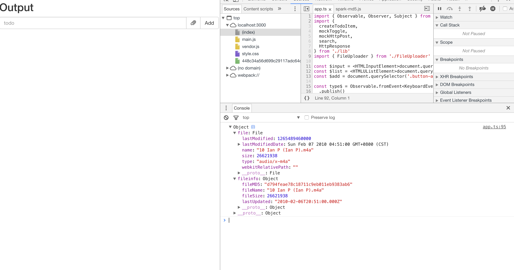
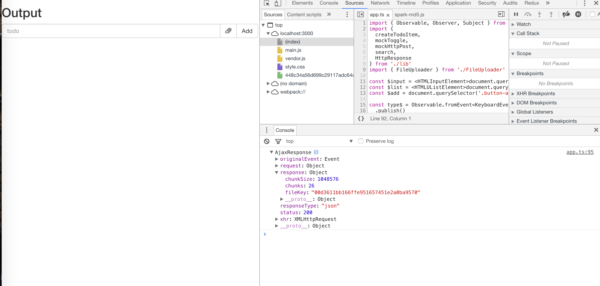
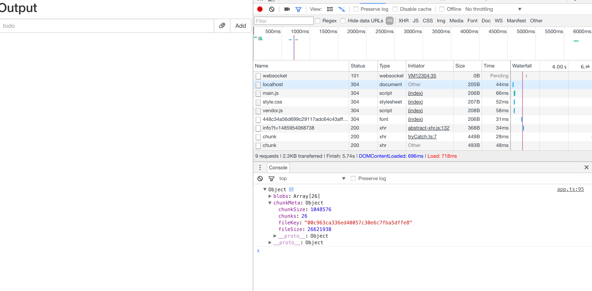
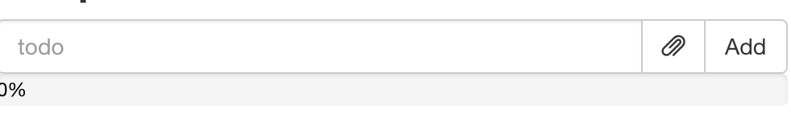
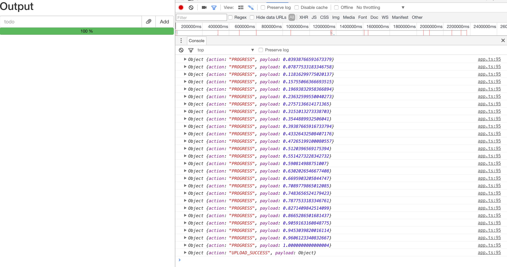

教你使用 RxJS 在 200 行代码内优雅的实现文件分片断点续传

## Intro

[ben lesh](https://github.com/blesh) 经常在他的各种 talking 中将 RxJS 比作 _Lodash for Async_ 用来彰显 RxJS 的强大异步控制能力，而 RxJS 对于异步而言确实有着媲美 [lodash](https://lodash.com/) 之于 Array 的强大功能。与 lodash 的优秀性能类似，RxJS 在操作异步任务的时的性能也是非常优秀的，并不会因为高等级的抽象而牺牲过多的性能。本篇文章将会以一个相对复杂的异步任务为例子，逐步介绍 RxJS 如何简洁优雅的进行复杂的异步控制。

<!--more-->

## 准备工作

在 [learning-rxjs](https://github.com/Brooooooklyn/learning-rxjs) clone 项目所需的 seed，并基于 `article3-seed` checkout 一个你的 article3 分支。本文中所有涉及到 RxJS 的代码将全部使用 TypeScript 编写。

这篇文章中，我们将使用 RxJS 实现以下功能:

article3-seed 分支附带了一个简单的文件上传的 server，它的作用是实现一个简单的文件分片上传 API。

一共有三个 API 提供调用:

- `post /api/upload/chunk`

  用来获取文件的分片信息，上传文件大小，文件 md5，文件修改时间和文件名

  服务端返回文件分片数量，每个分片大小和文件唯一的 fileKey

  - Request body:

```ts
{
  fileSize: string // 文件大小
  fileMD5: string // 文件 md5
  lastUpdated: ISOString // 文件上次修改时间
  fileName: string // 文件名
}
```

- Response:

```ts
{
  chunkSize: number // 每个分片大小
  chunks: number // 分片数量
  fileKey: string // 唯一文件 id
}
```

- `post /api/upload/chunk/:fileKey?chunk=:chunk&chunks=:chunks`

  用来上传文件分片

  - Request header: `'Content-Type': 'application/octet-stream'`
  - Request body: `blob`
  - Response: `'ok'` or `error message`

- `post /api/upload/chunk/:fileKey`

  结算文件分片，后端会将各分片拼接成一个完整的文件并返回

  Response: `'ok'` or `error message`

在这几个 API 的基础上，我们将在这篇文章中实现以下的功能

1. 在 add 按钮左边增加一个按钮，用来选择一个文件 & (暂停 & 恢复) 文件的上传

2. 在增加文件后：

   - 计算文件 md5 ，文件名，文件上次修改时间，文件大小等信息
   - 调用 `post /api/upload/chunk` 接口，获取文件分片信息
   - 根据获取的分片信息对文件分片，并且调用 `post /api/upload/chunk/:fileKey?chunk=:chunk&chunks=:chunks` 上传文件分片，上传过程保证每次只有三个分片同时上传
   - 上传完所有的分片后，调用 `post /api/upload/chunk/:fileKey` 结算文件

3. 上传的过程中，input 框下有一个进度条显示上传进度

4. 在上传开始后，选择文件的按钮变成暂停按钮，点击则暂停上传

5. 点击暂停上传按钮后，按钮变成继续上传按钮，点击则在暂停的地方继续上传

为了实现上面的功能，并且将这些功能与之前的 todo app 区分开来，我们在 `src` 文件夹下新建一个 `FileUploader.ts` 文件并在这个文件中实现这些需求:

```typescript
// FileUploader.ts
import { Observable } from 'rxjs'

// @warn memory leak
const $attachment = document.querySelector('.attachment')

export class FileUploader {
  private file$ = Observable.fromEvent($attachment, 'change')
    .map((r: Event) => (r.target as HTMLInputElement).files[0])
    .filter((f) => !!f)

  uploadStream$ = this.file$
}
```

在 html 中加入 attachment 节点：

```html
// index.html ...
<div class="input-group-btn">
  <label
    class="btn btn-default btn-file glyphicon glyphicon-paperclip attachment"
  >
    <input type="file" style="display: none;" />
  </label>
  <div class="btn btn-default button-add">Add</div>
</div>
...
```

调整一下样式:

```css
// style.css
... .attachment {
  top: 0;
}
```

然后在 app.ts 中将这个我们将要实现功能的流 `merge` 到 `app$` 中:

```typescript
...
import { FileUploader } from './FileUploader'
...
const uploader = new FileUploader()

const app$ = toggle$.merge(remove$, search$, uploader.uploadStream$)
  .do(r => {
    console.log(r)
  })

app$.subscribe()
```

这个时候通过 attachment 按钮选择一个文件，就已经可以在控制台中看到从 `app$` 中流出的 `file`了：


## 获取文件分片信息

我们使用 FileReader + spark-md5 计算文件的 md5 信息，其它信息直接可以从 File 对象上拿到。而这里的 FileReader 读取文件是一个异步的过程，我们将它封装成 `Observable` 以便和 uploadStream\$ 组合:

```typescript
import { Observable, Observer } from 'rxjs'
// spark-md5 没有第三方 .d.ts 文件，这里用 commonjs 风格的 require 它
// 如果未再 tsconfig.json 中设置 noImplicitAny: true 且 TypeScript 版本大于 2.1 则也可以用
// import * as SparkMD5 from 'spark-md5' 的方式引用
const SparkMD5 = require('spark-md5')
const $attachment = document.querySelector('.attachment')

interface FileInfo {
  fileSize: number
  fileMD5: string
  lastUpdated: string
  fileName: string
}

export class FileUploader {
  private file$ = Observable.fromEvent($attachment, 'change')
    .map((r: Event) => (r.target as HTMLInputElement).files[0])
    .filter((f) => !!f)

  uploadStream$ = this.file$.switchMap(this.readFileInfo)

  private readFileInfo(
    file: File,
  ): Observable<{ file: File; fileinfo: FileInfo }> {
    const reader = new FileReader()
    const spark = new SparkMD5.ArrayBuffer()
    reader.readAsArrayBuffer(file)
    return Observable.create(
      (observer: Observer<{ file: File; fileinfo: FileInfo }>) => {
        reader.onload = (e: Event) => {
          spark.append((e.target as FileReader).result)
          const fileMD5 = spark.end()
          observer.next({
            file,
            fileinfo: {
              fileMD5,
              fileSize: file.size,
              lastUpdated: file.lastModifiedDate.toISOString(),
              fileName: file.name,
            },
          })
          observer.complete()
        }
        return () => {
          if (!reader.result) {
            console.warn('read file aborted')
            reader.abort()
          }
        }
      },
    )
  }
}
```

此时已经可以看到文件的 `FileInfo`可以从 `app$` 中流出:



再使用文件信息通过 `post /api/upload/chunk` 接口获取文件的分片信息:

```typescript
...
const apiHost = 'http://127.0.0.1:5000/api'
...

interface ChunkMeta {
  fileSize: number
  chunkSize: number
  chunks: number
  fileKey: string
}
...

export class FileUploader {
  ...
  uploadStream$ = this.file$
    .switchMap(this.readFileInfo)
    .switchMap(i => Observable.ajax
      .post(`${apiHost}/upload/chunk`, i.fileinfo)
    )
}
```



## 分片上传

获取分片信息之后，我们首先要做的事情是将文件按照分片信息分片，做一个 slice 方法来将文件分片:

```typescript
...
export class FileUploader {
  ...
  uploadStream$ = this.file$
    .switchMap(this.readFileInfo)
    .switchMap(i => Observable.ajax
      .post(`${apiHost}/upload/chunk`, i.fileinfo)
      .map((r) => {
        const blobs = this.slice(i.file, r.response.chunks, r.response.chunkSize)
        return { blobs, chunkMeta: r.response }
      })
    )

  ...

  private slice(file: File, n: number, chunkSize: number): Blob[] {
    const result: Blob[] = []
    for (let i = 0; i < n; i ++) {
      const startSize = i * chunkSize
      const slice = file.slice(startSize, i === n - 1 ? startSize + (file.size - startSize) : (i + 1) * chunkSize)
      result.push(slice)
    }
    return result
  }
}
```

这时，我们就能看到分片后的 blobs 和 meta 信息:



将文件切片完成之后，我们需要实现一个上传分片的方法:

```typescript
...
export class FileUploader {
  ...

  uploadStream$ = this.file$
    .switchMap(this.readFileInfo)
    .switchMap(i => Observable.ajax
      .post(`${apiHost}/upload/chunk`, i.fileinfo)
      .map((r) => {
        const blobs = this.slice(i.file, r.response.chunks, r.response.chunkSize)
        return { blobs, chunkMeta: r.response }
      })
    )
    .switchMap(({ blobs, chunkMeta }) => {
      const dists = blobs.map((blob, index) => this.uploadChunk(chunkMeta, index, blob))
      const uploadStream = Observable.from(dists)
        .mergeAll(this.concurrency)

      return Observable.forkJoin(uploadStream)
        .mapTo(chunkMeta)
    })

  constructor(
    private concurrency = 3
  ) { }
  ...
  private uploadChunk(meta: ChunkMeta, index: number, blob: Blob) {
    const host = `${apiHost}/upload/chunk/${meta.fileKey}?chunk=${index + 1}&chunks=${meta.chunks}`
    return Observable.ajax({
      url: host,
      body: blob,
      method: 'post',
      crossDomain: true,
      headers: { 'Content-Type': 'application/octet-stream' }
    })
  }
}
```

这里的 `uploadChunk` 是上传单个文件分片的方法，`uploadStream$` 中最后面一个 `switchMap `中的逻辑是使用 `mergeAll` 操作符将所有上传的流 merge 成一个 `Observable`，行为就是并发的上传所有的分片。而下面的 `forkJoin` 操作符则是等 `merge` 之后的 `uploadStream` `complete` 之后再 `emit` 一个结果。这里的 `mergeAll` + `forkJoin` 的用法其实与 `Promise.all` 的行为非常类似，这里也可以写成:

```typescript
...
const dists = blobs.map((blob, index) => this.uploadChunk(chunkMeta, index, blob))

return Observable.forkJoin(... dists)
  .mapTo(chunkMeta)
...
```

但我们有一个需求是 _上传过程保证每次只有三个分片同时上传_ , 所以需要使用 `mergeAll` 方法并传入 `concurrency = 3` 来控制并发数量，现在可以选择一个文件在 Devtool 上观察上传的行为。如果程序没有出问题行为应该是：并发上传文件分片，并且永远只有 3 个分片同时上传，在上传完所有分片后 `app$` 中流出 `chunkMeta` 数据。

最后，我们只需要结算这些分片，这个文件就算上传完成了:

```typescript
...
export class FileUploader {
  ...
  uploadStream$ = this.file$
    .switchMap(this.readFileInfo)
    .switchMap(i => Observable.ajax
      .post(`${apiHost}/upload/chunk`, i.fileinfo)
      .map((r) => {
        const blobs = this.slice(i.file, r.response.chunks, r.response.chunkSize)
        return { blobs, chunkMeta: r.response }
      })
    )
    .switchMap(({ blobs, chunkMeta }) => {
      const dists = blobs.map((blob, index) => this.uploadChunk(chunkMeta, index, blob))
      const uploadStream = Observable.from(dists)
        .mergeAll(this.concurrency)

      return Observable.forkJoin(uploadStream)
        .mapTo(chunkMeta)
    })
    .switchMap((r: ChunkMeta) => Observable.ajax.post(`${apiHost}/upload/chunk/${r.fileKey}`)
      .mapTo({
        action: 'UPLOAD_SUCCESS',
        payload: r
      })
    )
}
```

这时，选择一个文件后，可以看到它被分片上传，并且在结算后在 `$app` 中发送了一条数据：

```json
{
  "action": "UPLOAD_SUCCESS",
  "payload": {
    "chunkSize": 1048576,
    "chunks": 26,
    "fileKey": "00a12bdc10449d8ec93883a7d45292a30c",
    "fileSize": 26621938
  }
}
```

并且在项目的 `chunks` 文件夹下面可以找到这个被结算的文件。

## 进度条

为了实现在界面中实时显示进度条，我们先要在 index.html 中加入进度条标签:

```html
// index.html ...
<div class="progress">
  <div
    class="progress-bar progress-bar-success"
    role="progressbar"
    aria-valuenow="0"
    aria-valuemin="0"
    aria-valuemax="100"
    style="width: 0%"
  >
    <span>0%</span>
  </div>
</div>
...
```

调整一下样式中文字的颜色:

```css
// style.css
... .progress-bar > span {
  color: black;
}
```

这个时候界面看起来应该是这样的：



要获取总体的上传进度，必须先获取单个分片的上传进度，`Observable.ajax` 有一个方法可以获取 progress:..

```typescript
...
import { Observable, Observer, Subscriber } from 'rxjs'
...

export class FileUploader {
  ...

  private uploadChunk(meta: ChunkMeta, index: number, blob: Blob): Observable<ProgressEvent> {
    const host = `${apiHost}/upload/chunk/${meta.fileKey}?chunk=${index + 1}&chunks=${meta.chunks}`
    return Observable.create((subscriber: Subscriber<ProgressEvent>) => {
      const ajax$ = Observable.ajax({
        url: host,
        body: blob,
        method: 'post',
        crossDomain: true,
        headers: { 'Content-Type': 'application/octet-stream' },
        progressSubscriber: subscriber
      })
      const subscription = ajax$.subscribe()
      return () => subscription.unsubscribe()
    })
  }
}
```

这样一来我们就可以在 uploadSteram\$ 中计算总体的上传进度了:

```typescript
...

export class FileUploader {

  uploadStream$ = this.file$
    .switchMap(this.readFileInfo)
    .switchMap(i => Observable.ajax
      .post(`${apiHost}/upload/chunk`, i.fileinfo)
      .map((r) => {
        const blobs = this.slice(i.file, r.response.chunks, r.response.chunkSize)
        return { blobs, chunkMeta: r.response }
      })
    )
    .switchMap(({ blobs, chunkMeta }) => {
      const uploaded: number[] = []
      const dists = blobs.map((blob, index) => {
        let currentLoaded = 0
        return this.uploadChunk(chunkMeta, index, blob)
          .do(r => {
            currentLoaded = r.loaded / chunkMeta.fileSize
            uploaded[index] = currentLoaded
            const percent = uploaded.reduce((acc, val) => acc + (val ? val : 0))
            const p = Math.round(percent * 100)
            $progressBar.style.width = `${p}%`
            $progressBar.firstElementChild.textContent = `${p > 1 ? p - 1 : p} %`
          })
      })

      const uploadStream = Observable.from(dists)
        .mergeAll(this.concurrency)

      return Observable.forkJoin(uploadStream)
        .mapTo(chunkMeta)
    })
    .switchMap((r: ChunkMeta) => Observable.ajax.post(`${apiHost}/upload/chunk/${r.fileKey}`)
      .mapTo({
        action: 'UPLOAD_SUCCESS',
        payload: r
      })
    )
    .do(() => {
      $progressBar.firstElementChild.textContent = '100 %'
    })
}
```

这个时候我们可以在界面中看到文件分片上传的进度了。

而一般为了方便使用与调试，我们一般将所有的类似:

```json
{
  "action": "UPLOAD_SUCCESS",
  "payload": {
    "chunkSize": 1048576,
    "chunks": 26,
    "fileKey": "00a12bdc10449d8ec93883a7d45292a30c",
    "fileSize": 26621938
  }
}
```

的 local state 放在一个流里面:

```typescript
import { Observable, Subscriber, Subject } from 'rxjs'
...
type Action = 'pause' | 'resume' | 'progress' | 'complete'
...
export class FileUploader {
  ...
  private action$ = new Subject<{
    name: Action
    payload?: any
  }>()

  private progress$ = this.action$
    .filter(action => action.name === 'progress')
    .map(action => action.payload)
  	.do(r => {
      const percent = Math.round(r * 100)
      $progressBar.style.width = `${percent}%`
      $progressBar.firstElementChild.textContent = `${percent > 1 ? percent - 1 : percent} %`
  	})
    .map(r => ({ action: 'PROGRESS', payload: r }))


  uploadStream$ = this.file$
    ...

        return this.uploadChunk(chunkMeta, index, blob)
          .do(r => {
            currentLoaded = r.loaded / chunkMeta.fileSize
            uploaded[index] = currentLoaded
            const percent = uploaded.reduce((acc, val) => acc + (val ? val : 0))
            this.action$.next({ name: 'progress', payload: percent })
          })
	...
    .merge(this.progerss$)
}
```

这时控制台会出现更直观的调试信息:



## 暂停，续传

根据需求，我们在选择文件后，选择文件的按钮将会变成一个暂停按钮，我们可以用 `Observable.fromEvent`来实现这个需求:

```typescript
...
export class FileUploader {
  ...

  private click$ = Observable.fromEvent($attachment, 'click')
    .map((e: Event) => e.target)
    .filter((e: HTMLElement) => e === $attachment)
    .scan((acc: number, val: HTMLElement) => {
      if (val.classList.contains('glyphicon-paperclip')) {
        return 1
      }
      if (acc === 2) {
        return 3
      }
      return 2
    }, 3)
    .filter(v => v !== 1)
  	.do((v) => {
      if (v === 2) {
        this.action$.next({ name: 'pause' })
        $attachment.classList.remove('glyphicon-pause')
        $attachment.classList.add('glyphicon-play')
      } else {
        this.action$.next({ name: 'resume' })
        this.buildPauseIcon()
      }
    })

  uploadStream$ = this.file$
	.switchMap...
  	.switchMap...
  	.do(() => this.buildPauseIcon())
  	...
    .do(() => {
      $progressBar.firstElementChild.textContent = '100 %'
      // restore icon
      $attachment.classList.remove('glyphicon-pause')
      $attachment.classList.add('glyphicon-paperclip');
      ($attachment.firstElementChild as HTMLInputElement).disabled = false
    })
    .merge(this.progress$, this.click$)

  // side effect
  private buildPauseIcon() {
    $attachment.classList.remove('glyphicon-paperclip')
    $attachment.classList.add('glyphicon-pause');
    ($attachment.firstElementChild as HTMLInputElement).disabled = true
  }
}
```

这段代码用到涉及到的概念比较多，我们一点点来理解：

在 `uploadStream$` 的两个 `switchMap` 下插入了一个 `do` 操作符，这段代码的作用是将文件上传的图标变成暂停的图标。

然后我们新建了一个 `click$` 流，为了防止事件冒泡导致的重复推送值，我们用 map + filter 过滤掉了子节点冒泡上来的事件。而为了区分点击的是 `上传文件按钮`还是 `暂停按钮`还是 `继续按钮`，我们用 1，2，3 三个值代表三个不同的点击事件，并使用 `scan`操作符不停的生成这三个状态。`scan` 的行为与 `Array#reduce` 非常相似，它接受一个 `accumulator` 不停的根据当前的值和状态累加出新的状态(没错，和 Redux 中的 reducer 行为一致)。而在下面的 `do` 操作符中我们根据不同的状态改变按钮的`icon` 。

这个时候我们观察上传的过程中，点击暂停/继续，图标的状态可以正确切换了。并且在上传完成后图标也被恢复成上传文件的初始状态了。


为了让整个文件上传可以暂停与继续，我们在 `uploadChunk` 下使用 `takeUntil` 与 `repeatWhen` & `retryWhen` 操作符:

```ts
...
export class FileUploader {
  ...
  private action$ = ...
  private pause$ = this.action$.filter(ac => ac.name === 'pause')
  private resume$ = this.action$.filter(ac => ac.name === 'resume')
  private progress$ = this.action$
    ...
    .distinctUntilChanged((x: number, y: number) => x - y >= 0)
    ...

  ...

  private uploadChunk(meta: ChunkMeta, index: number, blob: Blob): Observable<ProgressEvent> {
    ...
    return Observable.create(
      ...
      const ajax$ = Observable.ajax({
      ...
      })
        .takeUntil(this.pause$)
        .repeatWhen(() => this.resume$)
      const subscription = ajax$.subscribe()
      return () => subscription.unsubscribe()
    )
      .retryWhen(() => this.resume$)
  }
}
```

`takeUntil` 操作符接受一个 `Observable`，它在这个 `Observable` 发射值的时候终止上面的 `Observable`

`repeatWhen` 与 `retryWhen` 操作符都是接受一个 `projectFunc`，它返回一个 `Observable` 并在这个 `Observable` 发射值的时候 重复/重试。

而在暂停恢复的过程中，进度条的数字可能显示错误：上传了一部分的请求被 abort，它的 progress 已经计算过一次了，重试的时候是重新上传，则可能会导致进度条后退，这时我们在 `progress$` 后面用 `distinctUntilChanged` 方法即可实现 **_只有在进度增长的时候发射值_** 这一效果。

## 结语

这是一篇超级抽象的文章，并且受限于未使用框架，在程序中使用了大量的副作用操作`do`，总体看起来并没有特别优雅。真正优雅的 FRP 应该是将 RxJS 与 Redux + React 这样的框架结合起来，那时这个文件上传的组件就可以有更优雅的写法。当然它的功能并不完备，很多 edge case 例如各个步骤中的异常处理都没有做，但没有关系，这里只起到一个示范作用来展示 RxJS 在处理异步上的强大功能，并且让初学者有机会亲手把玩 RxJS 的各种操作符并实现一个复杂的异步场景。在后面的文章中，将会深入前面这三篇文章中涉及到或未涉及到的各种操作符，逐渐拨开 RxJS 的迷雾。
