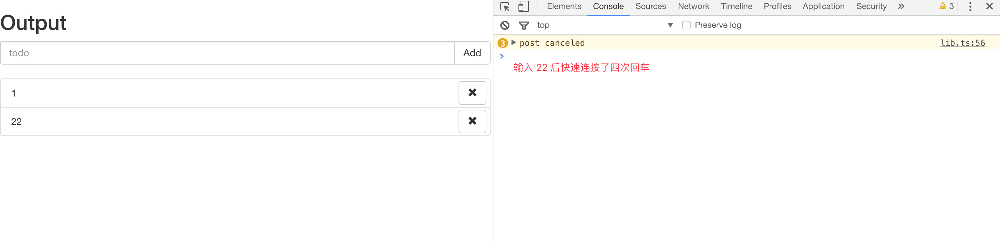
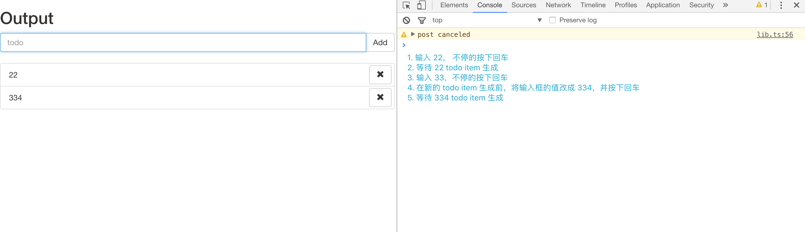
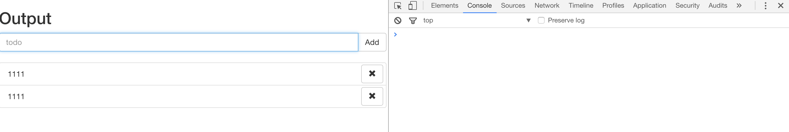
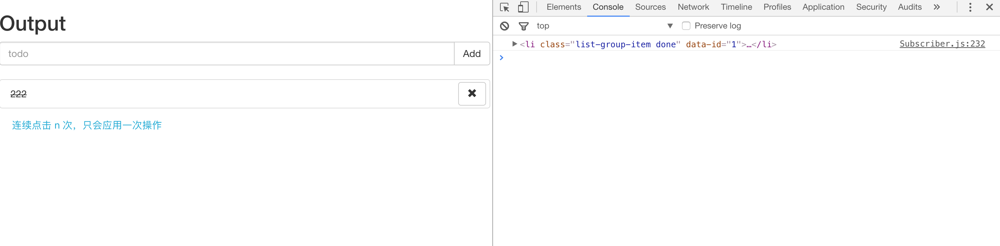
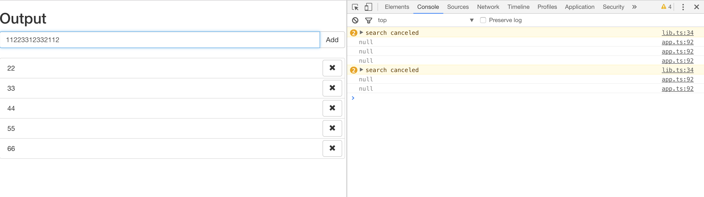
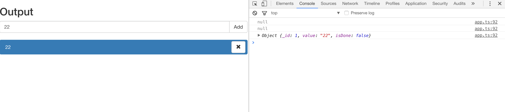

> This is the second article in a series introducing RxJS. The series starts from a small example and progressively dives deeper into applying RxJS across various scenarios, with corresponding explanations of different RxJS operators along the way. This article picks up from the example in the first article, [Hello Rx](https://zhuanlan.zhihu.com/p/23331432), and integrates more asynchronous operations (HTTP requests) into our Todo App. We'll use more operators (RxJS Operators) to handle our business logic, and subsequent articles will cover these operators in detail.

<!--more-->

## Preparation

First, clone the project seed from [learning-rxjs](https://github.com/Brooooooklyn/learning-rxjs), and `checkout a new article2 branch based on the article1 branch`. All RxJS-related code in this article will be written in TypeScript.

In this article, we'll use `RxJS` to implement the following features:

1. When the user presses Enter or clicks the add button, send a request. Only after the response comes back should the input field be cleared and the result rendered as a todo item. If Enter or the add button is pressed again before the response arrives, compare the current input value with the previously sent value — if they're the same, do nothing; if different, cancel the previous request and send a new one.
2. When a todo item is clicked, send a request. Clicks within a 300-millisecond interval will only trigger a single request.
3. Every time a character is typed in the input field, a request is sent after 200 milliseconds to search for matching existing todo items. If a match is found, the corresponding todo item is highlighted. If new characters are typed before the search result returns, the previous request is cancelled and a new search request is sent.

## Using switchMap to Switch Observables

To implement the requirements, we first need to add request logic to the existing flow. We can find the `mockHttpPost` method in `lib.ts`:

```ts
export const mockHttpPost = (value: string): Observable<HttpResponse> => {
  return Observable.create((observer: Observer<HttpResponse>) => {
    let status = 'pending'
    const timmer = setTimeout(() => {
      const result = {
        _id: ++dbIndex,
        value,
        isDone: false,
      }
      searchStorage.set(result._id, result)
      status = 'done'
      observer.next(result)
      observer.complete()
    }, random(10, 1000))
    return () => {
      clearTimeout(timmer)
      if (status === 'pending') {
        console.warn('post canceled')
      }
    }
  })
}
```

Here I'm not actually sending a real HTTP request. In a real-world scenario, converting a request into an Observable would look like this:

```ts
Observable.create((observer) => {
  request(
    xxxx,
    (response) => {
      // success callback
      observer.next(parse(response))
      observer.complete()
    },
    (err) => {
      // error callback
      observer.error(err)
    },
  )
  // teardown logic
  return () => request.abort()
})
```

Import `mockHttpPost` in _app.ts_:

```ts
...
import {
  createTodoItem,
  mockHttpPost
} from './lib'

...

const item$ = input$
  .map(() => $input.value)
  .filter(r => r !== '')
  .switchMap(mockHttpPost)
  .map(data => createTodoItem(data.value))
  .do((ele: HTMLLIElement) => {
    $list.appendChild(ele)
    $input.value = ''
  })
  .publishReplay(1)
  .refCount()
```

Modify the createTodoItem helper to accept data in the HttpResponse format:

```ts
// lib.ts
export const createTodoItem = (data: HttpResponse) => {
  const result = <HTMLLIElement>document.createElement('LI')
  result.classList.add('list-group-item', `todo-item-${data._id}`)
  result.setAttribute('data-id', `${data._id}`)
  const innerHTML = `
    ${data.value}
    <button type="button" class="btn btn-default button-remove pull-right" aria-label="right Align">
      <span class="glyphicon glyphicon-remove" aria-hidden="true"></span>
    </button>
  `
  result.innerHTML = innerHTML
  return result
}
```

With this change, the `$item` code can be simplified to:

```ts
const item$ = input$
  .map(() => $input.value)
  .filter((r) => r !== '')
  .switchMap(mockHttpPost)
  .map(createTodoItem)
  .do((ele: HTMLLIElement) => {
    $list.appendChild(ele)
    $input.value = ''
  })
  .publishReplay(1)
  .refCount()
```

At this point, the code behaves as follows:

1. Type a value and press Enter — the todo item is created as before.
2. Type a value and press Enter multiple times before the todo item is generated — you can see the requests being cancelled:



The `switchMap` here is essentially _map and switch_, and the behavior of the `switch` operator is:

> If the data flowing through the Observable is itself Observables, switch subscribes to the most recent inner Observable and passes its values to the next operator, while unsubscribing from the previous Observable.

So the switchMap here is actually shorthand for:

```ts
const item$ = input$
  .map(() => $input.value)
  .filter(r => r !== '')
  .map(mockHttpPost)
  .switch()
  .map(createTodoItem)
...

```

Similarly, the `mergeMap` we used earlier is _map and merge_.
If you're interested, try running the following code to observe `switchMap` behavior:

```ts
// You can run this in the project directory: npm i -g ts-node && ts-node example/switchMap.ts
import { Observable, Observer } from 'rxjs'

const stream = Observable.create((observer: Observer<number>) => {
  let i = 0
  const intervalId = setInterval(() => {
    observer.next(++i)
  }, 1000)
  return () => clearInterval(intervalId)
})

function createIntervalObservable(base: number) {
  let i = 0
  return Observable.create((observer: Observer<string>) => {
    const intervalId = setInterval(() => {
      observer.next(`base: ${base}, value: ${++i}`)
    }, 200)
    return () => {
      clearInterval(intervalId)
      console.log(`unsubscribe base: ${base}`)
    }
  })
}

stream
  .switchMap(createIntervalObservable)
  .subscribe((result) => console.log(result))
```

## Using distinct\* Operators to Filter Data

However, there's still a gap in the logic. If we type a value and rapidly press Enter multiple times, the earlier requests get cancelled. But if the input value hasn't changed, we don't actually need to cancel those requests — we just need to ignore the subsequent key presses. The distinct operator can handle this:

```ts
const item$ = input$
  .map(() => $input.value)
  .filter((r) => r !== '')
  .distinct()
  .switchMap(mockHttpPost)
  .map(createTodoItem)
  .do((ele: HTMLLIElement) => {
    $list.appendChild(ele)
    $input.value = ''
  })
  .publishReplay(1)
  .refCount()
```

Now, if you keep pressing Enter before the request returns, the previous request will only be cancelled when the input value actually changes:


## Using Subject to Push Data

There's still a minor issue: after a todo item is created, if you type the same value again and press Enter, the distinct operator will filter it out. To solve this, we can specify the second parameter `flushes` of the distinct operator to clear its internal cache:

```ts
import { Observable, Subject } from 'rxjs'
...

const clearInputSubject$ = new Subject<void>()

const item$ = input$
  .map(() => $input.value)
  .filter(r => r !== '')
  .distinct(null, clearInputSubject$)
  .switchMap(mockHttpPost)
  .map(createTodoItem)
  .do((ele: HTMLLIElement) => {
    $list.appendChild(ele)
    $input.value = ''
    clearInputSubject$.next()
  })
  .publishReplay(1)
  .refCount()
```



> The Subject introduced here has the capabilities of both an Observer and an Observable, but with some differences. As mentioned in the previous article, an Observable is unicast, meaning each value is sent to only one subscriber. The publish/share operators can make them multicast, but they remain lazy — they only execute when there's a subscriber. In contrast, a Subject is not only multicast but also non-lazy: it can push data at any time from anywhere, and that data can be shared by any number of subscribers.

Given the characteristics of Subject, the published Observable `item$` could be rewritten as a Subject. Interested readers can try this on their own (subscribe to input and call next with the value inside subscribe).

## Using debounceTime to Filter Redundant Operations

We've implemented the first requirement. Next, we need to fulfill the second one: `when a todo item is clicked, clicks before the response returns should be ignored`. The request logic is the same as before:

```ts
...
import {
  createTodoItem,
  mockToggle,
  mockHttpPost
} from './lib'
...

const toggle$ = item$.mergeMap($todoItem => {
  return Observable.fromEvent<MouseEvent>($todoItem, 'click')
    .filter(e => e.target === $todoItem)
    .mapTo({
      data: {
        _id: $todoItem.dataset['id'],
        isDone: $todoItem.classList.contains('done')
      }, $todoItem
    })
})
  .switchMap(result => {
    return mockToggle(result.data._id, result.data.isDone)
      .mapTo(result.$todoItem)
  })
...
```

Here, rapid repeated clicks would cancel the previous request, but that doesn't match our requirement. What we need is `clicks within a 300-millisecond interval should only trigger a single request`. The `debounceTime` operator can accomplish this:

```ts
const toggle$ = item$
  .mergeMap(($todoItem) => {
    return Observable.fromEvent<MouseEvent>($todoItem, 'click')
      .debounceTime(300)
      .filter((e) => e.target === $todoItem)
      .mapTo({
        data: {
          _id: $todoItem.dataset['id'],
          isDone: $todoItem.classList.contains('done'),
        },
        $todoItem,
      })
  })
  .switchMap((result) => {
    return mockToggle(result.data._id, result.data.isDone).mapTo(
      result.$todoItem,
    )
  })
```



## debounce and switchMap — Minimizing Resource Usage

The final requirement needs both debounceTime and switchMap:

```ts
...
import {
  createTodoItem,
  mockToggle,
  mockHttpPost,
  search,
  HttpResponse
} from './lib'

...
// The search$ and enter streams should be derived from the same Observable, so we publish the input event Observable as multicast
const type$ = Observable.fromEvent<KeyboardEvent>($input, 'keydown')
  .publish()
  .refCount()

const enter$ = type$
  .filter(r => r.keyCode === 13)

...
const search$ = type$.debounceTime(200)
  .filter(evt => evt.keyCode !== 13)
  .map(result => (<HTMLInputElement>result.target).value)
  .switchMap(search)
  .do((result: HttpResponse | null) => {
    const actived = document.querySelectorAll('.active')
    Array.prototype.forEach.call(actived, (item: HTMLElement) => {
      item.classList.remove('active')
    })
    if (result) {
      const item = document.querySelector(`.todo-item-${result._id}`)
      item.classList.add('active')
    }
  })

const app$ = toggle$.merge(remove$, search$)
  .do(r => {
    console.log(r)
  })

```

Try typing a series of characters at different speeds and observe the console output. Keystrokes within 200 milliseconds are ignored, and if a new keystroke occurs before the response arrives, the previous request is aborted. If a matching todo item is found, it gets highlighted.





## Summary

A simple Todo App is now complete (delete is similar to toggle — feel free to implement it yourself). It covers some areas where RxJS excels:

1. Abstracting synchronous and asynchronous code into the same shape and composing them with operators
2. Cancelling when needed to maximize resource efficiency

However, it's clear that as the business logic grows more complex, directly composing `Observable` with `Observable` can make the data flow **_hard to reason about_**, especially in scenarios with extensive interdependencies and derivations. As you may know, Flux/Redux excels at handling these situations. Future articles will cover how to apply unidirectional data flow principles to manage Observables, and how to use Redux Observable to leverage RxJS as Redux Epics.
