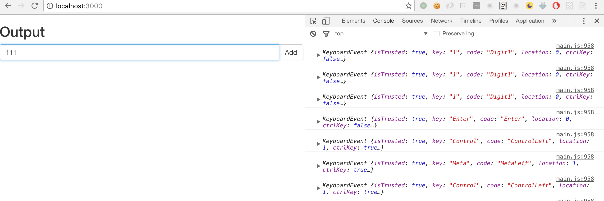
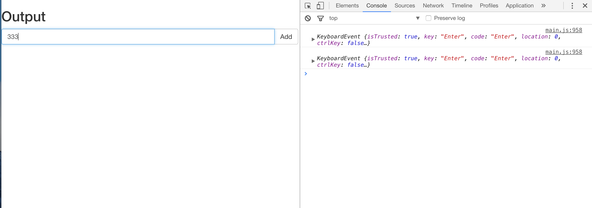
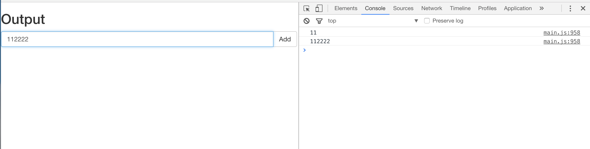
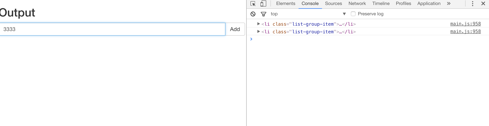
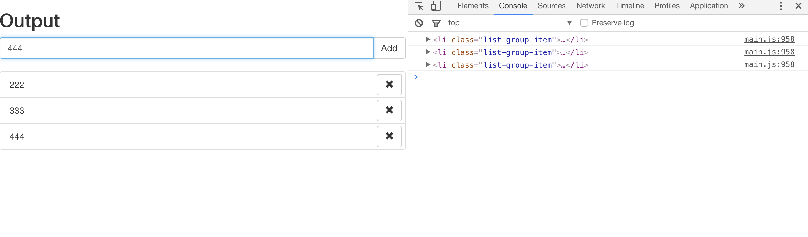
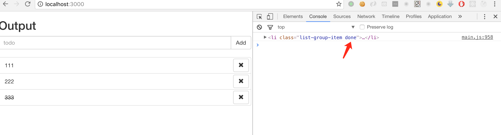
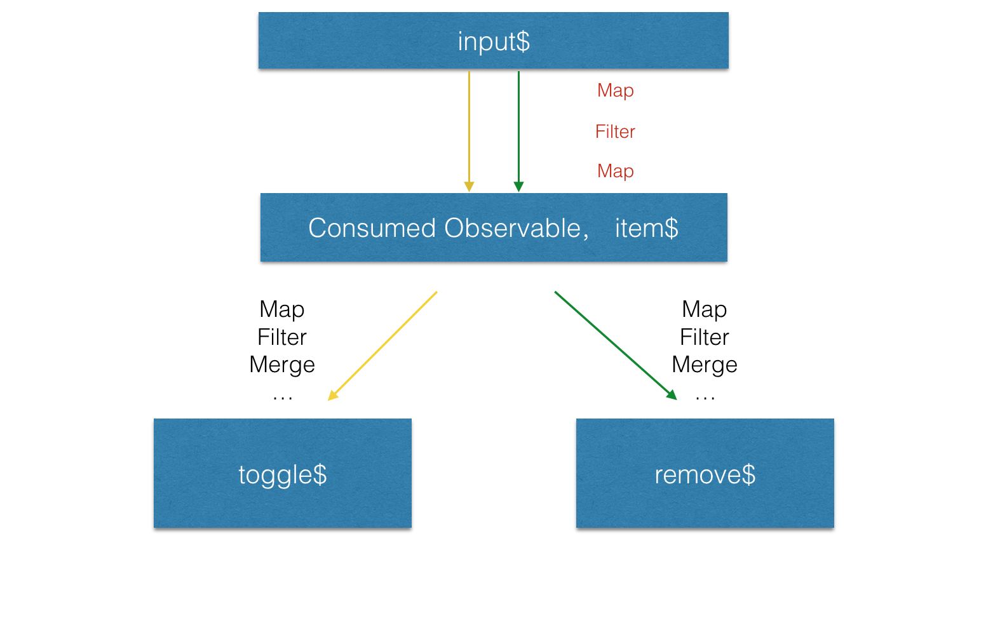
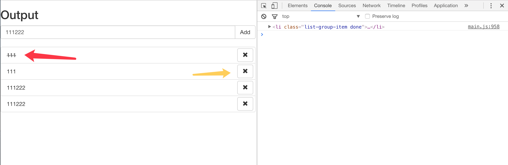
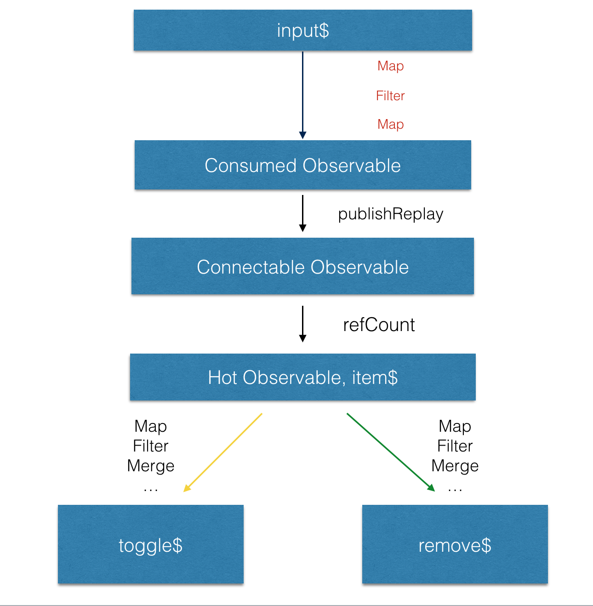

> This is the first article in a series introducing RxJS. The series will start with a small example and progressively dive deeper into how RxJS is used in various scenarios. Along the way, we'll also cover different RxJS operators (if I can keep it up without abandoning the series). This article uses a Todo list as an example to demonstrate how RxJS composes synchronous and asynchronous logic. If you're encountering RxJS for the first time, you might feel overwhelmed by all the operators and combinations — but don't worry. The goal of this article is simply to give you a feel for how RxJS works in familiar business scenarios. More detailed explanations will follow in subsequent articles.

<!--more-->

## Getting Started

First, clone the seed project from [learning-rxjs](https://github.com/Brooooooklyn/learning-rxjs). All RxJS-related code in this article will be written in TypeScript.

Start the seed project with `npm start `. In this article, we'll implement the following features:

1. Type in the input field and press Enter to turn the text into a todo item, clearing the input field at the same time.
2. Type in the input field and click the add button to turn the text into a todo item, clearing the input field at the same time.
3. Click on a todo item to toggle it to a completed state.
4. Click the remove button on the right side of a todo item to remove it from the todo list.

## Your First Observable

To respond to the `user pressing Enter` action, we first need to capture the user's input stream. In RxJS, you can use the `fromEvent` operator to directly convert an `eventListener` into an `Observable`:

```ts
import { Observable } from 'rxjs'

const $input = <HTMLInputElement>document.querySelector('.todo-val')

const input$ = Observable.fromEvent<KeyboardEvent>($input, 'keydown')
  // The do operator is typically used to handle side effects in the stream, such as DOM manipulation, modifying external variables, or logging
  .do((e) => console.log(e))

const app$ = input$

app$.subscribe()
```

Now you can see in the console that each user keystroke produces a corresponding event flowing through the input\$ Observable.



## Filtering Data with filter

We don't care about every key the user presses — we only need to capture the `Enter` key and respond to it. All we need to do is `filter` this Observable:

```ts
import { Observable } from 'rxjs'

const $input = <HTMLInputElement>document.querySelector('.todo-val')

const input$ = Observable.fromEvent<KeyboardEvent>($input, 'keydown')
  .filter((r) => r.keyCode === 13)
  .do((r) => console.log(r))

const app$ = input$

app$.subscribe()
```



## Transforming Data with map

To accomplish `turning the input text into a todo item when Enter is pressed`, we need to get the value from the input and transform it into a todo-item node. This is a classic `map` operation:
Think of it like Array's map: [ ... KeyboardEvent ] => [... HTMLElement ]
First, when Enter is pressed, we map the `KeyboardEvent` to a `string`, then filter out empty values.

```ts
import { Observable } from 'rxjs'

const $input = <HTMLInputElement>document.querySelector('.todo-val')

const input$ = Observable.fromEvent<KeyboardEvent>($input, 'keydown').filter(
  (r) => r.keyCode === 13,
)

const app$ = input$
  .map(() => $input.value)
  .filter((r) => r !== '')
  .do((r) => console.log(r))

app$.subscribe()
```



Now let's add a createTodoItem helper:

```ts
// lib.ts
export const createTodoItem = (val: string) => {
  const result = <HTMLLIElement>document.createElement('LI')
  result.classList.add('list-group-item')
  const innerHTML = `
    ${val}
    <button type="button" class="btn btn-default" aria-label="right Align">
      <span class="glyphicon glyphicon-remove" aria-hidden="true"></span>
    </button>
  `
  result.innerHTML = innerHTML
  return result
}
```

```ts
// app.ts
import { Observable } from 'rxjs'
import { createTodoItem } from './lib'

const $input = <HTMLInputElement>document.querySelector('.todo-val')

const input$ = Observable.fromEvent<KeyboardEvent>($input, 'keydown').filter(
  (r) => r.keyCode === 13,
)

const app$ = input$
  .map(() => $input.value)
  .filter((r) => r !== '')
  .map(createTodoItem)
  .do((r) => console.log(r))

app$.subscribe()
```



Now let's insert the mapped nodes into the DOM. As a side note, in the RxJS paradigm, all `side effects` during data flow should be placed inside the `do` operator.

```ts
import { Observable } from 'rxjs'
import { createTodoItem } from './lib'

const $input = <HTMLInputElement>document.querySelector('.todo-val')
const $list = <HTMLUListElement>document.querySelector('.list-group')

const input$ = Observable.fromEvent<KeyboardEvent>($input, 'keydown')
  .filter((r) => r.keyCode === 13)
  .map(() => $input.value)

const app$ = input$
  .filter((r) => r !== '')
  .map(createTodoItem)
  .do((ele: HTMLLIElement) => {
    $list.appendChild(ele)
  })
  .do((r) => console.log(r))

app$.subscribe()
```

At this point, we can already turn input strings into individual items:


Next, let's implement the `click the add button to add a todo item` feature. As you can see, programmatically this operation requires the same follow-up logic as pressing Enter. So all we need to do is turn the add button click event into an `Observable` and `merge` it with the `Enter key` `Observable`:

```ts
import { Observable } from 'rxjs'
import { createTodoItem } from './lib'

const $input = <HTMLInputElement>document.querySelector('.todo-val')
const $list = <HTMLUListElement>document.querySelector('.list-group')
const $add = document.querySelector('.button-add')

const enter$ = Observable.fromEvent<KeyboardEvent>($input, 'keydown').filter(
  (r) => r.keyCode === 13,
)

const clickAdd$ = Observable.fromEvent<MouseEvent>($add, 'click')

const input$ = enter$.merge(clickAdd$)

const app$ = input$
  .map(() => $input.value)
  .filter((r) => r !== '')
  .map(createTodoItem)
  .do((ele: HTMLLIElement) => {
    $list.appendChild(ele)
  })
  .do((r) => console.log(r))

app$.subscribe()
```

Next, clear the input value inside the `do` operator:

```ts
...
  .do((ele: HTMLLIElement) => {
    $list.appendChild(ele)
    $input.value = ''
  })
...
```

## Using mergeMap to Map from One Observable to Another

After creating these items, we need to attach their own event listeners to implement the **click a todo item to toggle its completed state** feature. The new eventListeners can only be added after these items are created. So the process is `Observable<HTMLElement>` => `map` => `Observable<MouseEvent>` => `merge`. In RxJS, there's an operator that accomplishes this map-and-merge in a single step:

```ts
import { Observable } from 'rxjs'
import { createTodoItem } from './lib'

const $input = <HTMLInputElement>document.querySelector('.todo-val')
const $list = <HTMLUListElement>document.querySelector('.list-group')
const $add = document.querySelector('.button-add')

const enter$ = Observable.fromEvent<KeyboardEvent>($input, 'keydown').filter(
  (r) => r.keyCode === 13,
)

const clickAdd$ = Observable.fromEvent<MouseEvent>($add, 'click')

const input$ = enter$.merge(clickAdd$)

const app$ = input$
  .map(() => $input.value)
  .filter((r) => r !== '')
  .map(createTodoItem)
  .do((ele: HTMLLIElement) => {
    $list.appendChild(ele)
    $input.value = ''
  })
  .mergeMap(($todoItem) => {
    return Observable.fromEvent<MouseEvent>($todoItem, 'click')
      .filter((e) => e.target === $todoItem)
      .mapTo($todoItem)
  })
  .do(($todoItem: HTMLElement) => {
    if ($todoItem.classList.contains('done')) {
      $todoItem.classList.remove('done')
    } else {
      $todoItem.classList.add('done')
    }
  })
  .do((r) => console.log(r))

app$.subscribe()
```



> Since the todoItem also contains other functional buttons (like the remove button), we use filter inside the mergeMap to filter out click events on non-li elements. Also, since the next do operator needs to consume the \$todoItem object, we use mapTo after the filter to pass it along.

## Mapping from One Observable to Multiple Observables: share/publish It, Then Operate on It

To implement clicking the remove button to remove the current todoItem, we need to `mergeMap` a new remove$ stream from the item$ Observable:

```ts
import { Observable } from 'rxjs'
import { createTodoItem } from './lib'

const $input = <HTMLInputElement>document.querySelector('.todo-val')
const $list = <HTMLUListElement>document.querySelector('.list-group')
const $add = document.querySelector('.button-add')

const enter$ = Observable.fromEvent<KeyboardEvent>($input, 'keydown').filter(
  (r) => r.keyCode === 13,
)

const clickAdd$ = Observable.fromEvent<MouseEvent>($add, 'click')

const input$ = enter$.merge(clickAdd$)

const item$ = input$
  .map(() => $input.value)
  .filter((r) => r !== '')
  .map(createTodoItem)
  .do((ele: HTMLLIElement) => {
    $list.appendChild(ele)
    $input.value = ''
  })

const toggle$ = item$
  .mergeMap(($todoItem) => {
    return Observable.fromEvent<MouseEvent>($todoItem, 'click')
      .filter((e) => e.target === $todoItem)
      .mapTo($todoItem)
  })
  .do(($todoItem: HTMLElement) => {
    if ($todoItem.classList.contains('done')) {
      $todoItem.classList.remove('done')
    } else {
      $todoItem.classList.add('done')
    }
  })

const remove$ = item$
  .mergeMap(($todoItem) => {
    const $removeButton = $todoItem.querySelector('.button-remove')
    return Observable.fromEvent($removeButton, 'click').mapTo($todoItem)
  })
  .do(($todoItem: HTMLElement) => {
    // Remove the todo item from the DOM
    const $parent = $todoItem.parentNode
    $parent.removeChild($todoItem)
  })

const app$ = toggle$.merge(remove$).do((r) => console.log(r))

app$.subscribe()
```

However, this code doesn't work as expected — nothing happens when the remove button is clicked.
This is because:
**Observables are lazy and unicast by default, which means:**

1. They only execute when subscribed to.
2. When subscribed to by multiple subscribers, they execute multiple times, each with an independent execution context.

In other words, our `remove$` Observable causes the logic in the item\$ stream to execute all over again:



In the diagram above, the toggle$ Observable first subscribes and executes the yellow arrow path, while the remove$ Observable subscribes and re-executes the green path. But by that time, input\$ is no longer emitting any data.

Think about it this way: first the toggle$ Observable subscribes, then the remove$ Observable subscribes. Because these two subscriptions cause the $item Observable to be subscribed to *twice*, the addEventListener logic for the input and add button is executed *twice*. When Enter is pressed or the add button is clicked, the first item$ Observable subscription executes first, adding a todoItem to the DOM and clearing the input. Then the second item$ Observable subscription executes, but the input is already empty, so no data flows through this item$ Observable. This is why our code doesn't work as expected. To verify this hypothesis, we can simply comment out `$input.value = ''` in the do operator of the \$item Observable to observe the program's actual behavior more clearly:



In the diagram, the yellow arrows show the result of the toggle$ Observable's subscription logic — this todoItem node only handles toggle logic. The green arrows show the result of the remove$ Observable's subscription logic — this todoItem node only handles remove logic.

The fix is actually quite simple. We don't want the item\$ Observable's logic to re-execute on every subscription, so we just need to:

```ts
const item$ = input$
  .map(() => $input.value)
  .filter((r) => r !== '')
  .map(createTodoItem)
  .do((ele: HTMLLIElement) => {
    $list.appendChild(ele)
    $input.value = ''
  })
  .publishReplay(1)
  .refCount()
```

At this point, `item$` looks like this:



> The concepts of `hot` vs `cold` Observables, `Subject` vs `Observable`, why we use `publishReplay` here, and why the argument is 1, will be explained in depth in later chapters. For now, we just need to understand this behavior.

With that, we've implemented all four requirements of a simple todoList using RxJS. In the next article, we'll cover how to integrate network requests, WebSocket events, and other asynchronous sources into this kind of business logic with RxJS.
