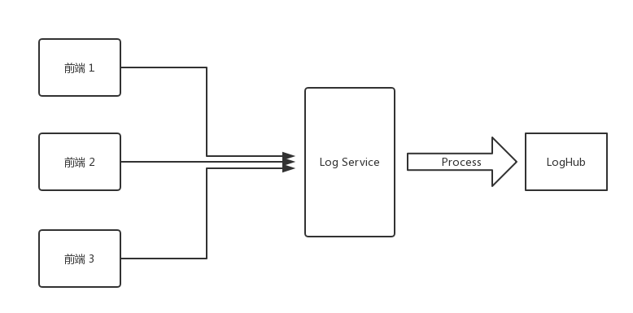
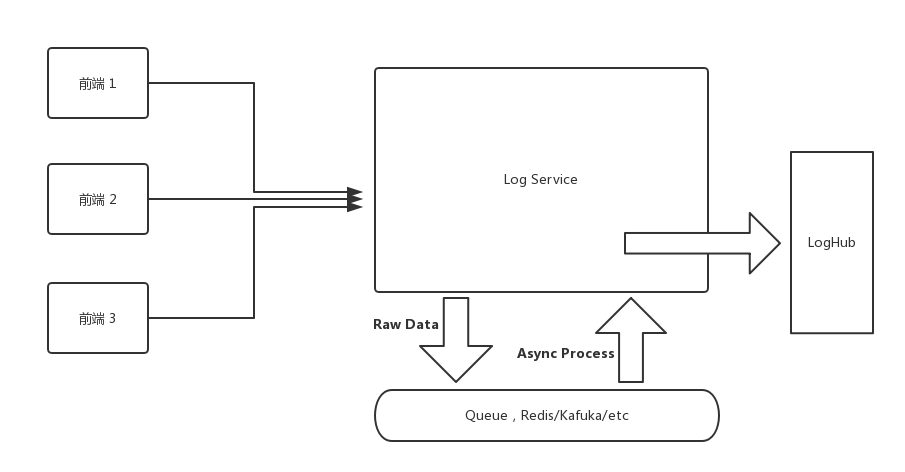

> https://github.com/Brooooooklyn/sourcemap-decoder

<!--more-->

## Intro

A while ago, I set up a Log Service at work to record frontend error information. After hacking away at the code, I got the first version up and running.

The flow is straightforward: the frontend sends error information in the following format to the Log Service via a GET request:

```json
{
  "url": "https://www.arkie.cn/scenarios",
  "channel": "frontend",
  "level": "FATAL",
  "crashId": "02x32f3",
  "stack": "base64 string ......",
  ...
}
```

Once the Log Service receives this request, it parses the **Stack** into JSON:

```js
JSON.parse(decodeURIComponent(Buffer.from(query.stack, 'base64').toString()))
```

The parsed stack looks like this:

```json
[
  {
    "filename": "https://arkie-public.oss-cn-hangzhou.aliyuncs.com/js/main.c3600f3f.js",
    "line": 1,
    "column": 334222
  },
  {
    "filename": "https://arkie-public.oss-cn-hangzhou.aliyuncs.com/js/common.752d2f13.js",
    "line": 1,
    "column": 113242
  }
]
```

Then the Log Service resolves the original error locations using the corresponding sourcemaps (which are uploaded to a private CDN during each frontend project's deployment). For example:

```js
{
  filename: './src/modules/design/design.container.tsx',
  line: 102
}
```

Finally, the processed information is sent to Alibaba Cloud's LogHub.



## Optimization

After finishing the first fragile version, I realized only a day and a half had passed, so I started thinking about optimizations.

The first version had two problems. First, the log processing pipeline on the backend was too long, resulting in significant performance overhead. Second, processing logs in real-time would overwhelm the server as the user base grows -- and in reality, the Log Service doesn't require that level of real-time responsiveness.

For the first problem, the solution could be optimizing code performance (yeah, right) or splitting the processing into steps (now that's realistic). The second problem can also be addressed by splitting the data processing steps.

The solution of splitting processing steps can be achieved by introducing a queue into the Log Service. For instance, when a frontend request comes in, we push the raw data directly into the queue. Then a consumer pulls raw logs from the queue at a maximum rate, processes them, and pushes the results into LogHub. I'll spare you the details on this part -- it could easily be a whole article on its own.



As for performance optimization, I didn't have high hopes initially, since there didn't seem to be much room for improvement. `base64 decode` --> `JSON.parse` --> `sourcemap parse` -- all of these use the most fundamental standard library calls (`sourcemap parse` uses Mozilla's https://github.com/mozilla/source-map).

However, just before going live, I suddenly remembered a library I had come across while learning Rust: [neon-bindings](https://github.com/neon-bindings/neon).

## Rust! Rust!

Could we use a faster language to optimize the Sourcemap processing, while keeping most of the main business logic in TypeScript?

After some research, I found that companies in China were already using neon in production: https://www.zhihu.com/question/19903210/answer/207779913

Moreover, the well-known [sentry](https://sentry.io/welcome/) also uses `Rust` to parse Sourcemaps in production: https://segmentfault.com/a/1190000007299177. Although they bind it to Python, they've open-sourced the Rust code: https://github.com/getsentry/rust-sourcemap

This means I just need to wrap the `Rust` code into a Node.js-callable module using neon-bindings -- unlike sentry, which has to port out a C API and then call C code from Python. Sweet.

I'll skip the coding process and the underlying principles. You can check out the code at: https://github.com/Brooooooklyn/sourcemap-decoder. Here I'll mainly share some data and pitfalls I encountered:

#### Benchmark

So how much faster is Rust compared to JavaScript when parsing the same Sourcemap?

I ran a simple benchmark, and the results are as follows:

```bash
$ node benchmark

JavaScript parse time 50794 microseconds

Rust parse time: 39 microseconds

JavaScript parse result, Source: webpack:///src/utils/logger/logger.ts, Line: 56

Rust parse result, Source: webpack:///./src/utils/logger/logger.ts, Line: 56

✨  Done in 0.33s.

```

##### Hardware Info:

```bash
ProductName:    Mac OS X
ProductVersion: 10.13.3
BuildVersion:   17D47
Model Name: MacBook Pro
Model Identifier: MacBookPro14,2
Processor Name: Intel Core i5
Processor Speed: 3.1 GHz
Number of Processors: 1
Total Number of Cores: 2
L2 Cache (per Core): 256 KB
L3 Cache: 4 MB
Memory: 16 GB
```

Benchmark code: https://github.com/Brooooooklyn/sourcemap-decoder/blob/master/benchmark/index.js

Since each call to Rust code involves a bootstrap overhead, and JavaScript code gets JIT-optimized after many runs, the gap might narrow to around ten-fold when running tens of thousands of iterations. Feel free to try it yourself if you're interested.

#### `CI/CD`

When I was about to deploy, I wanted to keep the production image as small as possible (we use Docker). So I used `node:8-alpine` as the base image for the production image, and used the same base image for the CI image (we use Gitlab runner's Docker executor). After spending over three hours trying to install the latest Rust toolchains on Alpine and failing, I reluctantly switched to `node:8-slim`, accepting the extra 100+ MB in image size. The final Dockerfile that builds smoothly in China can be found at: https://github.com/Brooooooklyn/sourcemap-decoder/blob/master/Dockerfile

#### `Toolchains` Installation

For well-known reasons (the Great Firewall), the CI image build was painfully slow at first, until it timed out and got killed by Gitlab. After over an hour of determined effort, I replaced all steps that could hit the wall with USTC mirrors.

For installing rustup on the dev machine:

```bash
curl https://sh.rustup.rs -sSf | sed "s/https:\/\/static.rust-lang.org\/rustup\/dist/https:\/\/mirrors.ustc.edu.cn\/rust-static\/rustup\/dist/g" | sh
```

This installs Rustup using the USTC mirror.

Before building:

```bash
cat > $HOME/.cargo/config << EOF
[source.crates-io]
registry = "https://github.com/rust-lang/crates.io-index"
replace-with = 'ustc'
[source.ustc]
registry = "git://mirrors.ustc.edu.cn/crates.io-index"
EOF
```

This configures Cargo to also use the USTC mirror (the same commands need to be run in the CI environment as well).

When building the Docker image in CI, you need to [replace the Rust download source](https://github.com/Brooooooklyn/sourcemap-decoder/blob/master/Dockerfile#L30) and [replace the Rustup source](https://github.com/Brooooooklyn/sourcemap-decoder/blob/master/Dockerfile#L34-L35).

For more details, please refer to the [README](https://github.com/Brooooooklyn/sourcemap-decoder/blob/master/README.md).
