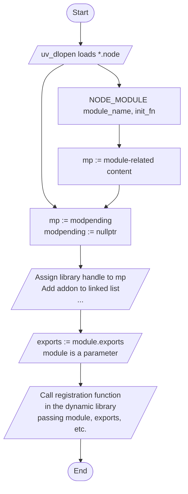
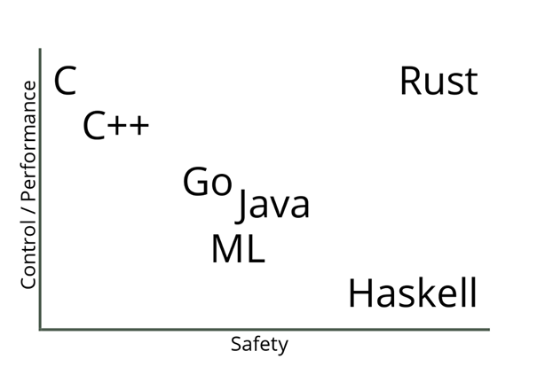
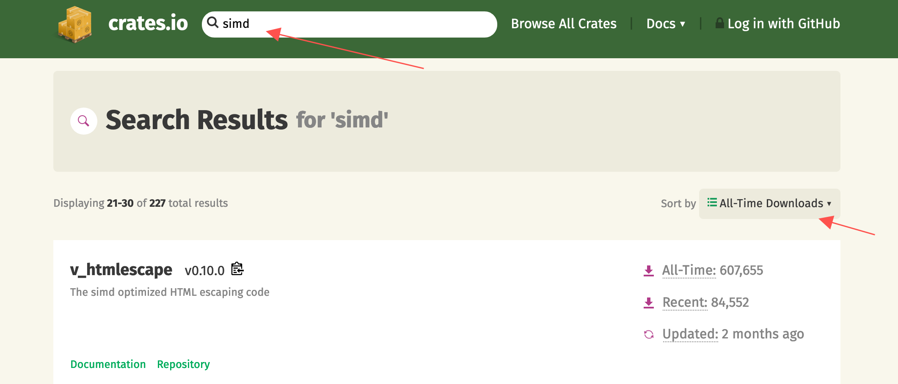

## Node.js Native Addons, Past and Present

Throughout the history of Node.js, native addons have always been a niche but important area. Whether you're a frontend engineer or a Node.js developer, you likely depend on some native addons to some extent. Common ones in the frontend world include `node-sass`, `node-canvas`, `sharp`, and others. On the backend side there are even more, such as `protobuf`, `bcrypt`, `crc32`, etc.

Native addons can do things that JavaScript cannot, such as calling system libraries, opening a window, or invoking GPU instructions.

Beyond that, since native code (C/C++/Rust/Nim/D, etc.) has significant performance advantages over `JavaScript`, native addons are often used for CPU-intensive tasks. For example, blockchain and cryptocurrency projects frequently provide Node.js npm packages as their public API, while all the underlying computational logic is implemented in C++.

### The Nature of Native Modules

> Most of the content in this section comes from [From Brute Force to NAN to NAPI — The Evolution of Node.js Native Module Development](https://xcoder.in/2017/07/01/nodejs-addon-history/)

- `.node` files
- Are binary files
- Are dynamic libraries (Windows `dll`/Linux `so`/Unix `dylib`)

Node.js exposes an ABI to the native addon development side:

> ABI: In [computer software](https://en.wikipedia.org/wiki/Computer_software), an **application binary interface** (**ABI**) is an [interface](<https://en.wikipedia.org/wiki/Interface_(computing)>) between two binary program modules

Below is the code from the Node.js source that loads native addons:

```cpp
void DLOpen(const FunctionCallbackInfo<Value>& args) {
  Environment* env = Environment::GetCurrent(args);
  uv_lib_t lib;

  ...

  Local<Object> module = args[0]->ToObject(env->isolate());
  node::Utf8Value filename(env->isolate(), args[1]);

  // Use uv_dlopen to load the dynamic library
  const bool is_dlopen_error = uv_dlopen(*filename, &lib);
  node_module* const mp = modpending;
  modpending = nullptr;

  ...

  // Transfer the loaded library handle to mp
  mp->nm_dso_handle = lib.handle;
  mp->nm_link = modlist_addon;
  modlist_addon = mp;

  Local<String> exports_string = env->exports_string();

  // exports_string is actually `"exports"`
  // This line means `exports = module.exports`
  Local<Object> exports = module->Get(exports_string)->ToObject(env->isolate());

  if (mp->nm_context_register_func != nullptr) {
    mp->nm_context_register_func(exports, module, env->context(), mp->nm_priv);
  } else if (mp->nm_register_func != nullptr) {
    mp->nm_register_func(exports, module, mp->nm_priv);
  } else {
    uv_dlclose(&lib);
    env->ThrowError("Module has no declared entry point.");
    return;
  }
}
```



#### The Ancient Era

Directly include `v8` and `libuv` related `.h` files and compile. The `v8` `API` changes very rapidly, which meant native addons built this way could not work across different Node versions.

#### NAN

> Native Abstractions for Node.js

NAN wrapped the `v8/libuv` related APIs and provided a stable abstraction layer API (though it could not guarantee ABI stability). Native addons built with `NAN` were nearly impossible to distribute as prebuilt binaries, because when the underlying `v8/libuv` APIs changed across Node versions, the source code had to be recompiled. This is why many native addons need to invoke a whole toolchain for local compilation after `npm install`, and why sometimes upgrading your Node version would break previously installed `node_modules`.

#### N-API

Since the release of Node.js v8.0.0, Node.js introduced a brand new interface for developing C++ native modules: N-API. In essence, it moved the abstraction layer that `NAN` provided into the `node` source code itself, compiling this abstraction during the Node build process. This way, N-API provides a stable ABI to consumers.

N-API has been available for a while now, and many native addons in the community have gradually migrated to it, such as [bcrypt](https://github.com/kelektiv/node.bcrypt.js) and [sse4_crc32](https://github.com/anandsuresh/sse4_crc32). N-API addresses the most painful issue of [nan](https://github.com/nodejs/nan): **ABI incompatibility across V8 versions**.

However, even after migrating to N-API, writing native addons still comes with some pain points beyond just writing code.

### Distribution Challenges

Currently, mainstream native addons are distributed in the following ways:

#### 1. Distributing Source Code

Users need to install build tools like `node-gyp`, `cmake`, `g++`, etc. on their own. During development this isn't a big deal, but with the rise of `Docker`, installing a whole compilation toolchain in specific `Docker` environments has become a nightmare for many teams. If not handled properly, it also bloats the `Docker image` size unnecessarily (this can technically be solved by compiling in a dedicated Builder image before building the final Docker image, but in my experience across various companies, very few teams actually do this).

#### 2. Distribute Only JavaScript Code, Download Binaries via postinstall

Some native addons have such complex build dependencies that it's unrealistic to expect regular Node developers to install the full compilation toolchain during development. Another scenario is when the native addon itself is so complex that compilation takes a very long time — no library author wants their users to spend half an hour just on installation.

So another popular approach is to use `CI` tools to **_precompile_** the native addon across platforms (win32/darwin/linux), distribute only the JavaScript code, and download the precompiled addon files from a CDN via a `postinstall` script. For example, [node-pre-gyp](https://github.com/mapbox/node-pre-gyp) is a popular community tool for this purpose. It automatically uploads native addons compiled in `CI` to a specified location, then downloads them during installation.

This distribution method seems bulletproof, but it actually has several unavoidable issues:

- Tools like `node-pre-gyp` add many **runtime-irrelevant** dependencies to your project.
- No matter which CDN you upload to, it's hard to serve both domestic (China) and international users well. Remember being stuck at `postinstall` for an hour waiting to download a file from some GitHub release, only to have it fail? While setting up a binary mirror domestically can partially alleviate this, mirrors being out of sync or missing files is a common occurrence.
- Unfriendly to private networks. Many companies' CI/CD machines can't access the public internet (they typically have private NPM registries — if they don't, there's no point discussing it), let alone download native addons from some CDN.

#### 3. Distribute Native Addons for Different Platforms via Separate npm Packages

The recently popular next-generation build tool [esbuild](https://github.com/evanw/esbuild) uses this approach. Each native addon corresponds to an npm package, and the appropriate platform-specific native addon package is installed via a `postinstall` script.

Another approach is to list all native packages as `optionalDependencies` in the user-facing package, and use the `os` and `cpu` fields in `package.json` to let `npm/yarn/pnpm` **automatically select (by failing to install non-matching ones)** which native package to install. For example:

```json
{
  "name": "@node-rs/bcrypt",
  "version": "0.5.0",
  "os": ["linux", "win32", "darwin"],
  "cpu": ["x64"],
  "optionalDependencies": {
    "@node-rs/bcrypt-darwin": "^0.5.0",
    "@node-rs/bcrypt-linux": "^0.5.0",
    "@node-rs/bcrypt-win32": "^0.5.0"
  }
}
```

```json
{
  "name": "@node-rs/bcrypt-darwin",
  "version": "0.5.0",
  "os": ["darwin"],
  "cpu": ["x64"]
}
```

```json
{
  "name": "@node-rs/bcrypt-linux",
  "version": "0.5.0",
  "os": ["linux"],
  "cpu": ["x64"]
}
```

```json
{
  "name": "@node-rs/bcrypt-win32",
  "version": "0.5.0",
  "os": ["win32"],
  "cpu": ["x64"]
}
```

This approach causes the least disruption to native addon users. [@ffmpeg-installer/ffmpeg](https://github.com/kribblo/node-ffmpeg-installer#readme) uses this method.

However, this approach creates additional work for native addon authors, including writing tools to manage release binaries and a bunch of packages. These tools are generally very hard to debug (they typically span multiple operating systems and CPU architectures).

These tools need to manage the entire addon lifecycle from development -> local release versioning -> CI -> artifacts -> deployment. On top of that, you need to write and debug extensive CI/CD configurations, all of which is very time-consuming and labor-intensive.

### Ecosystem and Toolchain

Currently, most Node.js addons are developed in C/C++. The C/C++ ecosystem is very mature — you can find a C/C++ library for virtually anything you want to do. However, due to the lack of a unified build toolchain and package manager, using these third-party libraries in practice comes with its own set of problems:

- Compiling libraries that use different build toolchains can be extremely difficult. For example, over the past few years I've been trying to wrap skia into a Node.js binding, but skia's compilation is... indescribably complex, so I've been running into one issue after another.
- Without a good package manager, much high-quality C/C++ code exists as part of a larger project rather than as a standalone library. In such cases, the only option might be to copy the code: [bcrypt.cc](https://github.com/kelektiv/node.bcrypt.js/blob/master/src/bcrypt.cc), which creates issues for long-term maintenance and upgrades.

## When Rust Met N-API



- Zero-cost abstractions
- Memory safety
- Practical

Since its inception, Rust has been rapidly adopted by many commercial companies:

- Amazon uses Rust as a build tool.
- Atlassian uses Rust on the backend.
- Dropbox uses Rust on both frontend and backend.
- Facebook rewrote its source control tool in Rust.
- Google uses Rust in the Fuchsia project.
- Microsoft partially uses Rust in Azure IoT networking.
- npm uses Rust in its core services.
- RedHat created a new storage system using Rust.
- Reddit uses Rust for comment processing.
- Twitter uses Rust in its build team.

Replacing `C/C++` with `Rust` seems like an excellent choice. Rust has a modern package manager: `Cargo`. After years of development, it has accumulated significant momentum in areas that overlap with `Node.js`, such as **server-side development**, **cross-platform CLI tools**, and **cross-platform GUI** (Electron). Compared to the `C/C++` ecosystem, packages in the `Rust` ecosystem are in a state of **_if it exists, you can use it directly_**, while third-party code in the `C/C++` ecosystem is more like **_it definitely exists, but you might not be able to use it directly_**. In this context, developing Node addons with `Rust` means fewer choices, but also fewer headaches from making those choices.

Before officially committing to developing `Node.js` addons with `Rust` + `N-API`, there are a few topics worth discussing:

### Rust Bindings for N-API

The Node.js team provides header files for N-API, which are needed when developing Node addons. However, `Rust` cannot directly use C header files, so we need to first wrap the APIs exposed by `node.h` into `Rust bindings` that Rust can use.

In the `Rust` ecosystem, the officially maintained [bindgen](https://github.com/rust-lang/rust-bindgen) can automatically generate `Rust bindings` from header files. This tool works very well for pure C API headers like `node.h` — C++ APIs would be much more complex.

However, the `Rust bindings` generated this way are typically `unsafe` and full of low-level pointer operations, which is clearly not conducive to building native addons on top of them, nor does it let us enjoy the many benefits of `Safe Rust`.

In the short-lived [xray](https://github.com/atom-archive/xray) project, the original editor architecture was not the later `LSP`-like `Client/Server` architecture, but rather `Node.js` directly calling Rust-written addons. So in its early days, xray had a very rough `Rust N-API` implementation.

A few years ago, I recovered this code from the `Git` history of the xray project, then wrapped and improved it: [napi-rs](https://github.com/napi-rs/napi-rs). It wraps most commonly used N-API interfaces into `Safe Rust` interfaces with comprehensive unit tests, serving as a crucial foundation for writing native addons in `Rust`.

### What Can You Do with `Rust`

When we write a native addon, we obviously want to speed up some computations. However, this speedup doesn't come for free.


Native code (C/C++/Rust) is significantly faster than JS in pure computation scenarios, but once you use `N-API` to interact with Node's JS engine, there is substantial overhead (relative to computation).

For example, setting a property on an object in JS is several times faster than setting an object property in native code using `N-API`:

```js
const obj = {}
obj.a = 1
```

```rust
let mut result = env.create_object()?;
result.set_named_property("code", env.create_uint32(1)?)?;
Ok(result)
```

So when building a native addon, we should minimize `N-API` calls as much as possible, otherwise the runtime savings from native logic will be entirely eaten up by `N-API` call overhead.

> There are too many performance pitfalls to be aware of when using `N-API` to cover here. I may write a series of articles in the future about how to choose the optimal way to call `N-API` for better performance across various use cases.

However, some `N-API` calls are unavoidable, such as extracting native values from JS argument values, or converting native values back to JS values for the return:

```rust
#[js_function(1)] // -> arguments length
fn add_one(ctx: CallContext) -> Result<JsNumber> {
  let input: JsNumber = ctx.get(0)?; // get first argument
  let input_number: u32 = input.try_into()?; // get u32 value from JsNumber, call  `napi_get_value_uint32` under the hood
  ctx.env.create_u32(input_number + 1) // convert u32 to JsNumber, call `napi_create_uint32` under the hood
}
```

So a typical native addon requires at least two `N-API` calls (even returning `undefined` requires calling `napi_get_undefined`). When you're planning to write a native addon, you should always consider whether the speedup from native code can offset the overhead of those `N-API` calls. An `add_one` method like the example above would definitely be much slower than the JS version. There's a project on GitHub that benchmarks the typical `N-API` call overhead across different wrapping approaches: [rust-node-perf](https://github.com/jdsaund/rust-node-perf).

Here we can roughly assume that the `a + b` operation takes approximately the same execution time for pure `JS` and `native` code:

| Framework                 | Relative Exec Time | Effort |
| ------------------------- | ------------------ | ------ |
| node.js                   | 1                  | n/a    |
| wasm-pack (nodejs target) | 1.5386953312994696 | low    |
| rust-addon                | 2.563630295032209  | high   |
| napi-rs                   | 3.1991337066589773 | mid    |
| neon                      | 13.342197321199631 | mid    |
| node-bindgen              | 13.606728128895583 | low    |

As you can see, `napi-rs` is over 3 times slower than plain `JavaScript`.

This is also why, despite everyone knowing that native addons are much faster than pure JavaScript, few people use them extensively in their projects. Given the overhead of `N-API` calls and the fact that the `v8` engine is already very fast, most **pure computation** scenarios are not suitable for replacing JS with native addons. You can even find cases where replacing a native module with JavaScript resulted in dramatic performance improvements: https://github.com/capnproto/node-capnp#this-implementation-is-slow

Another example from my early days of wrapping addons with `N-API` was a failed attempt: [@node-rs/simd-json](https://github.com/napi-rs/node-rs/tree/simd-json). I wrapped simd-json as a native addon, hoping to get a faster API than Node's built-in `JSON.parse`. But in practice, while the native parse portion was blazingly fast, the time spent on `N-API` calls to convert the `native struct` into a `Js Object` was orders of magnitude greater than the time to parse a JSON string.

An existing SIMD JSON port has the same issue: [simdjson_nodejs#5](https://github.com/luizperes/simdjson_nodejs/issues/5)

So what kinds of functionality are actually well-suited for native addons?

- Computation with simple inputs/outputs but complex intermediate logic, such as [@node-rs/crc32](https://github.com/napi-rs/node-rs/tree/master/packages/crc32) which directly uses CPU SIMD instructions, encryption algorithms like [@node-rs/bcrypt](https://github.com/napi-rs/node-rs/tree/master/packages/bcrypt), or Chinese word segmentation like [@node-rs/jieba](https://github.com/napi-rs/node-rs/tree/master/packages/jieba). These libraries all share a common trait: simple inputs and outputs (avoiding extra `N-API` calls) with very complex intermediate computation.
- Libraries that need to call system-level APIs, such as the `SIMD` instructions mentioned above, or `GPU` calls, etc.

So let's head to [crates.io](https://crates.io/) to find a simple library with SIMD support and wrap it into a Node native addon, to demonstrate how to happily use `Rust` + `N-API` to build high-performance and practical utility libraries.

### Choosing a Distribution Method

`Rust` is notoriously slow to compile, so distributing source code is clearly impractical, and it's also unreasonable to require every user to install the full `Rust` toolchain.

Using `postinstall` downloads is a relatively simple but extremely user-unfriendly approach that I don't think should be promoted anymore.

So for `Node.js native addons` written in `Rust`, our best option is to use the **_per-platform addon distribution_** approach.

In the [napi-rs](https://github.com/napi-rs/napi-rs) project, I've built simple `CLI` tools to help developers using `napi-rs` manage the entire workflow from local development to `CI` publishing. Let's walk through a simple yet practical example of how to develop, test, and publish a Node.js native addon using `Rust` and `napi-rs`.

### `@napi-rs/fast-escape`

Link first: https://github.com/napi-rs/fast-escape



I searched for `SIMD` on `crates.io`, sorted by all-time downloads, and looked through the popular libraries that use `SIMD` technology. The first two pages of libraries were either **already wrapped by me (runs away)**, had inputs/outputs too complex for wrapping, or already had existing Node stdlib equivalents. On the third page, I spotted `v_htmlescape`, which looked perfect for an `N-API` use case:

- It uses SIMD technology, significantly accelerating the computation
- Simple input/output — one string in, one string out — without too many `N-API` calls eating into performance

We create a new project from the [package-template](https://github.com/napi-rs/package-template) template. The package-template already has all the dependencies, CI configurations, and commands set up, so you can just start writing code in `src/lib.rs`:

```rust
#[macro_use]
extern crate napi;
#[macro_use]
extern crate napi_derive;

use napi::{CallContext, Env, JsString, Module, Result};
use v_htmlescape::escape; // import

register_module!(escape, init);

#[module_exports]
fn init(mut exports: JsObject) -> Result<()> {
  exports.create_named_method("escapeHTML", escape_html)?;
  Ok(())
}

#[js_function(1)]
fn escape_html(ctx: CallContext) -> Result<JsString> {
  let input = ctx.get::<JsString>(0)?;

  return ctx
    .env
    .create_string_from_std(escape(input.as_str()?).to_string());
}
```

This is the minimal working native addon code. It consists of two parts:

1. The `init` function decorated by the `module_exports` macro takes two parameters. The first is `exports`, representing the `module.exports` object in Node.js — we can set what we want to export through the `exports` object, and there's a `helper` method `module.create_named_method` for directly exporting functions. The second is an optional `env`, which can be used to create objects, constants, functions, etc. for export.
2. The `#[js_function(1)]` macro defines a `JsFunction`. The decorated `Rust function` has a single `CallContext` parameter, and arguments passed from `JavaScript` can be retrieved via the `ctx::get(n)` method. The number inside `#[js_function()]` defines how many parameters the function accepts. When `ctx.get` is called with a value exceeding the actual number of arguments passed, a JS exception will be thrown.

After running `yarn build`, we can call the `escape_html` function from `js` like this:

```js
const { escapeHTML } = require('./index')

console.log(escapeHTML('<div>1</div>')) // &lt;div&gt;1&lt;&#x2f;div&gt;
```

The `yarn build` command actually does a lot behind the scenes:

- Runs `cargo build`, compiling `lib.rs` into a dynamic library at `./target/release/escape.[dll|so|dylib]`

- Runs `napi build --release --platform`, which copies the `(lib)escape.[dll|so|dylib]` from the `target/release` directory to the current directory and renames it to `escape.[darwin|win32|linux].node`

Then in `index.js`, the `loadBinding` method from `@node-rs/helper` automatically loads the native addon from the correct location:

```js
const { loadBinding } = require('@node-rs/helper')

/**
 * __dirname means load native addon from current dir
 * 'escape' means native addon name is `escape`
 * the first arguments was decided by `napi.name` field in `package.json`
 * the second arguments was decided by `name` field in `package.json`
 * loadBinding helper will load `escape.[PLATFORM].node` from `__dirname` first
 * If failed to load addon, it will fallback to load from `@napi-rs/escape-[PLATFORM]`
 */
module.exports = loadBinding(
  __dirname,
  'escape',
  '@napi-rs/escape-[linux|darwin-win32]',
)
```

With this, we can happily use the wrapped `escapeHTML` function through `index.js`.

So how much faster is this wrapper compared to a pure `JavaScript` version? Let's run a simple benchmark: [bench](https://github.com/napi-rs/fast-escape/blob/master/bench/index.ts). Here I chose [escape-goat](https://github.com/sindresorhus/escape-goat) by the legendary [sindresorhus](https://github.com/sindresorhus) as the performance baseline:

```bash
napi x 799 ops/sec ±0.38% (93 runs sampled)
javascript x 586 ops/sec ±1.40% (81 runs sampled)
Escape html benchmark # Large input bench suite: Fastest is napi
napi x 2,158,169 ops/sec ±0.59% (93 runs sampled)
javascript x 1,951,484 ops/sec ±0.31% (92 runs sampled)
Escape html benchmark # Small input bench suite: Fastest is napi
```

We test performance in two scenarios: small-scale input and large-scale input. The small-scale input is a single line: `<div>{props.getNumber()}</div>`, and the large-scale input is an HTML file with `1610` lines. As you can see, our native addon outperforms the pure JavaScript version for both input scales.

Experience tells me that performance is even better when the input is a `Buffer` (N-API's JsBuffer-related API calls have notably less overhead than string APIs), so let's add an API that accepts `Buffer`:

```rust
...
module.create_named_method("escapeHTMLBuf", escape_html_buf)?;

#[js_function(1)]
fn escape_html_buf(ctx: CallContext) -> Result<JsString> {
  let input = ctx.get::<JsBuffer>(0)?;
  let input_buf: &[u8] = &input;
  ctx
    .env
    .create_string_from_std(escape(unsafe { str::from_utf8_unchecked(input_buf)}).to_string())
}
```

Let's test the performance again by running `yarn bench`:

```bash
napi x 799 ops/sec ±0.38% (93 runs sampled)
napi#buff x 980 ops/sec ±1.39% (92 runs sampled)
javascript x 586 ops/sec ±1.40% (81 runs sampled)
Escape html benchmark # Large input bench suite: Fastest is napi#buff
napi x 2,158,169 ops/sec ±0.59% (93 runs sampled)
napi#buff x 2,990,077 ops/sec ±0.73% (93 runs sampled)
javascript x 1,951,484 ops/sec ±0.31% (92 runs sampled)
Escape html benchmark # Small input bench suite: Fastest is napi#buff
```

As you can see, `Buffer` performs better than `String`-related N-API calls.

For intensive computation tasks, we typically want to `spawn` them to another thread to avoid blocking the main thread (the `escape` example might not be the best fit since the computational overhead is relatively small). Using `napi-rs`, this can be accomplished fairly easily:

```rust
module.create_named_method("asyncEscapeHTMLBuf", async_escape_html_buf)?;

struct EscapeTask<'env>(&'env [u8]);

impl<'env> Task for EscapeTask<'env> {
  type Output = String;
  type JsValue = JsString;

  fn compute(&mut self) -> Result<Self::Output> {
    Ok(escape(unsafe { str::from_utf8_unchecked(self.0) }).to_string())
  }

  fn resolve(&self, env: &mut Env, output: Self::Output) -> Result<Self::JsValue> {
    env.create_string_from_std(output)
  }
}

#[js_function(1)]
fn async_escape_html_buf(ctx: CallContext) -> Result<JsObject> {
  let input = ctx.get::<JsBuffer>(0)?;
  let task = EscapeTask(input.data);

  ctx.env.spawn(task)
}
```

In the code above, we define an `EscapeTask` struct and implement the `Task trait` from `napi`. The `Task trait` requires implementing 4 parts:

- `type Output` — the value returned from computation in the `libuv` thread pool, typically a `Rust` value
- `type JsValue` — the value the `Promise` resolves to after computation
- `compute` method — defines the computation logic in the `libuv` thread pool
- `resolve` method — converts the computed `Output` into a JS value, which is then `Promise resolved`

In the newly defined `js_function` `async_escape_html_buf`, we simply construct the `EscapeTask` and use the `spawn` method to get a `Promise` object:

```rust
let task = EscapeTask(input.data);
ctx.env.spawn(task)
```

In `js`, we can use it like this:

```js
const { asyncEscapeHTMLBuf } = require('./index')

asyncEscapeHTMLBuf(Buffer.from('<div>1</div>')).then((escaped) =>
  console.log(escaped),
) // &lt;div&gt;1&lt;&#x2f;div&gt;
```

At this point, our simple native addon is complete. Publishing the package only requires a few steps:

- Commit the code changes
- Run the `npm version [patch | minor | major | ...]` command
- `git push --follow-tags`

The `Github Actions` configured in the repository will automatically publish the `native` module via separate npm packages [Build log](https://github.com/napi-rs/fast-escape/actions/runs/247349235)

Of course, if you're starting from scratch with the package-template, there are a few prerequisites to handle:

- Globally replace `pacakge-tempalte` with your package name (a CLI tool will be provided later to help with this)
- Modify `package-template` in the `Upload artifact` step in `.github/workflows/CI.yml` — the new value needs to match the `napi.name` field in `package.json` (a CLI tool will also be provided for this)
- If your package name is not under a `@scope`, you need to ensure you have publishing rights for `package-name-darwin`, `package-name-win32`, `package-name-linux`, and `package-name-linux-musl`

With that, a simple native addon is fully wrapped. You can try out the native addon we just built by running `yarn add @napi-rs/escape`.

## END

Since its creation, `napi-rs` has grown into a sizeable ecosystem. The [node-rs](https://github.com/napi-rs/node-rs) repository contains a collection of commonly used native addon wrappers (deno_lint is still in a very early stage). [swc-node](https://github.com/Brooooooklyn/swc-node) is already being used by many projects, and thanks to the success of `swc-node`, the author of `swc` recently migrated from `neon` to `napi-rs` as well: https://github.com/swc-project/swc/pull/1009

This `migration` made `swc`'s API **2x faster** [swc#852](https://github.com/swc-project/swc/issues/852) (which is one of the current advantages of napi-rs over neon), and also saved a lot of code in CI and release management.

Finally, I welcome everyone to try [napi-rs](https://github.com/napi-rs/napi-rs). Many large Node.js projects including [strapi](https://github.com/strapi/strapi) (as well as ByteDance's internal Node.js infrastructure, supporting a combined QPS likely exceeding 100,000) are already using libraries wrapped with `napi-rs`, so it is production ready in terms of code quality.

I will continue to improve its documentation and surrounding toolchain to make it more usable and user-friendly, so don't forget to give it a Star or **Sponsor**!
