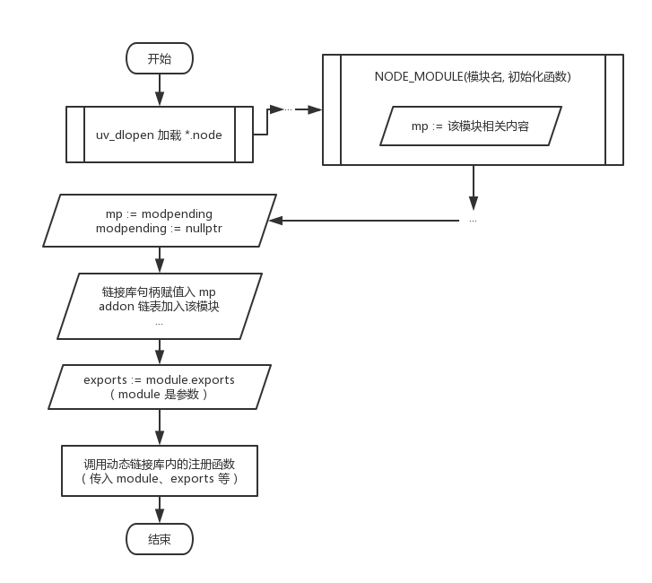
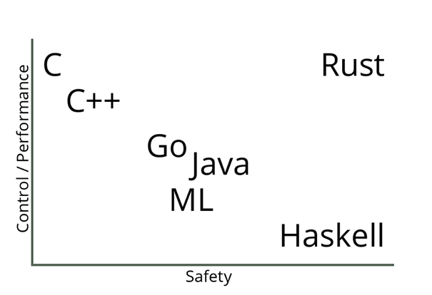

## Node.js native addon，过去和现状

在 Node.js 的历史中，native addon 一直是一个冷门但是重要的领域。无论是前端工程师还是 Node.js 开发，都或多或少的依赖一些 native addon。在前端中比较常见的比如 `node-sass`, `node-canvas`, `sharp` 等。后端开发中就更多了，比如 `protobuf` , `bcrypt` ,`crc32` 等。

Native addon 可以做到 JavaScript 做不到的一些事情，比如调用系统库、打开一个窗口、调用 GPU 指令等。

除此之外，由于 naive 代码 (C/C++/Rust/Nim/D 等) 在性能上对比 `JavaScript` 有较大的优势，所以 native addon 也经常被用来做一些 CPU 密集型的事情，比如区块链和加密货币相关领域中经常提供 Node.js 的 npm package 作为对外 API，而底层的计算逻辑全部都用 C++ 实现。

### 原生模块的本质

> 这个章节大部分内容来自 [从暴力到 NAN 再到 NAPI——Node.js 原生模块开发方式变迁](https://xcoder.in/2017/07/01/nodejs-addon-history/)

- `.node ` 文件
- 是一个二进制文件
- 是一个动态链接库 (Windows `dll`/Linux `so`/Unix `dylib`)

Node.js 对 native addon 开发侧暴露的是 ABI:

> ABI: In [computer software](https://en.wikipedia.org/wiki/Computer_software), an **application binary interface** (**ABI**) is an [interface](<https://en.wikipedia.org/wiki/Interface_(computing)>) between two binary program modules

下面是 Node.js 源码中加载 native addon 的代码:

```cpp
void DLOpen(const FunctionCallbackInfo<Value>& args) {
  Environment* env = Environment::GetCurrent(args);
  uv_lib_t lib;

  ...

  Local<Object> module = args[0]->ToObject(env->isolate());
  node::Utf8Value filename(env->isolate(), args[1]);

  // 使用 uv_dlopen 加载链接库
  const bool is_dlopen_error = uv_dlopen(*filename, &lib);
  node_module* const mp = modpending;
  modpending = nullptr;

  ...

  // 将加载的链接库句柄转移到 mp 上
  mp->nm_dso_handle = lib.handle;
  mp->nm_link = modlist_addon;
  modlist_addon = mp;

  Local<String> exports_string = env->exports_string();

  // exports_string 其实就是 `"exports"`
  // 这句的意思是 `exports = module.exports`
  Local<Object> exports = module->Get(exports_string)->ToObject(env->isolate());

  if (mp->nm_context_register_func != nullptr) {
    mp->nm_context_register_func(exports, module, env->context(), mp->nm_priv);
  } else if (mp->nm_register_func != nullptr) {
    mp->nm_register_func(exports, module, mp->nm_priv);
  } else {
    uv_dlclose(&lib);
    env->ThrowError("Module has no declared entry point.");
    return;
  }
}
```



#### 远古时代

直接 include `v8` 和 `libuv` 相关的 `.h` 文件，直接编译。`v8` 相关的 `API` 变化非常快，导致用这种方式封装的 native addon 无法跨 node 版本使用。

#### NAN

> Native Abstractions for Node.js

NAN 将 `v8/libuv` 相关的 API 进行了封装，对外是稳定的抽象层 API (但却无法保证是 ABI 稳定)。用 `NAN` 进行封装的 native addon 几乎无法通过预编译的方式进行分发，因为跨 Node 版本底层 `v8/libuv` API 变化之后需要对源码进行重新编译才能使用。所以这就是为什么很多 native addon 在 npm install 后还要调用一堆工具链在本地进行编译才能使用，以及为什么有时候 node 版本升级之后之前安装好的 node_modules 就无法直接使用了。

#### N-API

自从 Node.js v8.0.0 发布之后，Node.js 推出了全新的用于开发 C++ 原生模块的接口，N-API。本质其实是将 `NAN` 这层抽象挪到了 `node` 源码中，在 node 编译的时候就编译好这层对外抽象，这样 N-API 对外就是稳定的 ABI 了。

N-API 也发布一段时间了，社区中有很多 Native addon 也慢慢迁移到了 N-API，比如 [bcrypt](https://github.com/kelektiv/node.bcrypt.js) , [sse4_crc32](https://github.com/anandsuresh/sse4_crc32) 等。N-API 弥补了之前 [nan](https://github.com/nodejs/nan) 最痛的**跨 V8 版本 ABI 不兼容**的问题。

但即使是迁移到了 N-API，编写 native addon 也有一些编写代码之外的痛点。

### 分发困难

目前主流的 native addon 有以下几种分发方式:

#### 1. 分发源码

需要使用的用户自行安装 `node-gyp`，`cmake` `g++` 等构建工具，在开发阶段这些都不是什么问题，但随着 `Docker` 的普及，在特定的 `Docker` 环境中安装一堆编译工具链实在是很多团队的噩梦。而且这个问题如果处理不好的话，还会白白增加 `Docker image` 的体积 (其实这个问题是可以通过构建 Docker image 之前就在一个专门的 Builder image 里面编译完来解决，但是我在各种公司聊下来鲜有团队会这样做)。

#### 2. 只分发 JavaScript 代码，postinstall 下载对应产物

有些 native addon 的构建依赖实在是太复杂了，让普通的 Node 开发者在开发阶段安装全套的编译工具不太现实。还有一种情况是，native addon 本身太复杂了，可能编译一次需要非常多的时间，库的作者肯定不希望大家在使用他的库的时候仅安装就要花掉半小时吧。

所以还有一种比较流行的方式是通过 `CI` 工具，在各个平台(win32/darwin/linux) 的 `CI` 任务中**_预编译_** native addon，进行分发的时候只分发对应的 JavaScript 代码，而预编译的 addon 文件通过 `postinstall` 脚本从 CDN 下载下来。比如社区中有一个比较流行的用来干这个事情的工具： [node-pre-gyp](https://github.com/mapbox/node-pre-gyp)。这个工具会根据使用者的配置自动将 `CI` 中编译出来的 native addon 上传到特定的地方，然后在安装的时候从上传的地方下载下来。

这种分发方式看起来无懈可击，但其实有几个没办法绕过去的问题:

- 诸如 `node-pre-gyp` 这种工具会在项目里增加很多**运行时无关**的依赖。
- 无论上传到哪个 CDN ，都很难兼顾国内/海外用户。回想起了你卡在 `postinstall` 从某个 Github release 下载文件等 1 小时最后失败了的惨痛回忆吗？诚然在国内搭建对应的 binary mirror 可以部分缓解这个问题，但是 mirror 不同步/缺失的情况也时有发生。
- 私有网络不友好。很多公司的 CI/CD 机器可能都没法访问外网（他们会有配套的私有 NPM，没有的话也没有讨论的意义），更别说从某些 CDN 下载 native addon。

#### 3. 不同平台的 native addon 通过不同的 npm package 分发

最近前端很火的新一代构建工具 [esbuild](https://github.com/evanw/esbuild) 就采用了这种方式。每一个 native addon 对应一个 npm package。然后通过 `postinstall` 脚本去安装当前系统对应的 native addon package。

还有一种方式是暴露给用户安装使用的 package 将所有的 native package 作为 `optionalDependencies`，然后通过 `package.json` 中的 `os` 与 `cpu` 字段，让 `npm/yarn/pnpm` 在安装的时候**自动选择(其实是不符合系统要求的就安装失败了)** 安装哪一个 native package，比如:

```json
{
  "name": "@node-rs/bcrypt",
  "version": "0.5.0",
  "os": ["linux", "win32", "darwin"],
  "cpu": ["x64"],
  "optionalDependencies": {
    "@node-rs/bcrypt-darwin": "^0.5.0",
    "@node-rs/bcrypt-linux": "^0.5.0",
    "@node-rs/bcrypt-win32": "^0.5.0"
  }
}
```

```json
{
  "name": "@node-rs/bcrypt-darwin",
  "version": "0.5.0",
  "os": ["darwin"],
  "cpu": ["x64"]
}
```

```json
{
  "name": "@node-rs/bcrypt-linux",
  "version": "0.5.0",
  "os": ["linux"],
  "cpu": ["x64"]
}
```

```json
{
  "name": "@node-rs/bcrypt-win32",
  "version": "0.5.0",
  "os": ["win32"],
  "cpu": ["x64"]
}
```

这种方式是对使用 native addon 的用户侵扰最小的分发方式，[@ffmpeg-installer/ffmpeg](https://github.com/kribblo/node-ffmpeg-installer#readme) 就采用了这种方式。

但是这种方式会对 native addon 的作者带来额外的工作量，包括需要编写一些管理 Release binary 和一堆 package 的工具，这些工具一般都非常难以调试（一般会跨好几个系统与好几个 CPU 架构）。

这些工具需要管理整个 addon 在开发 -> 本地 release version -> CI -> artifacts -> deploy 整个阶段的流转过程。除此之外，还要编写/调试大量的 CI/CD 配置，这些都十分费时费力。

### 生态和工具链

目前大部分的 Node.js addon 基本都使用 C/C++ 开发。C/C++ 生态非常的繁荣，基本上你想做任何事情都能找到对应的 C/C++ 库。但 C/C++ 的生态因为缺乏统一的构建工具链以及包管理工具，导致这些第三方库在实际封装和使用上会遇到一些其它的问题:

- 使用多个不一样构建工具链的库的时候可能会很难搞定编译，比如这几年以来我一直都在尝试封装 skia 到 nodejs binding, 但是 skia 的编译。。实在是一言难尽的复杂，所以一直都在遇到这样或者那样的问题。
- 由于没有好用的包管理器，很多优质的 C/C++ 代码都是作为一个大型项目的一部分存在的，而不是独立成一个库。这种情况下想要使用可能只能以 Copy 代码的形式: [bcrypt.cc](https://github.com/kelektiv/node.bcrypt.js/blob/master/src/bcrypt.cc)，这样对项目后期的升级和维护都带来了一些问题。

## When Rust met N-API



- 零成本抽象
- 内存安全
- 实用

Rust 诞生以来迅速被很多商业公司使用

- Amazon，使用 Rust 作为构建工具。
- Atlassian，在后端使用 Rust。
- Dropbox，在前后端均使用了 Rust。
- Facebook，使用 Rust 重写了源码管理工具。
- Google，在 Fuchsia 项目中使用了 Rust。
- Microsoft，在 Azure IoT 网络上部分使用了 Rust。
- npm，在其核心服务上使用了 Rust。
- RedHat，使用 Rust 创建了新的存储系统。
- Reddit，使用 Rust 处理评论。
- Twitter，在构建团队中使用 Rust。

用 `Rust` 替代 `C/C++` 看起来是一个很美好的选择，Rust 有现代化的包管理器: `Cargo` ，经过这么多年的发展在生态上尤其是与 `Node.js` 重叠的 **服务端开发** 、**跨平台 CLI 工具**、**跨平台 GUI **(electron) 等领域有了非常多的沉淀。比起 `C/C++` 生态，`Rust` 生态的包属于**_只要有，都可以直接用_** 的状态，而 `C/C++` 生态中的第三方代码则属于 **_肯定有，但不一定能直接用_** 的状态。这种状态下，用 `Rust` 开发 Node addon 少了很多选择，也少了很多选择的烦恼。

在正式决定开始使用 `Rust` + `N-API` 开发 `Node.js` addon 之前，还有一些问题需要讨论:

### N-API 的 Rust binding

Node.js 官方为 N-API 提供了相应的头文件，作为开发 Node addon 时所需。而 `Rust` 没有办法直接使用 C 的头文件，所以我们需要将 `node.h` 暴露的 API 先封装成 `Rust` 可以使用的 `Rust binding`.

在 `Rust` 生态中，有官方维护的 [bindgen](https://github.com/rust-lang/rust-bindgen) 来自动生成头文件对应的 `Rust binding`，这个工具非常适合 `node.h` 这样非常纯粹的 C API 头文件，如果是 C++ API 则会复杂很多。

但是这样生成出来的 `Rust binding` 一般都是 `unsafe` 的并且会充满底层的指针操作，这显然不利于我们进一步封装 native addon，也享受不到 `Safe Rust` 带来的种种好处。

在早夭的 [xray](https://github.com/atom-archive/xray) 项目中，最早的编辑器架构并非后来的类似 `LSP` 的 `Client/Server` 架构，而是 `Node.js` 直接调用 `Rust` 编写的 addon。所以在早期，xray 有一个非常粗糙的 `Rust N-API` 实现。

几年前我将这些代码从 xray 项目的 `Git` 的历史中找回来了，并且加以封装和改进：[napi-rs](https://github.com/napi-rs/napi-rs)，将大部分常用的 N-API 接口封装成了 `Safe Rust ` 接口，并为它们编写了全方位的单元测试，它可以作为使用 `Rust` 编写 native addon 的重要基石。

### 用 `Rust` 能做哪些事情

我们编写一个 native addon，肯定是想要加速一些计算的过程，然而这种加速并不是没有代价的。


Native code （C/C++/Rust）在一些纯计算的场景比 js 快非常多，但是一旦使用 `N-API` 与 node 的 js 引擎打交道，就会有非常大的开销(相对计算而言)。

比如在 js 里面设置一个对象的属性会比在 native 里面使用 `N-API` 设置一个对象的属性快好几倍

```js
const obj = {}
obj.a = 1
```

```rust
let mut result = env.create_object()?;
result.set_named_property("code", env.create_uint32(1)?)?;
Ok(result)
```

所以在封装 native addon 的时候，我们应该尽量避免 `N-API` 的调用，不然 native 逻辑为你减少的运行时间又全部被 `N-API` 调用给加回去了。

> 使用 `N-API` 中需要注意的性能点实在是太多了，这里就不展开来讲了，后面有时间了或许会写一系列文章介绍各种使用场景下如何选择最优的方式调用 `N-API` 来达到更好的性能。

但是有一些 `N-API` 的调用其实是必不可少的，比如从参数中的 Js 值里面获取对应的 native 值，或者把 native 值转换成 Js 值返回:

```rust
#[js_function(1)] // -> arguments length
fn add_one(ctx: CallContext) -> Result<JsNumber> {
  let input: JsNumber = ctx.get(0)?; // get first argument
  let input_number: u32 = input.try_into()?; // get u32 value from JsNumber, call  `napi_get_value_uint32` under the hood
  ctx.env.create_u32(input_number + 1) // convert u32 to JsNumber, call `napi_create_uint32` under the hood
}
```

所以一个典型的 native addon 至少需要两次 `N-API` 调用 (即使返回 `undefined` 也要调用 `napi_get_undefined`)。在你打算开始编写一个 native addon 的时候，要时刻计算 native 带来的加速是否能抵消其中的 `N-API` 调用的开销。像上面例子中的 `add_one` 方法，肯定是比 Js 版本要慢非常多的。Github 上有一个项目对比了不同封装方式中典型的 `N-API` 的调用开销: [rust-node-perf](https://github.com/jdsaund/rust-node-perf) 。

这里近似认为 `a + b` 这个操作对于纯 `Js` 和 `native` 代码来说执行时间近似相等:

| Framework                 | Relative Exec Time | Effort |
| ------------------------- | ------------------ | ------ |
| node.js                   | 1                  | n/a    |
| wasm-pack (nodejs target) | 1.5386953312994696 | low    |
| rust-addon                | 2.563630295032209  | high   |
| napi-rs                   | 3.1991337066589773 | mid    |
| neon                      | 13.342197321199631 | mid    |
| node-bindgen              | 13.606728128895583 | low    |

可以看到 `napi-rs` 比直接使用 `JavaScript` 慢了 3 倍多。

这也是为什么大家都知道 native addon 比纯 JavaScript 快很多，但很少有人在项目中大规模使用的原因。在 `N-API` 的调用开销和 `v8` 引擎已经非常快的前提下，大部分的**纯计算**的场景也不适合使用 native addon 来替换 Js，甚至是你还能看到一些地方提到用 JavaScript 替换了 native 模块之后，性能有了质的提升：https://github.com/capnproto/node-capnp#this-implementation-is-slow

再比如我最早用 `N-API` 封装 addon 的时候有一个失败的尝试: [@node-rs/simd-json](https://github.com/napi-rs/node-rs/tree/simd-json)。我将 simd-json 封装成了 native addon，希望得到一个比 `Node` 自带的 `JSON.parse` 更快的 API，但实际测下来 native parse 的部分快的突破了天际，而将 `native struct` 转变成 `Js Object` 中间的 `N-API` call 所需要的时间在数量级上远超 parse 一个 JSON 字符串的时间。

已有的一个 SIMD json port 也有这个问题: [simdjson_nodejs#5](https://github.com/luizperes/simdjson_nodejs/issues/5)

那么到底哪些功能适合用 native addon 来完成呢？

- 简单的输入输出但是中间逻辑复杂的计算逻辑，比如直接用到 CPU simd 指令的 [@node-rs/crc32](https://github.com/napi-rs/node-rs/tree/master/packages/crc32) , 或者加密算法 [@node-rs/bcrypt](https://github.com/napi-rs/node-rs/tree/master/packages/bcrypt), 中文分词 [@node-rs/jieba](https://github.com/napi-rs/node-rs/tree/master/packages/jieba) 。这些库的逻辑都有一个共同点：输入输出都非常简单(避免额外的 `N-API` 调用)， 中间计算逻辑非常复杂。
- 一些需要调用系统级 API 能力的库，比如之前提到的 `SIMD` 指令，还有类似 `GPU` 调用等。

所以下面让我们到 [crates.io](https://crates.io/) 中找一个简单的支持 SIMD 功能库，将它封装成 node native addon，来演示一下如何快乐的使用 `Rust` + `N-API` 做一些高性能并且实用的工具库。

### 选择分发方式

`Rust` 作为出了名的编译极缓慢的语言，分发源码显然是不现实的，而且也不可能要求使用的开发者全部都安装 `Rust` 全家桶。

通过 `postinstall` 下载作为一种比较简单但是对使用者极不友好的方式，我觉得也不应该继续提倡使用。

那最终对于使用 `Rust` 编写的 `Node.js native addon`， 我们最好的选择就是使用**_不同平台分别分发 addon_** 的形式。

在 [napi-rs](https://github.com/napi-rs/napi-rs) 项目中，我封装了简单的 `cli` 工具，用来帮助使用 `napi-rs` 的开发者管理从本地开发到 `CI` 发布的全流程。下面我们来用一个简单而实际的例子介绍一下如何使用 `Rust` 和 `napi-rs` 开发、测试、发布一个 NodeJS native addon。

### `@napi-rs/fast-escape`

先上链接: https://github.com/napi-rs/fast-escape


在 `crates.io` 里面搜索 `SIMD` ，按全时期下载量排序，找到比较流行的使用了 `SIMD` 技术的库，然后逐个查看。前面 2 页的库要么已经**被我封装过了（逃** 要么输入输出太复杂不适合封装，要么已经有现成的 Node stdlib 可以用了，翻到第三页看到第一个 `v_htmlescape`，一看就适合 `N-API` 的场景:

- 用到了 SIMD 技术，计算过程可以加速很多
- 输入输出简单，进一个字符串出一个字符串，不会有太多的 `N-API` call 来消耗性能

我们从 [package-template](https://github.com/napi-rs/package-template) 模版项目 new 一个新项目出来，package-template 中已经设置好了各种依赖/CI 配置和命令，直接在 `src/lib.rs` 中开始写代码就行了:

```rust
#[macro_use]
extern crate napi;
#[macro_use]
extern crate napi_derive;

use napi::{CallContext, Env, JsString, Module, Result};
use v_htmlescape::escape; // import

register_module!(escape, init);

#[module_exports]
fn init(mut exports: JsObject) -> Result<()> {
  exports.create_named_method("escapeHTML", escape_html)?;
  Ok(())
}

#[js_function(1)]
fn escape_html(ctx: CallContext) -> Result<JsString> {
  let input = ctx.get::<JsString>(0)?;

  return ctx
    .env
    .create_string_from_std(escape(input.as_str()?).to_string());
}
```

这就是一个最小可以使用的的 native addon 代码了，代码分 2 个部分:

1. 被 `module_exports` 宏作用的 `init` 函数接受 2 个参数，第一个是 `exports`，这个参数代表了 Node.js 中的 `module.exports` 对象，我们可以通过 `exports` 对象设置需要导出的东西，而如果要导出函数则有一个 `helper` 方法: `module.create_named_method` 来直接导出。第二个是可选的 `env`, 这个参数可以用来创建对象、常量、函数等用于导出。
2. `#[js_function(1)]` 宏用来定义一个 `JsFunction`，被定义的 `Rust function` 有唯一一个 `CallContext` 参数，我们从 `JavaScript` 代码中传入的参数可以通过 `ctx::get(n)` 方法获取。`#[js_function()]` 宏里面的参数定义了这个函数有几个参数，当 `ctx.get` 传入的值大于实际传入的参数个数的时候会抛一个 Js 异常。

在运行 `yarn build` 之后，我们可以在 `js` 里面这样调用这里的 `escape_html` 函数:

```js
const { escapeHTML } = require('./index')

console.log(escapeHTML('<div>1</div>')) // &lt;div&gt;1&lt;&#x2f;div&gt;
```

这里的 `yarn build` 其实做了很多事情:

- 运行 `cargo build` ，将 `lib.rs` 编译成了动态链接库，放在了 `./target/release/escape.[dll|so|dylib]`

- 运行 `napi build --release --platform`，这个命令将上一步的 `(lib)escape.[dll|so|dylib]` 从 `target/release` 目录拷贝到当前目录下，并重命名为 `escape.[darwin|win32|linux].node`

然后 `index.js` 中调用 `@node-rs/helper` 里面的 `loadBinding` 方法，自动从正确的地方加载 native addon:

```js
const { loadBinding } = require('@node-rs/helper')

/**
 * __dirname means load native addon from current dir
 * 'escape' means native addon name is `escape`
 * the first arguments was decided by `napi.name` field in `package.json`
 * the second arguments was decided by `name` field in `package.json`
 * loadBinding helper will load `escape.[PLATFORM].node` from `__dirname` first
 * If failed to load addon, it will fallback to load from `@napi-rs/escape-[PLATFORM]`
 */
module.exports = loadBinding(
  __dirname,
  'escape',
  '@napi-rs/escape-[linux|darwin-win32]',
)
```

这样我们就能愉快的通过 `index.js` 使用封装好的 `escapeHTML` 函数了。

那么这个封装能比纯 `JavaScript` 版本快多少呢？写一个简单的 benchmark 测试一下: [bench](https://github.com/napi-rs/fast-escape/blob/master/bench/index.ts) 。这里选取了大神 [sindresorhus](https://github.com/sindresorhus) 的 [escape-goat](https://github.com/sindresorhus/escape-goat) 作为性能比较的基准:

```bash
napi x 799 ops/sec ±0.38% (93 runs sampled)
javascript x 586 ops/sec ±1.40% (81 runs sampled)
Escape html benchmark # Large input bench suite: Fastest is napi
napi x 2,158,169 ops/sec ±0.59% (93 runs sampled)
javascript x 1,951,484 ops/sec ±0.31% (92 runs sampled)
Escape html benchmark # Small input bench suite: Fastest is napi
```

我们测试两个场景的性能: 小规模输入和大规模输入。小规模输入是一行字符串: `<div>{props.getNumber()}</div>` 大规模输入是一个 `1610` 行的 HTML，可以看到不同输入规模下我们的 native addon 性能都要优于纯 JavaScript 版本。

经验告诉我，输入如果是 `Buffer` ，性能会更优一些 (N-API 的 JsBuffer 相关 API 调用开销要明显小于字符串 API)， 所以我们再加一个接受 `Buffer` 的 API:

```rust
...
module.create_named_method("escapeHTMLBuf", escape_html_buf)?;

#[js_function(1)]
fn escape_html_buf(ctx: CallContext) -> Result<JsString> {
  let input = ctx.get::<JsBuffer>(0)?;
  let input_buf: &[u8] = &input;
  ctx
    .env
    .create_string_from_std(escape(unsafe { str::from_utf8_unchecked(input_buf)}).to_string())
}
```

再来测试一下性能，运行 `yarn bench`：

```bash
napi x 799 ops/sec ±0.38% (93 runs sampled)
napi#buff x 980 ops/sec ±1.39% (92 runs sampled)
javascript x 586 ops/sec ±1.40% (81 runs sampled)
Escape html benchmark # Large input bench suite: Fastest is napi#buff
napi x 2,158,169 ops/sec ±0.59% (93 runs sampled)
napi#buff x 2,990,077 ops/sec ±0.73% (93 runs sampled)
javascript x 1,951,484 ops/sec ±0.31% (92 runs sampled)
Escape html benchmark # Small input bench suite: Fastest is napi#buff
```

可以看到 `Buffer` 比 `String` 相关 N-API 性能更好一些。

而一般高强度的计算任务，我们一般都希望把它 `spawn` 到另一个线程，以免阻塞主线程的执行。（`escape` 这个例子可能不太合适，因为这里的计算开销还是挺小的)。使用 `napi-rs` 也可以比较轻松的完成这个任务:

```rust
module.create_named_method("asyncEscapeHTMLBuf", async_escape_html_buf)?;

struct EscapeTask<'env>(&'env [u8]);

impl<'env> Task for EscapeTask<'env> {
  type Output = String;
  type JsValue = JsString;

  fn compute(&mut self) -> Result<Self::Output> {
    Ok(escape(unsafe { str::from_utf8_unchecked(self.0) }).to_string())
  }

  fn resolve(&self, env: &mut Env, output: Self::Output) -> Result<Self::JsValue> {
    env.create_string_from_std(output)
  }
}

#[js_function(1)]
fn async_escape_html_buf(ctx: CallContext) -> Result<JsObject> {
  let input = ctx.get::<JsBuffer>(0)?;
  let task = EscapeTask(input.data);

  ctx.env.spawn(task)
}
```

在上面的代码中，我们定义了一个 `EscapeTask` 结构，然后实现 `napi` 中的 `Task trait` ，`Task trait` 需要实现 4 个部分:

- `type Output` 在 `libuv` 线程池中计算返回的值，一般是 `Rust` 值
- `type JsValue` 计算完成后 `Promise resolve` 的值
- `compute` 方法，定义了在 `libuv` 线程池中的计算逻辑
- `resolve` 方法，将计算完毕的 `Output` 转化成 Js 值，最后被 `Promise resolve`

而在新定义的 `js_function` `async_escape_html_buf` 中，我们只需要构造刚才的 `EscapeTask`，然后使用 `spawn` 方法就能得到一个 `Promise` 对象:

```rust
let task = EscapeTask(input.data);
ctx.env.spawn(task)
```

在 `js` 中，我们可以这样使用:

```js
const { asyncEscapeHTMLBuf } = require('./index')

asyncEscapeHTMLBuf(Buffer.from('<div>1</div>')).then((escaped) =>
  console.log(escaped),
) // &lt;div&gt;1&lt;&#x2f;div&gt;
```

到这里为止，我们的一个简单的 native addon 就编写完毕了，而发布这个包，只需要以下几步:

- commit 刚才变更的代码
- 运行 `npm version [patch | minor | major | ...]` 命令
- `git push --follow-tags`

仓库中配置好的 `Github actions` 会自动帮你将 `native` 模块分别通过不同的 npm 包发布 [Build log](https://github.com/napi-rs/fast-escape/actions/runs/247349235)

当然如果你是从 package-template 开始从零开始做这些事情，有几个前置修改需要做:

- 全局替换 `pacakge-tempalte` 到你的包名 (后面会提供 CLI 来帮你做这件事情)
- 修改 `.github/workflows/CI.yml` 中 `Upload artifact` 步骤中的 `package-template` ，新的值需要和 `package.json` 中的 `napi.name` 字段保持一致 (后面也会提供 CLI 来帮你做这件事)
- 如果你的包名不在 `@scope` 下，需要保证 `package-name-darwin`,`package-name-win32`, `package-name-linux`, `package-name-linux-musl` 这几个包你都有发布权限

至此，一个简单的 native addon 就封装完成了，大家可以使用 `yarn add @napi-rs/escape` 来试玩一下刚才封装的这个 native addon。

## END

` napi-rs` 从诞生到现在，已经形成了一定规模的生态了，[node-rs](https://github.com/napi-rs/node-rs) 仓库集中封装了一些常见的 native addon (deno_lint 目前还在非常初始的阶段)，[swc-node](https://github.com/Brooooooklyn/swc-node) 已经有很多项目用起来了，而由于 `swc-node` 的成功，`swc` 的作者最近也从 `neon` 迁移到了 `napi-rs` 上: https://github.com/swc-project/swc/pull/1009

这次 `migrate` 让 `swc` 的 API 性能**快了 2 倍** [swc#852](https://github.com/swc-project/swc/issues/852) (这也是目前 napi-rs 对比 neon 的优势之一)，并且在 CI 和发布管理上节省了很多代码量。

最后欢迎大家试用 [napi-rs](https://github.com/napi-rs/napi-rs) ，包括 [strapi](https://github.com/strapi/strapi) 在内的很多大型 Node.js 项目 (包括字节跳动内部的 Node.js 基础库，支撑的总 QPS 可能超过 10w) 已经用上 `napi-rs` 封装的库了，所以它在代码上已经 production ready 了。

后面我会持续建设它的文档和周边工具链，让它更好用更易用，所以大家也不要忘了给个 Star 或者 **Sponsor**!
