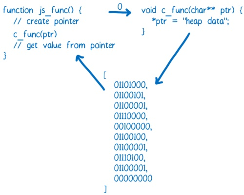
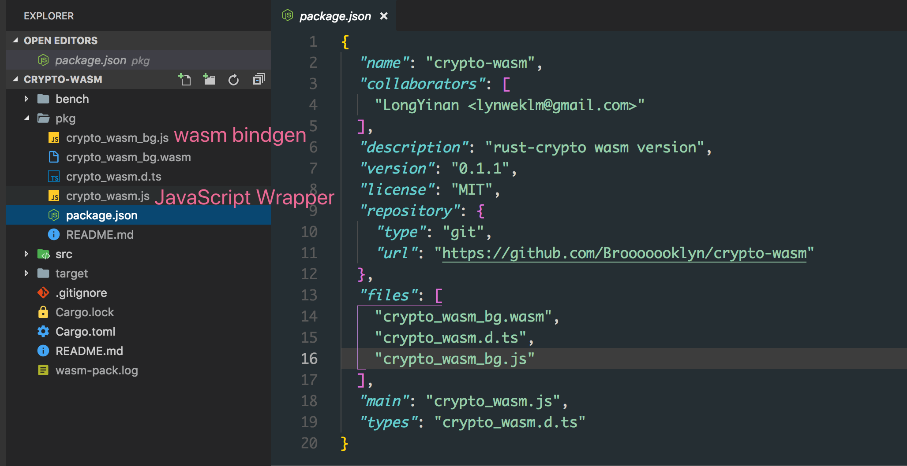

## 0x00

> A very quick overview. This article does not go into deep details — you can find those in the code: [crypto-wasm](https://github.com/Brooooooklyn/crypto-wasm) , [node-crypto](https://github.com/Brooooooklyn/node-crypto)

By the end of 2017, all four major browser vendors had completed their initial implementations of WebAssembly. With the announcement that [Webpack implementing first-class support for WebAssembly](https://medium.com/webpack/webpack-awarded-125-000-from-moss-program-f63eeaaf4e15), more and more teams are considering WebAssembly as a viable technology option. So what is the actual developer experience and performance like with WebAssembly in the current environment (Node 8.11.3 LTS — I haven't tried browsers at this stage) and with the available toolchains ([wasm-pack](https://github.com/rustwasm/wasm-pack), Emscripten)?

<!--more-->

## 0x01 Background

> If you're already familiar with WebAssembly or have even tried it hands-on, feel free to skip this section. It mainly covers some very basic WebAssembly concepts.

In brief, WebAssembly has three key characteristics:

- Binary format, unlike JavaScript's text format
- Standardized — just like JavaScript, any engine that implements the WebAssembly standard can run WebAssembly, whether on the server side or in the browser
- Fast — WebAssembly can fully leverage hardware capabilities. In the future, you'll even be able to use SIMD or interact directly with the GPU from WebAssembly

Since WebAssembly was born in the browser environment, it naturally needs to interact with JavaScript. Using WebAssembly in a currently supported environment roughly involves the following steps:

- Loading

  Since we need to use WebAssembly.instantiate to instantiate a WebAssembly module, and this method only accepts an ArrayBuffer as its first argument, we must load the .wasm file as an ArrayBuffer before we can instantiate it.

  You can load it using fetch:

  ```js
  fetch(url)
    .then((response) => response.arrayBuffer())
    .then((bytes) => {
      // your bytes here
    })
  ```

  Or in Node.js using `fs.readFile`:

  ```js
  const bytes = fs.readFileSync('hello.wasm')
  ```

- Instantiation

  ```js
  WebAssembly.instantiate(bytes, imporObject)
  ```

  This is a binding process. The `WebAssembly.instantiate` method passes the importObject to the wasm module, allowing it to access the properties and methods on importObject. The return value of `WebAssembly.instantiate(bytes, imporObject) ` then exposes the wasm module's methods for JavaScript to call.

  ```js
  const importObject = {
    imports: {
      foo: (arg) => console.log(arg), // can be called from within wasm
    },
  }

  WebAssembly.instantiate(bytes, importObject).then((results) => {
    results.instance.exports.exported_func() // the exports object contains everything exposed by wasm
  })
  ```

  As you can see, this is currently a very verbose and confusing process. You can find more detailed descriptions at [Using_the_JavaScript_API](https://developer.mozilla.org/zh-CN/docs/WebAssembly/Using_the_JavaScript_API).

- Invocation

  When there are no arguments or the argument types are numbers, you can call wasm module methods directly. However, once other complex types are involved as arguments or return values, you need to operate directly on memory to make calls and retrieve return values properly.

  > Excerpted from [WebAssembly Series (Part 4): How WebAssembly Works](https://zhuanlan.zhihu.com/p/25754084)
  >
  > If you want to pass strings between JavaScript and WebAssembly, you can write them into memory using an ArrayBuffer. At that point, the ArrayBuffer index is an integer that can be passed to the WebAssembly function. The index of the first character can then be used as a pointer.
  >
  > 

As you can see, using WebAssembly directly is currently a very complex and laborious endeavor. Fortunately, there are tools that can simplify this process, which we'll cover next.

## 0x02 Toolchains: Emscripten and wasm-pack

You can't talk about WebAssembly without mentioning Emscripten.

WebAssembly originally evolved from [Asm.js](https://zh.wikipedia.org/wiki/Asm.js). Emscripten was born alongside asm.js — the first version of asm.js was generated by Emscripten.

The secret behind asm.js's high performance is that engines compile asm.js-compliant code directly to assembly for execution, rather than first running it in a virtual machine and then gradually optimizing it like regular JavaScript code.

Early versions of Emscripten used LLVM to convert static languages into [LLVM IR](https://segmentfault.com/a/1190000002669213), and then converted LLVM IR into asm.js. Today it can also compile LLVM IR into wasm. Currently, it is the most important tool for compiling C/C++ to asm.js/wasm.

Earlier this year, the Rust team published the [Rust 2018 Roadmap](https://blog.rust-lang.org/2018/03/12/roadmap.html), which placed WebAssembly at the same strategic level as **Network services**, **Command-line apps**, and **Embedded devices**, and established a dedicated working group focused on building the WebAssembly ecosystem.

Shortly after, the rustwasm team released wasm-pack — a tool that can quickly compile Rust code to WebAssembly and publish it to npm. Compared to the Emscripten toolchain, there are three capabilities that I find particularly powerful and convenient:

- No need to write long compile commands or build scripts — one-command compilation

  `wasm-pack init` or `wasm-pack init -t nodejs` gives you the wasm code and corresponding JS bindings you need. By comparison, here's the script for compiling C++ code to wasm using Emscripten (from [fdconf 2018](https://github.com/yunxiange/frontend-conf/blob/master/content/fdconf-2018-05-19.md): WebAssembly at Quanmin Live):

  ```bash
  #!/usr/bin/env bash
  set -x
  rm -rf ./build
  mkdir -p ./build

  em++  --std=c++11 -s WASM=1 -Os \
  			--memory-init-file 0 --closure=1 \
  			-s NO_FILESYSTEM=1 -s DISABLE_EXCEPTION_CATCHING=0 \
  			-s ELIMINATE_DUPLICATE_FUNCTIONS=1 -s LEGACY_VM_SUPPORT=1
  			--llvm-lto 1 -s "EXTRA_EXPORTED_RUNTIME_METHODS=['ccall']" \
  			-s EXPORTED_FUNCTIONS="['_sum']" \
  			./sum.cpp -o ./build/index.html
  ```

- No need to write extremely long JS wrappers

  Here's what calling C++ code compiled to wasm via Emscripten looks like from the JavaScript side:

  ```js
  function _arrayToHeap(typedArray) {
    const numBytes = typedArray.length * typedArray.BYTES_PER_ELEMENT
    const ptr = Module._malloc(numBytes)
    const heapBytes = new Uint8Array(Module.HEAPU8.buffer, ptr, numBytes)
    heapBytes.set(new Uint8Array(typedArray.buffer))
    return heapBytes
  }

  function _freeArray(heapBytes) {
    Module._free(heapBytes.byteOffset)
  }

  Module.sum = function (intArray) {
    const heapBytes = _arrayToHeap(intArray)
    const ret = Module.ccall(
      'sum',
      'number',
      ['number', 'number'],
      [heapBytes.byteOffset, intArray.length],
    )
    _feeArray(heapBytes)
    return ret
  }
  ```

  In contrast, packages generated by wasm-pack can be called just like a regular JavaScript library:

  

  These are the files generated by wasm-pack. The pkg directory is automatically generated by wasm-pack — once its contents are published as an npm package, consumers can simply `require('crypto-wasm')` to use it.

- Automatic .d.ts generation, very friendly to frontend toolchains

  wasm-pack can take code like this:

  ```rust
  #[wasm_bindgen]
  pub fn sha256(input: &str) -> String {
    let mut hasher = Sha256::new();
    hasher.input_str(input);
    hasher.result_str()
  }
  ```

  And generate:

  ```typescript
  export function sha256(arg0: string): string
  ```

  No extra configuration needed.

However, alongside these advantages, wasm-pack currently has some drawbacks:

- Generated wasm files are too large

  To be precise, this isn't really a wasm-pack issue but rather a Rust language issue. Currently, an empty project produces a bundle of roughly `250kb`. Of course, this isn't much of a concern for Node.js.

- No incremental compilation, extremely slow compile times

  An empty project takes about 2 minutes to compile, and repeated compilations don't get any faster.

- There are still some bugs

  Not bugs in the generated code, but issues in the packaging process. For example, the generated package.json file's `files` field was missing entries, causing the package to be unusable after being published to npm.

## 0x03 Performance

> This is currently a very informal benchmark — results are for reference only. If you want to modify the benchmark process or do profiling, you can make changes in the bench directory of [crypto-wasm](https://github.com/Brooooooklyn/crypto-wasm).

This benchmark compared `md5` performance across 4 different implementations:

- Node.js native crypto
- rust-crypto library's wasm version
- crypto-js
- rust-crypto Node native binding version

With input string `hello world!`:

```bash
➜ node bench/md5.js
md5#native x 637,185 ops/sec ±1.99% (79 runs sampled)
md5#wasm x 194,583 ops/sec ±17.49% (63 runs sampled)
md5#js x 86,228 ops/sec ±11.65% (66 runs sampled)
md5#binding x 1,172,619 ops/sec ±4.45% (85 runs sampled)
Fastest is md5#binding
```

With input string length of `200000`:

```bash
➜ node bench/md5.js
md5#native x 1,496 ops/sec ±2.24% (91 runs sampled)
md5#wasm x 809 ops/sec ±1.46% (91 runs sampled)
md5#js x 60.91 ops/sec ±1.68% (63 runs sampled)
md5#binding x 785 ops/sec ±0.75% (93 runs sampled)
Fastest is md5#native
```

Due to differences in algorithm implementations, more dimensions of benchmarking are needed to get accurate performance data for wasm running on V8.

That said, from a practical standpoint, if a library doesn't have a native implementation for Node, and there's a Rust implementation available that doesn't rely on system-level APIs, then using wasm-pack to bundle a wasm version for use in Node is a very rewarding choice with relatively low cost.

Compared to native bindings, wasm has a huge advantage when it comes to CI. Wasm can be compiled once in any environment on any supported Node version and then used across all platforms. For native bindings, if the build cost at install time is too high and you need to use prebuilt binaries, CI becomes a nightmare — you need to prebuild for every platform and every supported Node version, then have consumers download the precompiled binary.

## EOF

Due to time constraints, this is as far as I've explored for now.

I'll follow up with the browser-side wasm experience and more comprehensive comparisons (if there is a next post).
