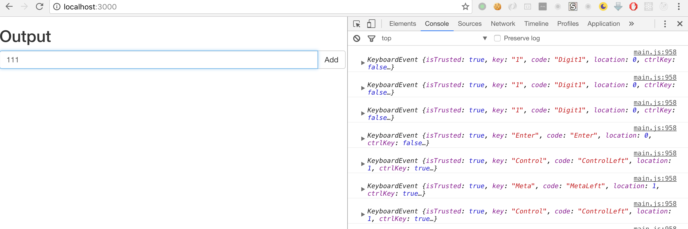
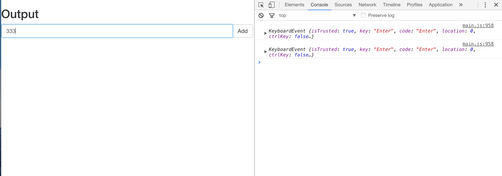
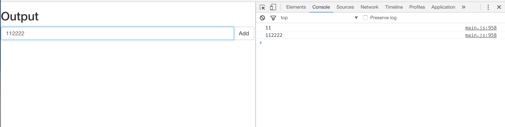
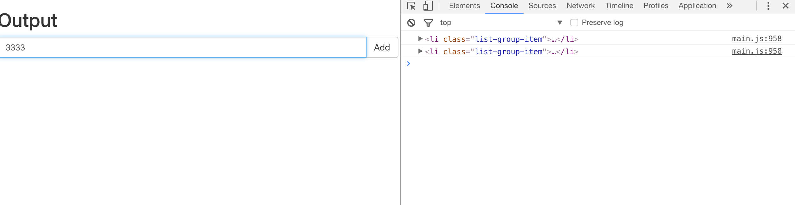
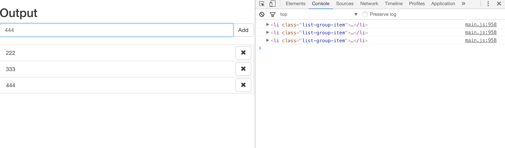
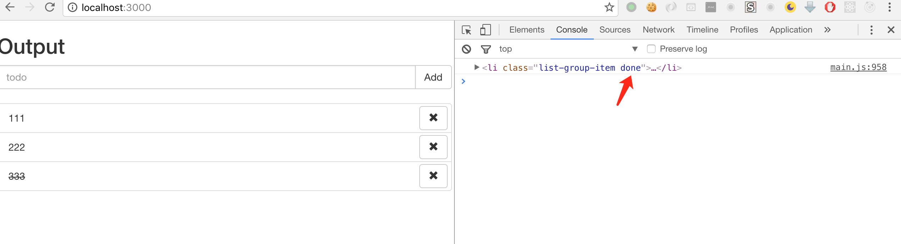
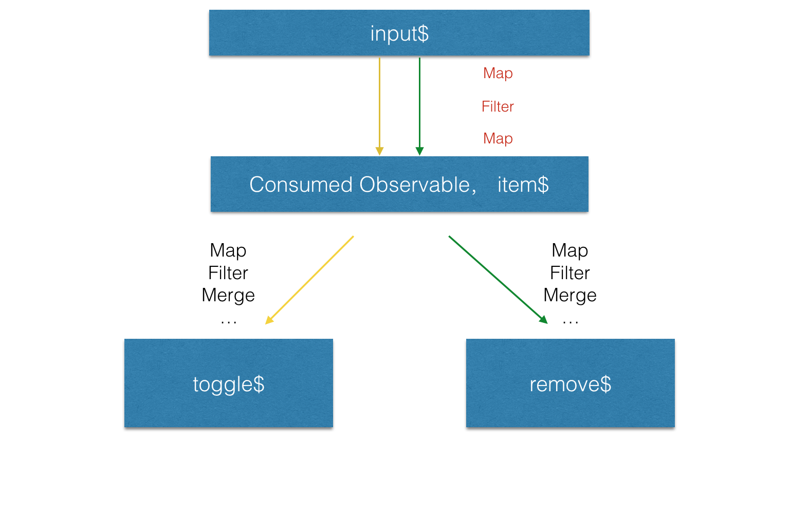
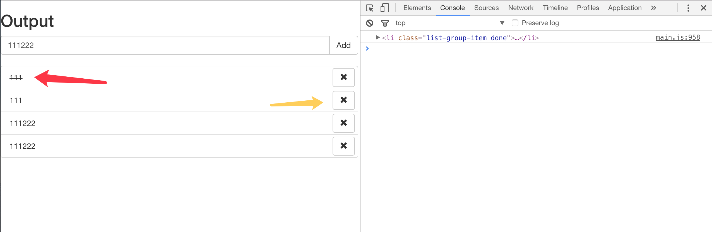
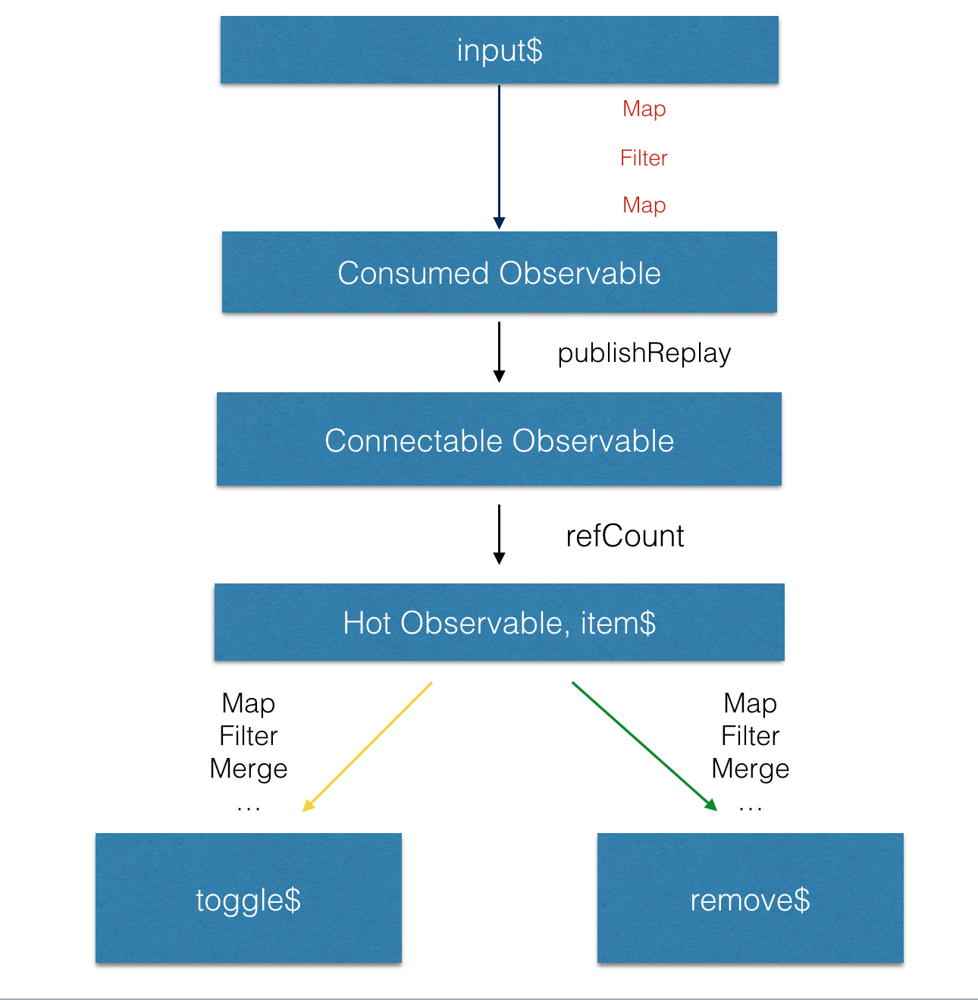

> 本文是一系列介绍 RxJS 文章的第一篇，这一系列的文章将从一个小的例子开始，逐渐深入的讲解 RxJS 在各种场景下的应用。对应的，也会有对 RxJS 各种操作符的讲解（如果能坚持不弃坑的话。这篇文章将会用一个 Todo list 作为例子，讲解 RxJS 是如何组合各种同步/异步业务的，在这个过程中，初次接触 RxJS 的同学可能会被各种操作符和组合搞得云里雾里，但没关系，本片的主旨是让大家了解 RxJS 是如何在我们熟悉的那些业务场景中使用的，更细节的介绍将会在后续的文章中。

<!--more-->

## 准备工作
首先在 [learning-rxjs](https://github.com/Brooooooklyn/learning-rxjs) clone 项目所需的 seed，本文中所有涉及到 RxJS 的代码将全部使用 TypeScript 编写。

使用 `npm start ` 启动 seed 项目，这篇文章中我们将实现以下几点功能：
1. 在输入框中输入字符，在回车的时候将输入框中的文字变成一个 todo item，同时清空输入框中的内容。
2. 在输入框中输入字符，点击 add 按钮，将输入框中的文字变成一个 todo item，同时清空输入框中的文字。
3. 点击一个 todo item，让它变成已完成的状态
4. 点击 todo item 右边的 remove button，将这个 todo item 从 todo list 中移除。

## 第一个 Observable

如果要响应`用户按下回车`这个行为，我们首先要获取用户输入的流，在 RxJS 中，可以直接使用 `fromEvent` 操作符直接将一个 `eventListener` 转变成一个 `Observable`:

```ts
import { Observable } from 'rxjs'

const $input = <HTMLInputElement>document.querySelector('.todo-val')

const input$ = Observable.fromEvent<KeyboardEvent>($input, 'keydown')
  // do 操作符一般用来处理流的副作用，例如操作 DOM，修改外部变量，打 log
	.do(e => console.log(e))

const app$ = input$

app$.subscribe()
```

这样在控制台就能看到每次用户输入时对应的 event 在 input$ Observable 中流动了。



## 使用 filter 进行数据过滤

但我们并不关心用户的输入的其它值，只需要获取`回车`这个值，并作出响应。此时我们只需要对这个 Observable 进行 `filter` :

```ts
import { Observable } from 'rxjs'

const $input = <HTMLInputElement>document.querySelector('.todo-val')

const input$ = Observable.fromEvent<KeyboardEvent>($input, 'keydown')
  .filter(r => r.keyCode === 13)
  .do(r => console.log(r))

const app$ = input$

app$.subscribe()
```



## 使用 map 进行数据的变换

为了完成`在回车的时候将输入框中的文字变成一个 todo item`，我们需要获取 input 中的值，并将它变成一个 todo-item 节点。这个过程是一个很典型的 `map` 的过程:
可以类比于 Array 的 Map : [ ... KeyboardEvent ] => [... HTMLElement ]
首先在输入回车的时候把 `KeyboardEvent` map 到 `string `, filter 掉空值

```ts
import { Observable } from 'rxjs'

const $input = <HTMLInputElement>document.querySelector('.todo-val')

const input$ = Observable.fromEvent<KeyboardEvent>($input, 'keydown')
  .filter(r => r.keyCode === 13)

const app$ = input$
  .map(() => $input.value)
  .filter(r => r !== '')
  .do(r => console.log(r))

app$.subscribe()
```



再来一个 createTodoItem 的 helper:

```ts
// lib.ts
export const createTodoItem = (val: string) => {
  const result = <HTMLLIElement>document.createElement('LI')
  result.classList.add('list-group-item')
  const innerHTML = `
    ${val}
    <button type="button" class="btn btn-default" aria-label="right Align">
      <span class="glyphicon glyphicon-remove" aria-hidden="true"></span>
    </button>
  `
  result.innerHTML = innerHTML
  return result
}
```
```ts
// app.ts
import { Observable } from 'rxjs'
import { createTodoItem } from './lib'

const $input = <HTMLInputElement>document.querySelector('.todo-val')

const input$ = Observable.fromEvent<KeyboardEvent>($input, 'keydown')
  .filter(r => r.keyCode === 13)

const app$ = input$
  .map(() => $input.value)
  .filter(r => r !== '')
  .map(createTodoItem)
  .do(r => console.log(r))

app$.subscribe()
```



将 map 出来的节点插入 DOM，顺便一提的是，在 RxJS 的范式中，数据流动中的 `副作用` 都应该写在 `do` 操作符中。

```ts
import { Observable } from 'rxjs'
import { createTodoItem } from './lib'

const $input = <HTMLInputElement>document.querySelector('.todo-val')
const $list = <HTMLUListElement>document.querySelector('.list-group')

const input$ = Observable.fromEvent<KeyboardEvent>($input, 'keydown')
  .filter(r => r.keyCode === 13)
  .map(() => $input.value)

const app$ = input$
  .filter(r => r !== '')
  .map(createTodoItem)
  .do((ele: HTMLLIElement) => {
    $list.appendChild(ele)
  })
  .do(r => console.log(r))

app$.subscribe()
```

实现到这一步，我们已经可以把输入的字符串变成一个个 item 了:


下一步我们来实现`点击 add 按钮增加一个 todo item` 功能。可以看到，在程序上这个操作和按下回车后需要的后续操作是一样的。所以我们只需要将点击 add 按钮事件也变成一个 `Observable` 然后与 `按下回车` 的 `Observable` `merge` 到一起就好了:

```ts
import { Observable } from 'rxjs'
import { createTodoItem } from './lib'

const $input = <HTMLInputElement>document.querySelector('.todo-val')
const $list = <HTMLUListElement>document.querySelector('.list-group')
const $add = document.querySelector('.button-add')

const enter$ = Observable.fromEvent<KeyboardEvent>($input, 'keydown')
  .filter(r => r.keyCode === 13)

const clickAdd$ = Observable.fromEvent<MouseEvent>($add, 'click')

const input$ = enter$.merge(clickAdd$)

const app$ = input$
  .map(() => $input.value)
  .filter(r => r !== '')
  .map(createTodoItem)
  .do((ele: HTMLLIElement) => {
    $list.appendChild(ele)
  })
  .do(r => console.log(r))

app$.subscribe()
```

接下来在 `do` 操作符中把 `input` 中的值清除掉:

```ts
...
  .do((ele: HTMLLIElement) => {
    $list.appendChild(ele)
    $input.value = ''
  })
...
```

## 从 Observable mergeMap 到 新的 Observable
在创建出这些 item 后，我们再给它们加上各自的 event listener 来完成 **点击一个 todo item，让它变成已完成的状态** 功能，而新的 eventListener 只能在这些 item 创建出来以后加上。所以这个过程是 ```Observable<HTMLElement>``` => `map` => ```Observable<MouseEvent>``` => `merge` 的过程，在 RxJS 中有一个操作符可以一步完成这个 map and merge 的过程:

```ts
import { Observable } from 'rxjs'
import { createTodoItem } from './lib'

const $input = <HTMLInputElement>document.querySelector('.todo-val')
const $list = <HTMLUListElement>document.querySelector('.list-group')
const $add = document.querySelector('.button-add')

const enter$ = Observable.fromEvent<KeyboardEvent>($input, 'keydown')
  .filter(r => r.keyCode === 13)

const clickAdd$ = Observable.fromEvent<MouseEvent>($add, 'click')

const input$ = enter$.merge(clickAdd$)

const app$ = input$
  .map(() => $input.value)
  .filter(r => r !== '')
  .map(createTodoItem)
  .do((ele: HTMLLIElement) => {
    $list.appendChild(ele)
    $input.value = ''
  })
  .mergeMap($todoItem => {
    return Observable.fromEvent<MouseEvent>($todoItem, 'click')
      .filter(e => e.target === $todoItem)
      .mapTo($todoItem)
  })
  .do(($todoItem: HTMLElement) => {
    if ($todoItem.classList.contains('done')) {
      $todoItem.classList.remove('done')
    } else {
      $todoItem.classList.add('done')
    }
  })
  .do(r => console.log(r))

app$.subscribe()
```



> 因为 todoItem 上还有其它功能性的按钮，比如移除 todoItem ，所以在 mergeMap 中我们用 filter 过滤掉了非 li 标签的点击事件。同时下一个 do 操作符中需要 consume 这个 $todoItem 对象，所以我们在 filter 后将它 mapTo 下一个操作符。

## 从一个 Observable map 到不同的 Observable，share/publish 它再操作它
为了实现点击 remove 按钮，把当前的 todoItem 移除，我们需要从 item$ 的 Observable 中重新 `mergeMap` 出新的 remove$ 的流:

```ts
import { Observable } from 'rxjs'
import { createTodoItem } from './lib'

const $input = <HTMLInputElement>document.querySelector('.todo-val')
const $list = <HTMLUListElement>document.querySelector('.list-group')
const $add = document.querySelector('.button-add')

const enter$ = Observable.fromEvent<KeyboardEvent>($input, 'keydown')
  .filter(r => r.keyCode === 13)

const clickAdd$ = Observable.fromEvent<MouseEvent>($add, 'click')

const input$ = enter$.merge(clickAdd$)

const item$ = input$
  .map(() => $input.value)
  .filter(r => r !== '')
  .map(createTodoItem)
  .do((ele: HTMLLIElement) => {
    $list.appendChild(ele)
    $input.value = ''
  })

const toggle$ = item$.mergeMap($todoItem => {
  return Observable.fromEvent<MouseEvent>($todoItem, 'click')
    .filter(e => e.target === $todoItem)
    .mapTo($todoItem)
})
  .do(($todoItem: HTMLElement) => {
    if ($todoItem.classList.contains('done')) {
      $todoItem.classList.remove('done')
    } else {
      $todoItem.classList.add('done')
    }
  })

const remove$ = item$.mergeMap($todoItem => {
  const $removeButton = $todoItem.querySelector('.button-remove')
  return Observable.fromEvent($removeButton, 'click')
    .mapTo($todoItem)
})
  .do(($todoItem: HTMLElement) => {
    // 从 DOM 上移掉 todo item
    const $parent = $todoItem.parentNode
    $parent.removeChild($todoItem)
  })

const app$ = toggle$.merge(remove$)
  .do(r => console.log(r))

app$.subscribe()

```

然而，这段代码并没有按我们预期的工作，remove button 点击之后是没有反应的。
这是因为：
**Observable 默认是 lazy 且 unioncast的，这意味着:**
1. 它只有在订阅的时候才会被执行
2. 它被多个订阅者订阅会执行多次，并且执行时上下文是独立的

也就是说，我们的 `remove$` Observable 会重新让 item$ 的流中的逻辑重新执行一遍:



在上图中，toogle$ Observable 先订阅并执行了黄色箭头部分的过程，remove$ Observable 订阅的时候重新执行绿色部分的过程，然而这个时候流里面 input$ 已经不会流数据出来了。

想象一下，首先 toggle$ Observable 被订阅，随后 remove$ Observable 被订阅。此时由于这两个 Observable 被订阅导致 $item Observable 被订阅了*两次*，所以对 input 与 add button 的 addEventlistener 逻辑执行了*两次*。在按下回车或者点击 add button 的时候，第一个 item$ Observable 的订阅逻辑先执行，向 DOM 中加入了一个 todoItem 并将 input 清空，此时再执行第二个 item$ Observable 的订阅逻辑，此时 input 里面已经为空，所以这个 item$ Observable 里面没有数据流过，这也是我们的代码没有按照预期执行的原因。为了验证这个猜想，我们只需要把 $item Observable 中的 do 操作符中的 ```$input.value = ''``` 注释掉就可以更直观的观察到程序现在的运行状态了:



图中黄色的箭头是 toogle$ Observable 的 subscribe 逻辑执行的结果，这个 todoItem 节点只会处理 toogle 逻辑。黄色箭头的部分是 remove$ Observable 的 subscribe 逻辑执行的结果，这个 todoItem 节点只会处理 remove 逻辑。

解决的方法其实很简单，我们不想要在每次订阅的时候都重复执行 item$ Observable 的逻辑，所以只需要:

```ts
const item$ = input$
  .map(() => $input.value)
  .filter(r => r !== '')
  .map(createTodoItem)
  .do((ele: HTMLLIElement) => {
    $list.appendChild(ele)
    $input.value = ''
  })
  .publishReplay(1)
  .refCount()
```

此时的 item$ 是这样的



> 关于 Observable 的 `hot` vs `cold`, `Subject` vs `Observable` 等概念，以及这里为什么用 `publishReplay`, 它的参数为什么是 1，将会在后续的章节中深入讲解，这里我们只需要关注这种行为就好了。

自此，一个简单的 todoList 的四种需求已经被我们用 RxJS 实现了，下一篇文章我们会介绍如何用 RxJS 把网络请求，websocket 等事件接入到这些业务逻辑中。