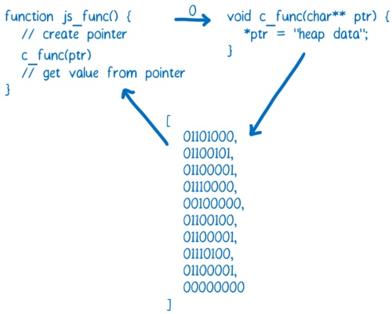
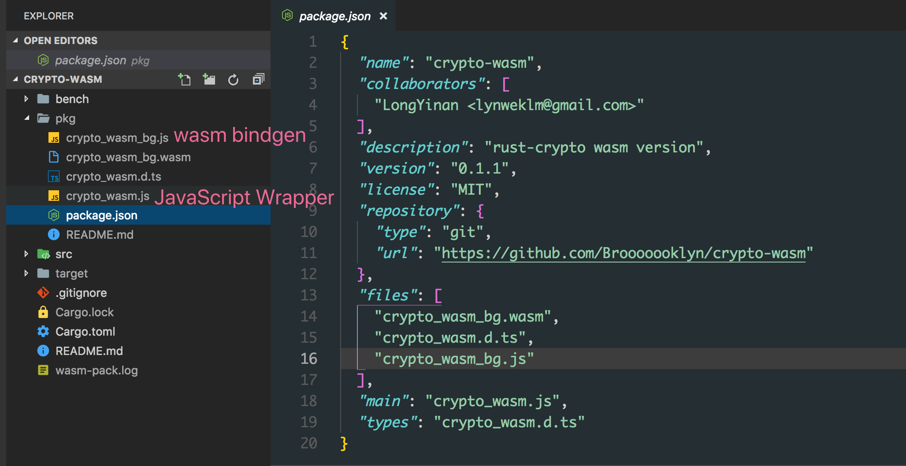

> 一个非常快速的概览，文章中不涉及深度细节，深度的细节可以在代码中找到: [crypto-wasm](https://github.com/Brooooooklyn/crypto-wasm) , [node-crypto](https://github.com/Brooooooklyn/node-crypto)

## 0x00

随着 2017 年底，四大浏览器厂商全部完成对 WebAssembly 的初步实现，以及 [Webpack implementing first-class support for WebAssembly](https://medium.com/webpack/webpack-awarded-125-000-from-moss-program-f63eeaaf4e15) 的消息公布，越来越多的团队在实现需求的时候将 WebAssembly 作为备选技术之一考虑，那么在如今的环境 (Node 8.11.3 LTS，目前阶段没有尝试浏览器)， 和相关工具链 ([wasm-pack](https://github.com/rustwasm/wasm-pack), Emscripten) 下 WebAssembly 的使用体验、性能到底是什么样的状况呢？

<!--more-->

## 0x01 前置背景介绍

> 如果你已经对 WebAssembly 已经有所了解甚至已经上手试过了，那你可以放心的跳过这一节。这一小节主要介绍一些 WebAssembly 相关的非常基础的概念

WebAssembly 简要来说有以下三个特点:

- 二进制格式，不同于 JavaScript 代码的文本格式
- 标准化，与 JavaScript 一样，实现了 WebAssembly 标准的引擎都可以运行 WebAssembly，不管是在服务器端还是浏览器端
- 快速，WebAssembly 可以充分发挥硬件的能力，以后你甚至可以在 WebAssembly 中使用 SIMD 或直接与 GPU 交互

而 WebAssembly 诞生自浏览器环境，自然需要与 JavaScript 交互，在目前支持 WebAssembly 的环境中使用 WebAssembly 大概需要以下步骤:

- 加载

  因为我们需要使用 WebAssembly.instantiate 来实例化一个 WebAssembly 模块，而这个方法只接受 ArrayBuffer 作为第一个参数，所以只能将 .wasm 文件加载为 ArrayBuffer 才能将它实例化

  你可以使用 fetch 加载

  ```js
  fetch(url).then(response =>
    response.arrayBuffer()
  ).then(bytes => {
  	// your bytes here  
  })
  ```

  或者在 NodeJS 中使用 `fs.readFile` 加载:

  ```js
  const bytes = fs.readFileSync('hello.wasm')
  ```

- 实例化

  ```js
  WebAssembly.instantiate(bytes, imporObject)
  ```

  这是一个 binding 的过程。 `WebAssembly.instantiate` 方法会将 importObject 对象传递给 wasm ，这样在 wasm 内就可以访问到 imporObject 上的属性和方法，而 `WebAssembly.instantiate(bytes, imporObject) ` 的返回值则会将 wasm 内暴露的方法交给 JavaScript 调用。

  ```js
  const importObject = {
    imports: {
      foo: arg => console.log(arg) // 可以在 wasm 内调用
    }
  }
  
  WebAssembly.instantiate(bytes, importObject).then(results => {
    results.instance.exports.exported_func() // exports 对象上有所有 wasm 暴露的东西
  })
  ```

  

  目前来看这是一个非常冗长和令人费解的过程，你可以在 [Using_the_JavaScript_API](https://developer.mozilla.org/zh-CN/docs/WebAssembly/Using_the_JavaScript_API) 找到更多详细的相关描述

- 调用

  无参数或者参数类型为数字的时候，可以直接调用 wasm 模块内的方法，但是一旦涉及到其它复杂类型的参数或返回值的时候，就需要直接对内存进行操作才能正常的调用和获取返回值了。

  > 摘自 [*WebAssembly* 系列（四）*WebAssembly* 工作原理](https://zhuanlan.zhihu.com/p/25754084)
  >
  > 如果你想在 JavaScript 和 WebAssembly 之间传递字符串，可以利用 ArrayBuffer 将其写入内存中，这时候 ArrayBuffer 的索引就是整型了，可以把它传递给 WebAssembly 函数。此时，第一个字符的索引就可以当做指针来使用。
  >
  >  


可以看到，目前直接使用 WebAssembly 是非常复杂而且费力的一件事情，好在我们有一些工具可以简化这个过程，下面的内容将介绍这些工具。

## 0x02 工具链，Emscripten 与 wasm-pack

提到 WebAssembly 就不得不说一下 Emscripten。

WebAssembly 最早是由 [Asm.js](https://zh.wikipedia.org/wiki/Asm.js) 发展而来，Emscripten 与 asm.js 同时诞生，最初版本的 asm.js 就是靠 Emscripten 生成。

asm.js 高性能的秘密在于引擎会直接将符合 asm.js 规范的代码编译为汇编执行，而不是像普通的 JavaScript 代码那样先运行在虚拟机上再由引擎逐步优化。

早期的 Emscripten 使用 llvm 将静态语言变成 [LLVM IR](https://segmentfault.com/a/1190000002669213)，然后再将 LLVM IR 变成 asm.js。而如今它还可以将 LLVM IR 编译成 wasm，目前来看它是 C/C++ 到 asm.js/wasm 最重要的工具。

今年稍早的时候，Rust 团队公布了[Rust 2018 Roadmap](https://blog.rust-lang.org/2018/03/12/roadmap.html) ，里面将 WebAssembly 的战略地位放在了与 **Network services、**   **Command-line apps**、  **Embedded devices**  平级的地位上，并成立了专门的小组 Focus 在 WebAssembly 的生态建设上。

随后，rustwasm 团队便发布了 wasm-pack，这是一个能快速将 Rust 代码编译到 WebAssembly 并发布到 npm 的工具。对比 Emscripten 工具链，它有三个方面的功能让我觉得非常强大方便:

- 无需写巨长的编译命令/编译脚本，一键编译

  `wasm-pack init` 或者 `wasm-pack init -t nodejs` 即可得到需要的 wasm 代码与相应的 js bindings。相较而言，这是 C++ 的代码使用 Emscripten 编译到 wasm 的脚本 (代码来自 [fdconf 2018](https://github.com/yunxiange/frontend-conf/blob/master/content/fdconf-2018-05-19.md): webassembly在全民直播的应用)

  ```bash
  #!/usr/bin/env bash
  set -x
  rm -rf ./build
  mkdir -p ./build
  
  em++  --std=c++11 -s WASM=1 -Os \
  			--memory-init-file 0 --closure=1 \
  			-s NO_FILESYSTEM=1 -s DISABLE_EXCEPTION_CATCHING=0 \
  			-s ELIMINATE_DUPLICATE_FUNCTIONS=1 -s LEGACY_VM_SUPPORT=1
  			--llvm-lto 1 -s "EXTRA_EXPORTED_RUNTIME_METHODS=['ccall']" \
  			-s EXPORTED_FUNCTIONS="['_sum']" \
  			./sum.cpp -o ./build/index.html
  ```

- 不需要编写巨长无比的 js wrapper

  下面是一段用 C++ 编写，使用 Emscripten 编译到 wasm 之后从 JavaScript 端的调用过程:

  ```js
  function _arrayToHeap(typedArray) {
    const numBytes = typedArray.length * typedArray.BYTES_PER_ELEMENT;
    const ptr = Module._malloc(numBytes);
    const heapBytes = new Uint8Array(Module.HEAPU8.buffer, ptr, numBytes);
    heapBytes.set(new Uint8Array(typedArray.buffer));
    return heapBytes;
  }
  
  function _freeArray(heapBytes) {
    Module._free(heapBytes.byteOffset);
  }
  
  Module.sum = function(intArray) {
    const heapBytes = _arrayToHeap(intArray);
    const ret = Module.ccall(
    	"sum",
      "number",
      ["number", "number"],
      [heapBytes.byteOffset, intArray.length],
    );
    _feeArray(heapBytes);
    return ret;
  }
  ```

  对比来看，wasm pack 生成的包可以像调用普通 JavaScript 库一样调用：

  

  这是 wasm-pack 生成出来的文件，pkg 目录是 wasm-pack 自动生成的文件，里面的内容发布为 npm package 之后，使用方可以直接 `require('crypto-wasm')` 来使用。

- 自动生成 .d.ts，对前端工具链非常友好

  wasm pack 可以将这样的代码:

  ```rust
  #[wasm_bindgen]
  pub fn sha256(input: &str) -> String {
    let mut hasher = Sha256::new();
    hasher.input_str(input);
    hasher.result_str()
  }
  ```

  

  生成为:

  ```typescript
  export function sha256(arg0: string): string;
  ```

  无需任何额外的配置


不过在这些优点的同时，目前 wasm pack 还存在一些缺陷:

- 生成的 wasm 体积太大

  准确来说这并不是 wasm pack 工具的问题，而是 Rust 语言的问题。目前一个空项目打包出来的体积大概是 `250kb` 左右，当然这对于 NodeJS 来说就不是什么大问题了。

- 无法增量编译，编译速度极慢

  空项目 2min 左右才能编译好，而且重复编译时间不会减少。

- 还有一些 Bug

  不是指生成的代码有 Bug，而是打包过程中的一些问题。比如生成的 package.json 文件中的 files 字段少加了文件导致发布到 npm 之后无法直接安装使用。


## 0x03 性能

> 目前这是一个非常不严谨的 Benchmark，结果仅供参考，如果你想修改 Benchmark 的过程或者进行 Profile，可以在 [crypto-wasm](https://github.com/Brooooooklyn/crypto-wasm) 的 bench 目录下进行修改调试。

这次 Benchmark 对比了 4 种代码的 `md5` 性能，它们分别是：

- NodeJS 原生 crypto
- rust-crypto 库的 wasm 版本
- crypto-js
- rust-crypto Node native binding 版本


在输入字符串为 `hello world!` 时:

```bash
➜ node bench/md5.js
md5#native x 637,185 ops/sec ±1.99% (79 runs sampled)
md5#wasm x 194,583 ops/sec ±17.49% (63 runs sampled)
md5#js x 86,228 ops/sec ±11.65% (66 runs sampled)
md5#binding x 1,172,619 ops/sec ±4.45% (85 runs sampled)
Fastest is md5#binding
```

 在输入字符串长度为 `200000` 时:

```bash
➜ node bench/md5.js
md5#native x 1,496 ops/sec ±2.24% (91 runs sampled)
md5#wasm x 809 ops/sec ±1.46% (91 runs sampled)
md5#js x 60.91 ops/sec ±1.68% (63 runs sampled)
md5#binding x 785 ops/sec ±0.75% (93 runs sampled)
Fastest is md5#native
```

由于实现的算法存在差异，所以需要更多维度的 Benchmark 才能获得 wasm 在 v8 下性能的准确信息。

但就现实场景而言，可以看到如果一些库在 Node 下没有 Native 实现，并且有相关的 Rust 实现，并且恰好这个 Rust 实现没有用到系统级的 API ，那么使用 wasm pack 打包一个 wasm 版本并在 Node 下使用还是一个性能收益非常可观并且成本并不算太高的选择。

相较于 native binding 而言，wasm 在 CI 上的优势是巨大的，wasm 可以在任意环境任意支持的 Node 版本下编译就可以全平台使用了。而 native binding 如果安装时 build 成本太高需要使用 prebuilt 发布的话，CI 简直就是噩梦，需要所有平台所有支持的 Node 版本下 prebuilt，然后让安装的一方下载编译好的 binary 。


## EOF

由于时间有限，所以目前只玩耍到这一步。

后面会带来 wasm 在浏览器中使用的体验和多方面的对比 (如果还有下一篇。