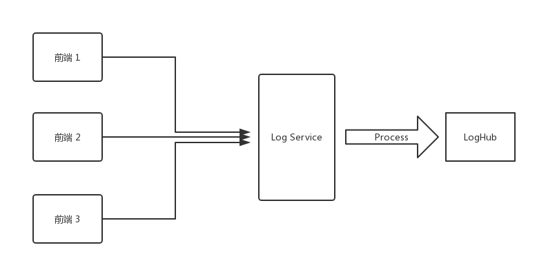
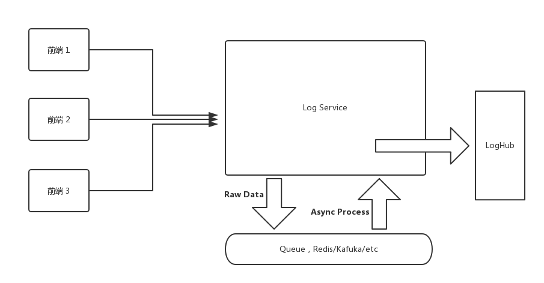

> https://github.com/Brooooooklyn/sourcemap-decoder

<!--more-->

## Intro

前阵子在公司内搭建了一个 Log Service，用来记录前端的报错信息，代码一顿乱写搞的七七八八之后实现了第一版的功能。

流程很简单，前端将以下格式的信息用 get 发到 Log Service:

```json
{
  "url": "https://www.arkie.cn/scenarios",
  "channel": "frontend",
  "level": "FATAL",
  "crashId": "02x32f3",
  "stack": "base64 string ......",
  ...
}
```

Log Service 接受到这个请求以后，将 `Stack` 解析成 JSON : `JSON.parse(decodeURIComponent(Buffer.from(query.stack, 'base64').toString()))`, 解析后的 stack 是这样的 :

```json
[
  { "filename": "https://arkie-public.oss-cn-hangzhou.aliyuncs.com/js/main.c3600f3f.js", line: 1, column: 334222 },
  { "filename": "https://arkie-public.oss-cn-hangzhou.aliyuncs.com/js/common.752d2f13.js", line: 1, column: 113242 },
]
```

然后 Log service 会根据文件对应的 sourcemap (前端各项目 deploy 的时候已经上传到私有 CDN 了) 解析出原始报错位置。比如:

```js
{
  filename: './src/modules/design/design.container.tsx',
  line: 102
}
```


最后会将这些处理后的信息输出到阿里云的 LogHub。




## 优化

做完第一个脆弱的版本后发现时间仅仅过去了一天半，所以开始考虑优化的事情了。

第一个版本有两个问题，第一个问题是在后端处理 log 的流程太长导致性能消耗有点大，第二个问题是实时处理 Log 在后面用户增多之后服务器会不堪重负，而其实 Log Service 的实时性要求并没有那么高。

对于第一个问题，可以优化代码性能(能优化才怪)，分拆步骤(这个靠谱)来解决，第二个问题也可以通过分拆数据处理步骤来解决。

而分拆处理步骤这个解决方案可以通过在 Log Service 中加入一个 queue 来解决。比如接受到前端请求后，直接将原始数据塞到 queue 中，然后有一个 consumer 按一个最大速率从 queue 中取出原始日志，处理之后再放入 LogHub，这一部分的细节就不赘述了，要写的话展开又是一个长篇大论。





而优化性能这方面，我本来没有抱什么希望，因为实在是看不出有啥可优化的。`base64 decode` --> `JSON.parse` --> `sourcemap parse` 都用的是最底层的标准库调用(`sourcemap parse` 用的是 Mozilla 出品的 https://github.com/mozilla/source-map)

然而在上线的前夕，我突然想起了前不久学习 Rust 的时候看到的一个库 [neon-bindings](https://github.com/neon-bindings/neon)


##  Rust!Rust!

是不是可以用更快的语言来优化 Sourcemap 处理的过程呢，同时大部分主要的繁琐的业务还是使用 TypeScript 编写。

调研了一圈发现，已经有国内的公司在项目里面用 neon 写业务了: https://www.zhihu.com/question/19903210/answer/207779913

并且大家熟悉的 [sentry](https://sentry.io/welcome/) 在生产环境中也是使用 `Rust` 来 parse Sourcemap  https://segmentfault.com/a/1190000007299177，虽然他们是 binding 到了 python 上，但他们已经把 Rust 代码开源出来了: https://github.com/getsentry/rust-sourcemap

也就是说我只需要把这部分的 `Rust` 代码通过 neon-bindgs 封装成 NodeJS 可调用的模块就行了，不像 sentry 还要 port 出 C API 再通过 python 调用 C 的代码，美滋滋。

写代码的过程和原理就省略了，代码可以在: https://github.com/Brooooooklyn/sourcemap-decoder 看到，主要分享一些数据和踩的坑:


#### Benchmark

所以 Rust 比 JavaScript 代码在处理同样的 Sourcemap 时 parse 快多少呢？

我做了一个简单的 benchmark, 测试结果如下:

```
$ node benchmark

JavaScript parse time 50794 microseconds

Rust parse time: 39 microseconds

JavaScript parse result, Source: webpack:///src/utils/logger/logger.ts, Line: 56

Rust parse result, Source: webpack:///./src/utils/logger/logger.ts, Line: 56

✨  Done in 0.33s.

```


##### Hardware Info:

```
ProductName:    Mac OS X
ProductVersion: 10.13.3
BuildVersion:   17D47
Model Name: MacBook Pro
Model Identifier: MacBookPro14,2
Processor Name: Intel Core i5
Processor Speed: 3.1 GHz
Number of Processors: 1
Total Number of Cores: 2
L2 Cache (per Core): 256 KB
L3 Cache: 4 MB
Memory: 16 GB
```


Benchmark 代码: https://github.com/Brooooooklyn/sourcemap-decoder/blob/master/benchmark/index.js

因为每次调用 Rust 的代码会有一次 bootstrap 的过程以及 JavaScript 代码在运行很多次后会被 JIT 优化，在一次性运行几万次的情况下差距可能缩小为十几倍，有兴趣大家可以自行尝试。


#### CI/CD

刚写完打算上线的时候，想让 production 的镜像尽量小一点(我们用的 Docker)，所以直接在 Production 的 Image 上用了 node:8-alpine 作为 base image，相应的，CI 的镜像(我们使用的是 Gitlab runner 的 Docker executor )也是用同样的 base image，然后花了三个多小时尝试在 Alpine 上安装 latest rust toolchains 后失败了，最后不得不忍受 100 多 m 的体积差切换到了 `node:8-slim`。最终的国内可以流畅 build 的 Dockerfile 在 https://github.com/Brooooooklyn/sourcemap-decoder/blob/master/Dockerfile


#### Toolschains 安装

由于众所周知的原因，CI 在刚开始 build image 的时候异常的缓慢，直到超时被 Gitlab kill 掉，经过一个多小时顽强的抵抗后将所有可能撞墙的步骤全部替换成了 USTC 的 mirror。

主要是 dev 机器 rustup 安装需要:

```bash
curl https://sh.rustup.rs -sSf | sed "s/https:\/\/static.rust-lang.org\/rustup\/dist/https:\/\/mirrors.ustc.edu.cn\/rust-static\/rustup\/dist/g" | sh
```

使用 USTC 的源安装 Rustup

build 前需要:

```bash
cat > $HOME/.cargo/config << EOF
[source.crates-io]
registry = "https://github.com/rust-lang/crates.io-index"
replace-with = 'ustc'
[source.ustc]
registry = "git://mirrors.ustc.edu.cn/crates.io-index"
EOF
```

让 Cargo 也是用 UTSC 的源(CI 环境也需要执行同样的命令)

在 CI 的 Docker Image build 的时候需要 [替换 Rust 下载源](https://github.com/Brooooooklyn/sourcemap-decoder/blob/master/Dockerfile#L30) 以及 [替换 Rustup源](https://github.com/Brooooooklyn/sourcemap-decoder/blob/master/Dockerfile#L34-L35)

详情请参考 [README](https://github.com/Brooooooklyn/sourcemap-decoder/blob/master/README.md)


### More Info

因为 Rust 在公司内成功应用，所以我们决定后面会尽量迁移一些 CPU 密集型的任务到 `Rust` 上，比如用 https://github.com/nical/lyon 替代 puppeteer 做海报的后端渲染，如果你有兴趣的话，欢迎联系我！
