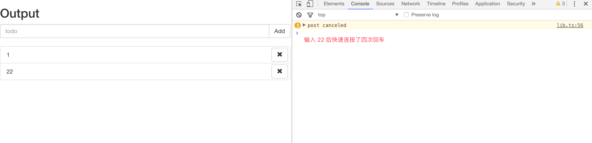
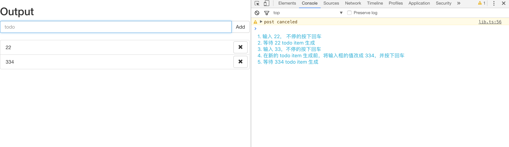
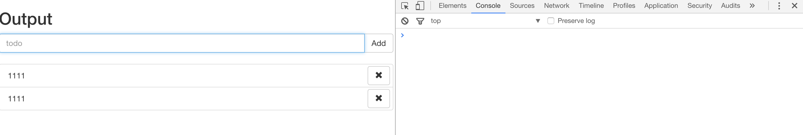
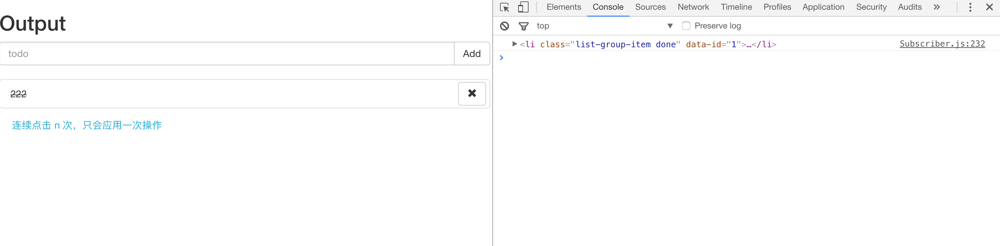
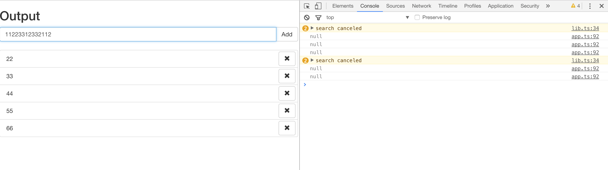
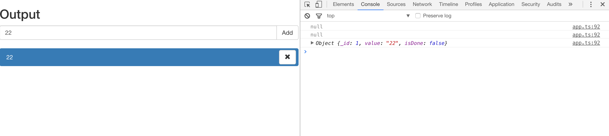

> 本文是一系列介绍 RxJS 文章的第二篇，这一系列的文章将从一个小的例子开始，逐渐深入的讲解 RxJS 在各种场景下的应用。对应的，也会有对 RxJS 各种操作符的讲解。这篇文章将接着第一篇[Hello Rx](https://zhuanlan.zhihu.com/p/23331432) 中的例子，将更多的异步业务(Http 请求) 接入我们的 Todo App 中。在例子中，会使用更多操作符(RxJS Operator) 来处理我们的业务，后续的文章中会详细的讲解这些操作符的作用和使用场景。

<!--more-->

## 准备工作
首先在 [learning-rxjs](https://github.com/Brooooooklyn/learning-rxjs) clone 项目所需的 seed，并`基于 article1 分支 checkout 一个你的 article2 分支`。本文中所有涉及到 RxJS 的代码将全部使用 TypeScript 编写。
这篇文章中，我们将使用 `RxJS` 实现以下几个功能:
1. 按回车或点击 add button 后发送一个请求，在请求返回结果后再清空输入框，并将返回的结果变成一个 todo item。如果在请求返回结果前又一次按下回车或 add 按钮，对比此时输入框的值和上次发送的值是否相同，如果相同则不进行任何操作，如果不同则取消掉上次的请求并发送新的请求。
2. 在点击一个 todo item 的时候发送请求，间隔 300 毫秒内的点击，只会发出一次请求。
3. 在输入框中每次输入字符，都会在 200 毫秒后发送一个请求，搜索是否匹配到已存在的 todo item，如果已存在则高亮这个 todo item。如果在一次搜索的结果返回前输入了新的字符，则取消掉前一个请求，再发一个搜索请求。

## 使用 switchMap 切换 Observable
为了实现需求，首先需要在原有的逻辑中加入请求的逻辑，我们可以在 `lib.ts` 中找到 `mockHttpPost` 方法:

```ts
export const mockHttpPost = (value: string): Observable<HttpResponse> => {
  return Observable.create((observer: Observer<HttpResponse>) => {
    let status = 'pending'
    const timmer = setTimeout(() => {
      const result = {
        _id: ++dbIndex, value,
        isDone: false
      }
      searchStorage.set(result._id, result)
      status = 'done'
      observer.next(result)
      observer.complete()
    }, random(10, 1000))
    return () => {
      clearTimeout(timmer)
      if (status === 'pending') {
        console.warn('post canceled')
      }
    }
  })
}
```

这里我并没有真正的发送一个 http 请求，在真实的业务场景中，将请求转化成 Observable 的过程应该是这样的:

```ts
Observable.create(observer => {
  request(xxxx, response => {
    // success callback
    observer.next(parse(response))
    observer.complete()
  }, err => {
    // error callback
    observer.error(err)
  })
  // teardown logic
  return () => request.abort()
})
```

在 *app.ts* 中引入 `mockHttpPost`:

```ts
...
import {
  createTodoItem,
  mockHttpPost
} from './lib'

...

const item$ = input$
  .map(() => $input.value)
  .filter(r => r !== '')
  .switchMap(mockHttpPost)
  .map(data => createTodoItem(data.value))
  .do((ele: HTMLLIElement) => {
    $list.appendChild(ele)
    $input.value = ''
  })
  .publishReplay(1)
  .refCount()
```

修改 createTodoItem helper，让它支持传入 HttpResponse 格式的数据:

```ts
// lib.ts
export const createTodoItem = (data: HttpResponse) => {
  const result = <HTMLLIElement>document.createElement('LI')
  result.classList.add('list-group-item', `todo-item-${data._id}`)
  result.setAttribute('data-id', `${data._id}`)
  const innerHTML = `
    ${data.value}
    <button type="button" class="btn btn-default button-remove pull-right" aria-label="right Align">
      <span class="glyphicon glyphicon-remove" aria-hidden="true"></span>
    </button>
  `
  result.innerHTML = innerHTML
  return result
}
```

这样 `$item` 部分的代码可以简化成:

```ts
const item$ = input$
  .map(() => $input.value)
  .filter(r => r !== '')
  .switchMap(mockHttpPost)
  .map(createTodoItem)
  .do((ele: HTMLLIElement) => {
    $list.appendChild(ele)
    $input.value = ''
  })
  .publishReplay(1)
  .refCount()
```

此时代码运行的行为是这样的:
1. 直接输入值并回车，todo item 像以前一样被创建
2. 输入值，并在 todo item 生成前多次回车，可以看到请求被 cancel 了多次:



这里的 `switchMap` 其实是 *map and switch*，而 `switch` 操作符的行为是：

> 如果 Observable 中流动的数据也是 Observable，switch 会将数据流中最新的一个 Observable 订阅并将它的值传递给下一个操作符，然后取消订阅之前的 Observable。

所以这里的 switchMap 实际是:

```ts
const item$ = input$
  .map(() => $input.value)
  .filter(r => r !== '')
  .map(mockHttpPost)
  .switch()
  .map(createTodoItem)
...

```
的缩写。同样的，之前用到的 `mergeMap` 也是 *map and merge*。
如果你有兴趣，可以尝试下面的代码观察 `switchMap` 行为:

```ts
// 你可以在项目目录下执行: npm i -g ts-node && ts-node example/switchMap.ts 观察运行结果
import { Observable, Observer } from 'rxjs'

const stream = Observable.create((observer: Observer<number>) => {
  let i = 0
  const intervalId = setInterval(() => {
    observer.next(++i)
  }, 1000)
  return () => clearInterval(intervalId)
})

function createIntervalObservable(base: number) {
  let i = 0
  return Observable.create((observer: Observer<string>) => {
    const intervalId = setInterval(() => {
      observer.next(`base: ${base}, value: ${++i}`)
    }, 200)
    return () => {
      clearInterval(intervalId)
      console.log(`unsubscribe base: ${base}`)
    }
  })
}

stream.switchMap(createIntervalObservable)
  .subscribe(result => console.log(result))
```

## 使用 distinct* 操作符过滤数据

但这里的逻辑还有一点不足，我们输入一个值并快速按下多次回车，前几次的请求被 cancel ，但如果 input 的值不变我们其实不需要 cancel 掉这些请求，只需要忽略后几次的点击即可。可以使用 distinct 操作符实现这个需求:

```ts
const item$ = input$
  .map(() => $input.value)
  .filter(r => r !== '')
  .distinct()
  .switchMap(mockHttpPost)
  .map(createTodoItem)
  .do((ele: HTMLLIElement) => {
    $list.appendChild(ele)
    $input.value = ''
  })
  .publishReplay(1)
  .refCount()
```
此时，如果在请求返回前不停的按下回车，只有在 input value 改变的时候才会 cancel 上一个请求:


## 使用 Subject 推送数据
此时还存在一个小问题，在生成 todo item 后再输入与上次同样的值并按下回车，这次的值会被 distinct 操作符过滤掉。为了解决这个问题，我们可以指定 distinct 操作符的第二个参数 `flushes` 来清除 `distinct` 操作符的缓存:

```ts
import { Observable, Subject } from 'rxjs'
...

const clearInputSubject$ = new Subject<void>()

const item$ = input$
  .map(() => $input.value)
  .filter(r => r !== '')
  .distinct(null, clearInputSubject$)
  .switchMap(mockHttpPost)
  .map(createTodoItem)
  .do((ele: HTMLLIElement) => {
    $list.appendChild(ele)
    $input.value = ''
    clearInputSubject$.next()
  })
  .publishReplay(1)
  .refCount()
```


> 这里出现的 Subject 既有 Observer 的功能，也有 Observable 的功能，但又有一些区别。上一篇讲过了 Observable 是 unioncast 的，也就意味着 Observable 中一个值只会发送给一个订阅者。而 publish/share 操作符可以将它们变成 muticast 的，但它依然是 lazy 的，也就是要有订阅者它才会执行。而这里的 Subject 与 Observable 相比，不仅是 muticast 的，而且是非 lazy 的，它可以在任意时刻任意地点推送数据，这些数据可以被任意多的订阅者共享。

根据 Subject 的特性可以看出来，item$ 这个 publish 出来的 Observable 可以改写成一个 Subject，有兴趣的读者可以自行尝试（订阅 input 并在 subscribe 中 next 值）。

## 使用 debounceTime 过滤重复的操作
我们已经实现了第一个需求，接下来要完成第二个 ` 在点击一个 todo item 的时候发送请求，在请求返回结果前的点击都会被忽略`。请求的逻辑和上一个一样：

```ts
...
import {
  createTodoItem,
  mockToggle,
  mockHttpPost
} from './lib'
...

const toggle$ = item$.mergeMap($todoItem => {
  return Observable.fromEvent<MouseEvent>($todoItem, 'click')
    .filter(e => e.target === $todoItem)
    .mapTo({
      data: {
        _id: $todoItem.dataset['id'],
        isDone: $todoItem.classList.contains('done')
      }, $todoItem
    })
})
  .switchMap(result => {
    return mockToggle(result.data._id, result.data.isDone)
      .mapTo(result.$todoItem)
  })
...
```

这里短时间的重复点击，会让前一个点击请求取消掉，但这与我们的需求不符，我们需要的是`间隔 300 毫秒内的点击，只会发出一次请求`，`debounceTime` 操作符可以完成这个工作：

```ts
const toggle$ = item$.mergeMap($todoItem => {
  return Observable.fromEvent<MouseEvent>($todoItem, 'click')
    .debounceTime(300)
    .filter(e => e.target === $todoItem)
    .mapTo({
      data: {
        _id: $todoItem.dataset['id'],
        isDone: $todoItem.classList.contains('done')
      }, $todoItem
    })
})
  .switchMap(result => {
    return mockToggle(result.data._id, result.data.isDone)
      .mapTo(result.$todoItem)
  })
```



## debounce and switchMap，最小化使用你的资源
最后一个需求，需要同时使用 debounceTime 和 switchMap :

```ts
...
import {
  createTodoItem,
  mockToggle,
  mockHttpPost,
  search,
  HttpResponse
} from './lib'

...
// 后面的 search$ 与 enter 应该时从同一个 Observable 中转换出来，这里将 input 事件的 Observable publish 成 muticast
const type$ = Observable.fromEvent<KeyboardEvent>($input, 'keydown')
  .publish()
  .refCount()

const enter$ = type$
  .filter(r => r.keyCode === 13)

...
const search$ = type$.debounceTime(200)
  .filter(evt => evt.keyCode !== 13)
  .map(result => (<HTMLInputElement>result.target).value)
  .switchMap(search)
  .do((result: HttpResponse | null) => {
    const actived = document.querySelectorAll('.active')
    Array.prototype.forEach.call(actived, (item: HTMLElement) => {
      item.classList.remove('active')
    })
    if (result) {
      const item = document.querySelector(`.todo-item-${result._id}`)
      item.classList.add('active')
    }
  })

const app$ = toggle$.merge(remove$, search$)
  .do(r => {
    console.log(r)
  })

```
试着用不同的速度输入一系列的字符串，观察控制台的响应。在 200 毫秒内的输入被忽略，在 response 回来之前的输入会让前一个 request abort 掉。如果匹配到相同的 todo item 则会高亮它。






## 总结

一个简陋的 Todo App 就此完成（delete 与 toggle 类似，有兴趣可以自行实现），它涵盖了一些 RxJS 擅长的领域：
1. 将同步/异步代码抽象成同样的形状，并使用操作符加以组合
2. 在需要的时候 cancel ，最大化节约资源

但可以明显看出，在业务逐渐复杂以后，直接的组合 Observable 与 Observable 已经会让数据流变得难以预测(`hard to reason about`)了，特别是在它们互相依赖互相派生的情况更加复杂的场景下。而大家知道，Flux/Redux 非常擅长处理这种场景，后面的文章中也会讲到如何运用单向数据流的思想管理 Observable，以及如何使用 Redux Observable 将 RxJS 作为 Redux 的 Epics。
